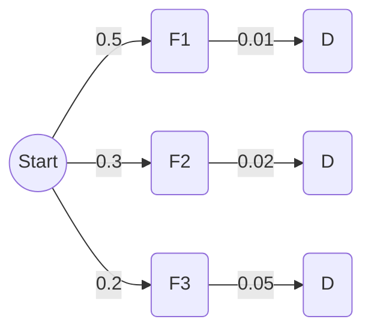

# Additional Practice: Models, Axioms, and Conditional Probability

## Part 1: Context of Series 01 (Axioms and Probability Models)

### Exercise 1.1: Translating Sentences into Set Theory
**Problem Statement:**
Let $A$, $B$, and $C$ be three events in a sample space $\Omega$. Express the following verbal statements using mathematical set operations ($\cup, \cap, \bar{}$):
(i) At least one of the three events occurs.
(ii) Exactly two of the events occur.
(iii) None of the events occur.

**Essential Background:**
*   **"At least one"** translates to the Union ($\cup$).
*   **"Both / And"** translates to Intersection ($\cap$).
*   **"None / Not"** translates to the Complement ($\bar{}$).

**Detailed Solution & Reasoning:**
*   **(i) At least one occurs:**
    This means A happens, OR B happens, OR C happens (or any combination of them). The union collects everything.
    **Expression:** $A \cup B \cup C$

*   **(ii) Exactly two occur:**
    This is complex. It means we have three distinct valid scenarios:
    1: A and B happen, but NOT C $\rightarrow (A \cap B \cap \bar{C})$
    2: A and C happen, but NOT B $\rightarrow (A \cap \bar{B} \cap C)$
    3: B and C happen, but NOT A $\rightarrow (\bar{A} \cap B \cap C)$
    Since these scenarios are mutually exclusive, we join them with unions.
    **Expression:** $(A \cap B \cap \bar{C}) \cup (A \cap \bar{B} \cap C) \cup (\bar{A} \cap B \cap C)$

*   **(iii) None occur:**
    This means NOT A, AND NOT B, AND NOT C.
    **Expression:** $\bar{A} \cap \bar{B} \cap \bar{C}$
    > **Tip:** By De Morgan's Law, this is mathematically identical to $\overline{A \cup B \cup C}$ (The complement of "at least one").

---

### Exercise 1.2: The Non-Equiprobable Spinner
**Problem Statement:**
A 4-sided spinner is unbalanced. The probability of landing on side $k \in \{1, 2, 3, 4\}$ is proportional to the **square** of its face value ($k^2$). 
(i) Determine the probability law of this universe.
(ii) Calculate the probability of landing on an even number.

**Detailed Solution & Reasoning:**
1.  **Set up the proportional equation:**
    "Proportional to $k^2$" means $P(k) = c \cdot k^2$, where $c$ is a constant we must discover.
    The golden rule of probability spaces: The sum of all probabilities in $\Omega$ equals 1.
    $$\sum_{k=1}^{4} P(k) = 1$$
    $$P(1) + P(2) + P(3) + P(4) = 1$$

2.  **Substitute and solve for $c$:**
    $$(c \cdot 1^2) + (c \cdot 2^2) + (c \cdot 3^2) + (c \cdot 4^2) = 1$$
    $$1c + 4c + 9c + 16c = 1$$
    $$30c = 1 \implies c = \frac{1}{30}$$

3.  **(i) The Probability Law:**
    Now we multiply $c$ by $k^2$ for each face.
    | $x_k$ (Face) | $1$ | $2$ | $3$ | $4$ |
    | :--- | :--- | :--- | :--- | :--- |
    | **$P(X = x_k)$** | $1/30$ | $4/30$ | $9/30$ | $16/30$ |

4.  **(ii) Probability of an Even Number:**
    Let $E = \{2, 4\}$.
    $P(E) = P(2) + P(4) = \frac{4}{30} + \frac{16}{30} = \mathbf{\frac{20}{30} = \frac{2}{3}}$

---

### Exercise 1.3: Combinatorics and Equiprobable Draws
**Problem Statement:**
An urn contains 9 balls: 3 Red, 4 Blue, and 2 Green. You draw 3 balls simultaneously at random. 
What is the probability of drawing exactly two different colors?

**Essential Background:**
When drawing *simultaneously* (or without replacement and without regard to order), we use Combinations: $C_n^k = \frac{n!}{k!(n-k)!}$. The universe $\Omega$ consists of all possible groups of 3 balls out of 9. $|\Omega| = C_9^3$.

**Detailed Solution & Reasoning:**
1.  **Calculate the Total Universe ($|\Omega|$):**
    $|\Omega| = C_9^3 = \frac{9 \times 8 \times 7}{3 \times 2 \times 1} = 84$.
    Since the draw is blind, every group of 3 is equally likely.

2.  **Define the Target Event:**
    Let $A$ = "Exactly two colors". 
    *Trick:* Calculating "exactly two colors" directly means calculating (2 Red, 1 Blue) + (2 Red, 1 Green) + (2 Blue, 1 Red) + (2 Blue, 1 Green) + (2 Green, 1 Red) + (2 Green, 1 Blue). 
    Let's do it the smart way: using the **Complement**.
    The complement $\bar{A}$ is "1 color OR 3 colors".

3.  **Calculate the Complement Probability:**
    *   **Case 1: Exactly 1 color (All same)**
        3 Reds: $C_3^3 = 1$ way.
        3 Blues: $C_4^3 = 4$ ways.
        3 Greens: Impossible ($C_2^3 = 0$, only 2 exist).
        Total 1-color ways = $1 + 4 = 5$.
    *   **Case 2: Exactly 3 colors (One of each)**
        We need 1 Red AND 1 Blue AND 1 Green.
        Ways = $C_3^1 \times C_4^1 \times C_2^1 = 3 \times 4 \times 2 = 24$.
    *   Total ways for $\bar{A}$ = $5 + 24 = 29$.
    *   $P(\bar{A}) = \frac{29}{84}$.

4.  **Final Probability:**
    $P(A) = 1 - P(\bar{A}) = 1 - \frac{29}{84} = \mathbf{\frac{55}{84}}$

---

### Exercise 1.4: Probability Axiom Proofs
**Problem Statement:**
Using only Kolmogorov's three axioms (Positivity, Certainty, Additivity of disjoint sets), prove that for any two events A and B: 
$P(A \cap \bar{B}) = P(A) - P(A \cap B)$.

**Detailed Solution & Reasoning:**
> **Why do students miss this?** They try to use algebra without establishing disjoint sets first. The 3rd axiom ONLY works if the sets share absolutely nothing ($X \cap Y = \emptyset$).

1.  **Deconstruct Event A into disjoint parts:**
    Imagine a Venn diagram. Event A is made of two distinct pieces: the part of A that is *outside* B, and the part of A that is *inside* B.
    Mathematically: $A = (A \cap \bar{B}) \cup (A \cap B)$
2.  **Verify disjointness:**
    Can an element be in $(A \cap \bar{B})$ AND $(A \cap B)$ at the same time? No, an element cannot be both outside B ($\bar{B}$) and inside B ($B$). Therefore, the two sets are disjoint.
3.  **Apply Axiom 3 (Additivity):**
    Because they are disjoint, the probability of their union is the sum of their individual probabilities.
    $P(A) = P(A \cap \bar{B}) + P(A \cap B)$
4.  **Rearrange the equation:**
    Subtract $P(A \cap B)$ from both sides.
    $P(A) - P(A \cap B) = P(A \cap \bar{B})$
    **Proof Complete.**

---

### Exercise 1.5: The Biased Coin
**Problem Statement:**
A rigged coin is designed so that the probability of getting Heads ($H$) is three times the probability of getting Tails ($T$). The coin is flipped twice.
Calculate the probability of getting exactly one Head.

**Detailed Solution & Reasoning:**
1.  **Find the base probabilities:**
    We know $P(H) = 3 \times P(T)$.
    We also know $P(H) + P(T) = 1$.
    Substitute: $3P(T) + P(T) = 1 \implies 4P(T) = 1$.
    $P(T) = \frac{1}{4}$, which means $P(H) = \frac{3}{4}$.

2.  **Define the Universe for two flips:**
    $\Omega = \{(H,H), (H,T), (T,H), (T,T)\}$.
    Since the flips are independent, the probability of a specific sequence is the multiplication of individual probabilities.

3.  **Calculate target event:**
    Event $E$ = "Exactly one Head".
    This corresponds to the outcomes $(H,T)$ and $(T,H)$.
    $P(E) = P(H,T) + P(T,H)$
    $P(E) = (P(H) \times P(T)) + (P(T) \times P(H))$
    $P(E) = \left(\frac{3}{4} \times \frac{1}{4}\right) + \left(\frac{1}{4} \times \frac{3}{4}\right) = \frac{3}{16} + \frac{3}{16} = \mathbf{\frac{6}{16} = \frac{3}{8}}$

***

## Part 2: Context of Series 02 (Conditional Probability & Independence)

### Exercise 2.1: Abstract Formula Mastery
**Problem Statement:**
Given two events $A$ and $B$ where $P(A) = 0.6$, $P(B) = 0.5$, and the conditional probability $P(A|B) = 0.8$.
(i) Calculate $P(A \cap B)$.
(ii) Calculate $P(B|A)$.
(iii) Are A and B independent? Justify.

**Detailed Solution & Reasoning:**
*   **(i) Find $P(A \cap B)$:**
    Use the definition of conditional probability: $P(A|B) = \frac{P(A \cap B)}{P(B)}$.
    Rearranging gives the Multiplication Rule: $P(A \cap B) = P(B) \times P(A|B)$.
    $P(A \cap B) = 0.5 \times 0.8 = \mathbf{0.4}$

*   **(ii) Find $P(B|A)$:**
    Now reverse the condition using Bayes' First Formula.
    $P(B|A) = \frac{P(A \cap B)}{P(A)}$
    $P(B|A) = \frac{0.4}{0.6} = \frac{4}{6} = \mathbf{\frac{2}{3}}$

*   **(iii) Check Independence:**
    Two events are independent if and only if $P(A \cap B) = P(A) \times P(B)$.
    Let's check: $P(A) \times P(B) = 0.6 \times 0.5 = 0.3$.
    However, we found $P(A \cap B) = 0.4$.
    Since $0.4 \neq 0.3$, the events are **NOT independent**.

---

### Exercise 2.2: The Factory Production (Total Probability & Bayes)
**Problem Statement:**
Three factories produce the same microchip. 
- Factory F1 produces 50% of the chips, with a 1% defect rate.
- Factory F2 produces 30% of the chips, with a 2% defect rate.
- Factory F3 produces 20% of the chips, with a 5% defect rate.
A chip is selected at random. 
(i) What is the probability it is defective ($D$)?
(ii) If the chip IS defective, what is the probability it came from Factory F3?

**Detailed Solution & Reasoning:**
*Step 1: Visualizing the Tree*

*   **(i) Probability of Defect ($P(D)$):**
    Use the Law of Total Probability. Sum the probability of reaching "D" through every possible branch.
    $P(D) = P(F1 \cap D) + P(F2 \cap D) + P(F3 \cap D)$
    $P(D) = P(F1)P(D|F1) + P(F2)P(D|F2) + P(F3)P(D|F3)$
    $P(D) = (0.5 \times 0.01) + (0.3 \times 0.02) + (0.2 \times 0.05)$
    $P(D) = 0.005 + 0.006 + 0.010 = \mathbf{0.021}$ (or 2.1%)

*   **(ii) Posterior Probability ($P(F3|D)$):**
    Use Bayes' Theorem. We know it's defective, we want the F3 branch's contribution to that total.
    $P(F3|D) = \frac{P(F3 \cap D)}{P(D)}$
    $P(F3|D) = \frac{0.010}{0.021} = \mathbf{\frac{10}{21}} \approx 47.6\%$

---

### Exercise 2.3: The Medical Trap (False Positives)
**Problem Statement:**
A rare disease affects 1 in 1000 people ($0.1\%$). A test for the disease is highly accurate:
- If you have the disease ($D$), the test is positive ($+$) 99% of the time.
- If you do NOT have the disease ($\bar{D}$), the test is negative ($-$) 95% of the time. (This means a 5% false positive rate).
You take the test and it returns Positive. What is the actual probability that you have the disease?

**Detailed Solution & Reasoning:**
> **Tip:** This is the most famous counter-intuitive puzzle in probability. Students guess "99%". The math says otherwise because the disease is extremely rare.

1.  **Extract Data:**
    $P(D) = 0.001 \implies P(\bar{D}) = 0.999$
    $P(+ | D) = 0.99$
    $P(- | \bar{D}) = 0.95 \implies P(+ | \bar{D}) = 0.05$ (False positive rate)

2.  **Calculate Total Probability of a Positive Test $P(+)$:**
    $P(+) = P(D \cap +) + P(\bar{D} \cap +)$
    $P(+) = (0.001 \times 0.99) + (0.999 \times 0.05)$
    $P(+) = 0.00099 + 0.04995 = 0.05094$

3.  **Apply Bayes' Theorem for $P(D | +)$:**
    $P(D | +) = \frac{P(D \cap +)}{P(+)}$
    $P(D | +) = \frac{0.00099}{0.05094} \approx \mathbf{0.0194}$ (or $1.94\%$)
    *(Conclusion: Even with a positive test, because the disease is so rare, you only have a ~2% chance of actually having it!)*

---

### Exercise 2.4: Sequential Drawing Without Replacement
**Problem Statement:**
An urn contains 5 White balls and 3 Black balls (8 total). You draw one ball, **keep it out of the urn**, and then draw a second ball.
(i) What is the probability the second ball is Black, given the first was White?
(ii) What is the total (unconditional) probability that the second ball is Black?

**Detailed Solution & Reasoning:**
Let $W_1, B_1$ be the color of the first draw, and $W_2, B_2$ the second.
*   **(i) Conditional Draw $P(B_2 | W_1)$:**
    If the first ball was White ($W_1$), we physically removed it. 
    The urn now contains 4 White balls and 3 Black balls (7 total).
    The probability of drawing a Black ball now is simply the black balls left divided by the total left.
    $P(B_2 | W_1) = \mathbf{\frac{3}{7}}$

*   **(ii) Total Probability $P(B_2)$:**
    The second ball can be black via two paths: (White then Black) OR (Black then Black).
    $P(B_2) = P(W_1 \cap B_2) + P(B_1 \cap B_2)$
    $P(B_2) = [P(W_1) \times P(B_2|W_1)] + [P(B_1) \times P(B_2|B_1)]$
    *Find the missing probabilities:*
    $P(W_1) = \frac{5}{8}$
    $P(B_1) = \frac{3}{8}$
    If first is Black ($B_1$), the urn drops to 5W, 2B (7 total). So $P(B_2|B_1) = \frac{2}{7}$.
    *Calculate:*
    $P(B_2) = \left(\frac{5}{8} \times \frac{3}{7}\right) + \left(\frac{3}{8} \times \frac{2}{7}\right) = \frac{15}{56} + \frac{6}{56} = \frac{21}{56} = \mathbf{\frac{3}{8}}$
    *(Fascinating property: The total probability of the second draw is exactly identical to the first draw if you know nothing about the first draw!)*

---

### Exercise 2.5: The Dice Independence Paradox
**Problem Statement:**
You roll two standard fair dice (one red, one blue). 
Let A = "The red die shows a 6".
Let B = "The sum of the two dice is exactly 7".
Let C = "The sum of the two dice is exactly 8".
(i) Are A and B independent?
(ii) Are A and C independent?

**Essential Background:**
The universe $\Omega$ is all combinations of $(red, blue)$. $|\Omega| = 36$.
For independence, we MUST rigorously check if $P(X \cap Y) = P(X)P(Y)$. Do not rely on intuition.

**Detailed Solution & Reasoning:**
1.  **Calculate Individual Probabilities:**
    *   $P(A)$: Red is 6. Outcomes: (6,1), (6,2), (6,3), (6,4), (6,5), (6,6). 6 outcomes. $P(A) = \frac{6}{36} = \frac{1}{6}$.
    *   $P(B)$: Sum is 7. Outcomes: (1,6), (2,5), (3,4), (4,3), (5,2), (6,1). 6 outcomes. $P(B) = \frac{6}{36} = \frac{1}{6}$.
    *   $P(C)$: Sum is 8. Outcomes: (2,6), (3,5), (4,4), (5,3), (6,2). 5 outcomes. $P(C) = \frac{5}{36}$.

2.  **(i) Checking Independence of A and B:**
    Find the intersection $A \cap B$ (Red is 6 AND Sum is 7). 
    Only one outcome fits: $(6,1)$.
    So, $P(A \cap B) = \frac{1}{36}$.
    Now check the formula: $P(A) \times P(B) = \frac{1}{6} \times \frac{1}{6} = \frac{1}{36}$.
    Since $\frac{1}{36} = \frac{1}{36}$, **Yes, A and B are strictly independent.** *(Intuition trap: Students think "if I know the red die is 6, the sum must change". But knowing the first is 6 leaves exactly a 1/6 chance the second is 1, matching the baseline 1/6 chance of rolling a 7).*

3.  **(ii) Checking Independence of A and C:**
    Find intersection $A \cap C$ (Red is 6 AND Sum is 8).
    Only one outcome fits: $(6,2)$.
    So, $P(A \cap C) = \frac{1}{36}$.
    Now check the formula: $P(A) \times P(C) = \frac{1}{6} \times \frac{5}{36} = \frac{5}{216}$.
    Since $\frac{1}{36} \neq \frac{5}{216}$, **No, A and C are NOT independent.**