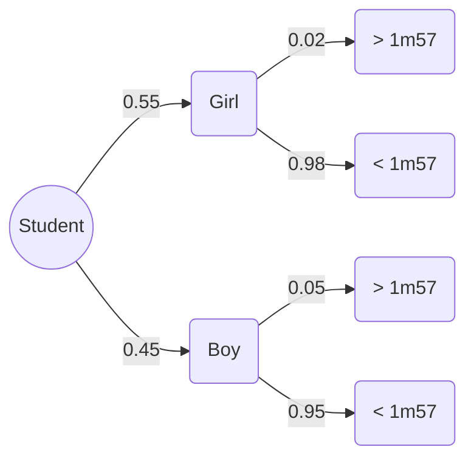

# Chapter 1. Axioms and Probability Models

## 1. Foundations of Probability Spaces.md

# 1. Foundations of Probability Spaces

Understanding probability requires a solid grasp of the underlying mathematical framework. Before calculating chances, we must define the universe of possible outcomes and the rules that govern them.

### 1. The Sample Space ($\Omega$)
The sample space, denoted by $\Omega$ (Omega), is the set of all possible outcomes of a random experiment. 
*   **Example:** For a standard six-sided die, $\Omega = \{1, 2, 3, 4, 5, 6\}$.
*   **Important Reminder:** Outcomes in $\Omega$ must be mutually exclusive (they cannot happen at the same time) and exhaustive (one of them *must* happen).

### 2. Events and Sigma-Algebras (Tribus)
An **Event** is a subset of the sample space $\Omega$. For example, the event "rolling an even number" is $A = \{2, 4, 6\}$.
A **Sigma-Algebra** (or Tribu in French), denoted as $\mathcal{T}$, is a collection of events that satisfies three strict rules:
1.  The empty set ($\emptyset$) is in $\mathcal{T}$. (The impossible event).
2.  If an event $A$ is in $\mathcal{T}$, its complement $\bar{A}$ (everything not in $A$) is also in $\mathcal{T}$.
3.  The union of any countable sequence of events in $\mathcal{T}$ is also in $\mathcal{T}$.

> **Why do students miss this?** Many students think *any* collection of subsets is a valid event space. The Sigma-Algebra ensures that if we can ask "What is the probability of A?", we are mathematically guaranteed to also be able to ask "What is the probability of NOT A?" or "What is the probability of A OR B?".

### 3. The Probability Measure ($P$)
A probability measure $P$ is a function that assigns a number between 0 and 1 to every event in our Sigma-Algebra. It must satisfy Kolmogorov's Axioms:
1.  **Positivity:** $P(A) \ge 0$ for any event $A$.
2.  **Certainty:** $P(\Omega) = 1$. The probability that *something* in the sample space happens is 100%.
3.  **Additivity:** If $A$ and $B$ are disjoint (mutually exclusive, $A \cap B = \emptyset$), then $P(A \cup B) = P(A) + P(B)$.

### 4. Equiprobable vs. Non-Equiprobable Spaces
*   **Equiprobable:** Every single outcome has the exact same chance of occurring. $P(\omega_i) = \frac{1}{|\Omega|}$. (e.g., a fair coin).
*   **Non-Equiprobable (Custom Laws):** Outcomes have varying weights. 
    *   **Crucial Trick:** No matter how the weights are distributed, **the sum of the probabilities of all individual elements in $\Omega$ MUST equal 1.**
    *   $\sum_{\omega_i \in \Omega} P(\omega_i) = 1$. You will use this exact property to solve "loaded die" problems (like Exercise 5 in Series 1).

---

## 2. Series 01 Detailed Exercise Solutions.md

# 2. Series 01 Detailed Exercise Solutions

This note covers the step-by-step resolution of "Série 01 - Modèles et Axiomes des probabilités".

### Exercise 01: Set Operations and Venn Concepts
**Problem Statement:** Let A and B be two events. Find an expression for the following events:
(i) A occurs but not B (only A occurs).
(ii) A or B, but not both occur exactly.

**Detailed Solution & Reasoning:**
*   **(i) A occurs but not B:**
    In set theory, "and" corresponds to intersection ($\cap$), and "not" corresponds to the complement ($\bar{B}$).
    Therefore, the expression is **$A \cap \bar{B}$** (or $A \setminus B$).
*   **(ii) A or B, but not both:**
    This is known as the **Symmetric Difference**, often denoted $A \Delta B$.
    It means either (A happens and B does not) OR (B happens and A does not).
    The mathematical expression is: **$(A \cap \bar{B}) \cup (\bar{A} \cap B)$**.
    *Alternative formulation:* Take the union of A and B, and remove their intersection: $(A \cup B) \setminus (A \cap B)$.

---

### Exercise 02: Properties of a Sigma-Algebra (Tribu)
**Problem Statement:** Show that if $\mathcal{T}$ is a tribu of events, then:
- $\emptyset \in \mathcal{T}$
- If $A, B \in \mathcal{T} \implies (A - B) = (A \cap \bar{B}) \in \mathcal{T}$

**Detailed Solution & Reasoning:**
By definition, a tribu $\mathcal{T}$ on $\Omega$ satisfies:
1. $\Omega \in \mathcal{T}$
2. $A \in \mathcal{T} \implies \bar{A} \in \mathcal{T}$
3. Stable under countable unions/intersections.

*   **Proof for $\emptyset \in \mathcal{T}$:**
    Since $\Omega \in \mathcal{T}$ (Rule 1), its complement must also be in $\mathcal{T}$ (Rule 2). The complement of everything ($\Omega$) is nothing ($\emptyset$). Therefore, $\emptyset \in \mathcal{T}$.
*   **Proof for $(A \cap \bar{B}) \in \mathcal{T}$:**
    We are given $A \in \mathcal{T}$ and $B \in \mathcal{T}$.
    Because $B \in \mathcal{T}$, its complement $\bar{B} \in \mathcal{T}$ (Rule 2).
    Because a tribu is stable under intersections, if $A \in \mathcal{T}$ and $\bar{B} \in \mathcal{T}$, their intersection $(A \cap \bar{B})$ must also be in $\mathcal{T}$.

---

### Exercise 05: The Loaded Die (Highly Important Concept)
*(Sourced heavily from your whiteboard/notebook images 9, 10, 11, 12, 13)*

**Problem Statement:** A die is loaded such that the probability of getting face $k$ is proportional to $k$. Let $A = \{\text{even number}\}$, $B = \{\text{prime number}\}$, $C = \{\text{odd number}\}$.
(i) Find the probability of each point in the universe.
(ii) Find $P(A)$, $P(B)$, and $P(C)$.
(iii) Find the probability that: a) A or B occurs, b) B odd occurs, c) A occurs but not B.

**Essential Background:** "Proportional to $k$" means $P(k) = c \times k$, where $c$ is an unknown constant we must find. 

**Detailed Solution (i): Finding the probabilities**
1.  **Define $\Omega$:** $\Omega = \{1, 2, 3, 4, 5, 6\}$.
2.  **Set up the equation:** We know the sum of all probabilities must be 1.
    $\sum_{k=1}^{6} P(\{k\}) = 1$
    $P(1) + P(2) + P(3) + P(4) + P(5) + P(6) = 1$
3.  **Substitute the proportional relationship ($P(k) = c \cdot k$):**
    $1c + 2c + 3c + 4c + 5c + 6c = 1$
    $21c = 1 \implies c = \frac{1}{21}$
4.  **Calculate individual probabilities:**
    The law is defined as $\forall k \in \{1,2,3,4,5,6\}, P(k) = \frac{k}{21}$.

| $x_i$ (Face) | $1$ | $2$ | $3$ | $4$ | $5$ | $6$ |
| :--- | :--- | :--- | :--- | :--- | :--- | :--- |
| **$P(x_i)$** | $1/21$ | $2/21$ | $3/21$ | $4/21$ | $5/21$ | $6/21$ |

**Detailed Solution (ii): Calculating $P(A)$, $P(B)$, $P(C)$**
*   **Set $A$ (Even):** $A = \{2, 4, 6\}$
    $P(A) = P(2) + P(4) + P(6) = \frac{2}{21} + \frac{4}{21} + \frac{6}{21} = \mathbf{\frac{12}{21} = \frac{4}{7}}$
*   **Set $B$ (Prime):** $B = \{2, 3, 5\}$ *(Note: 1 is NOT a prime number. Students frequently miss this!)*
    $P(B) = P(2) + P(3) + P(5) = \frac{2}{21} + \frac{3}{21} + \frac{5}{21} = \mathbf{\frac{10}{21}}$
*   **Set $C$ (Odd):** $C = \{1, 3, 5\}$
    $P(C) = P(1) + P(3) + P(5) = \frac{1}{21} + \frac{3}{21} + \frac{5}{21} = \mathbf{\frac{9}{21} = \frac{3}{7}}$

**Detailed Solution (iii): Composite Probabilities**
*   **a) A or B occurs: $P(A \cup B)$**
    *Method 1 (Formula):* $P(A \cup B) = P(A) + P(B) - P(A \cap B)$.
    First find $A \cap B$ (numbers that are both even AND prime). $A \cap B = \{2\}$.
    $P(A \cap B) = P(2) = \frac{2}{21}$.
    $P(A \cup B) = \frac{12}{21} + \frac{10}{21} - \frac{2}{21} = \mathbf{\frac{20}{21}}$.
    *Method 2 (Direct counting):* $A \cup B = \{2, 3, 4, 5, 6\}$. 
    $P(A \cup B) = 1 - P(1) = 1 - \frac{1}{21} = \frac{20}{21}$.

*   **b) Number is prime AND odd: $P(B \cap C)$**
    $B = \{2, 3, 5\}$, $C = \{1, 3, 5\}$.
    Intersection $B \cap C = \{3, 5\}$.
    $P(B \cap C) = P(3) + P(5) = \frac{3}{21} + \frac{5}{21} = \mathbf{\frac{8}{21}}$.

*   **c) A occurs but not B: $P(A \cap \bar{B})$**
    We want numbers that are Even but NOT Prime.
    $A = \{2, 4, 6\}$. The only prime here is 2. Remove it.
    $A \cap \bar{B} = \{4, 6\}$.
    $P(A \cap \bar{B}) = P(4) + P(6) = \frac{4}{21} + \frac{6}{21} = \mathbf{\frac{10}{21}}$.

***

# Chapter 2. Conditional Probability and Independence

## 1. Core Theorems and Rules.md

# 1. Core Theorems and Rules

This chapter moves from static probability to dynamic probability: how does knowing that event B has happened change the probability that event A will happen?

### 1. Conditional Probability Definition
The probability of event A occurring, *given* that event B has already occurred, is written as $P(A|B)$ or sometimes $P_B(A)$.

$$P(A|B) = \frac{P(A \cap B)}{P(B)} \quad \text{(where } P(B) \neq 0 \text{)}$$

**Intuition:** Because we know B happened, our entire "universe" shrinks from $\Omega$ down to just the set $B$. The only way A can happen now is if we are inside the intersection $A \cap B$. Therefore, we divide the probability of the intersection by the probability of our new universe, $B$.

### 2. Compound Probabilities Formula (Multiplication Rule)
By rearranging the definition above, we get the rule for intersections:
$$P(A \cap B) = P(B) \cdot P(A|B)$$
*(Or equally: $P(A \cap B) = P(A) \cdot P(B|A)$)*

**Generalization to $n$ events (From slide/notes image 16, 17):**
If you have a sequence of events, you multiply the probability of each subsequent event conditioned on all previous events happening.
$$P(A_1 \cap A_2 \cap A_3 \dots \cap A_n) = P(A_1) \cdot P(A_2|A_1) \cdot P(A_3|A_1 \cap A_2) \dots$$

### 3. Independence
Two events A and B are strictly **independent** if the occurrence of one gives absolutely no information about the occurrence of the other.

Mathematically, A and B are independent (denoted $A \perp\!\!\!\perp B$) if and only if:
$$P(A \cap B) = P(A) \cdot P(B)$$

**Consequences of Independence:**
If $A \perp\!\!\!\perp B$, then:
*   $P(A|B) = P(A)$
*   $P(B|A) = P(B)$
*(This makes logical sense: if they are independent, knowing B happened doesn't change the probability of A).*

### 4. Law of Total Probability
If you have a set of events $\{B_1, B_2, \dots, B_n\}$ that form a **partition** of $\Omega$ (they are mutually exclusive and together cover everything), you can find the probability of any event A by summing up its occurrence within each "slice" of the partition.

$$P(A) = \sum_{i} P(A \cap B_i) = \sum_{i} P(B_i) \cdot P(A|B_i)$$

### 5. Bayes' Theorem (First Formula)
Bayes' theorem allows us to "reverse" conditional probabilities. If you know $P(A|B)$, you can find $P(B|A)$. 

$$P(A|B) = \frac{P(B|A) \cdot P(A)}{P(B)}$$

*(Combined with the law of total probability for the denominator, this is the most powerful tool in Chapter 2).*

---

## 2. Probability Trees Methodology.md

# 2. Probability Trees Methodology

When dealing with sequential random events or conditional probabilities (like drawing items from a box, or testing patients for a disease), a Probability Tree is the safest and most structured way to visualize the problem.

### Anatomy of a Probability Tree

1.  **Nodes:** Represent the state after an event occurs.
2.  **Branches:** Represent the transition from one state to another.
    *   **Primary Branches (Level 1):** Originate from the start. These contain **Marginal Probabilities** (e.g., $P(A)$, $P(\bar{A})$).
    *   **Secondary Branches (Level 2+):** Originate from previous nodes. These contain **Conditional Probabilities** (e.g., $P(B|A)$ is the branch leading to B, starting from node A).
3.  **Paths:** Tracing from the root to an end node represents the **Intersection** of events. To find the probability of a path, you **MULTIPLY** the probabilities along the branches.
    *   Path A to B probability = $P(A) \times P(B|A) = P(A \cap B)$.

### The Two Golden Rules of Trees

*   **Rule 1 (The Node Rule):** The sum of the probabilities on all branches originating from a single node must exactly equal 1. 
    *(e.g., $P(B|A) + P(\bar{B}|A) = 1$)*.
*   **Rule 2 (The Vertical Rule / Law of Total Probability):** To find the total unconditional probability of an event at the end of the tree (e.g., $P(B)$), identify every path that ends in $B$. Calculate the probability of each path (by multiplying along it), and then **ADD** those path probabilities together.

### Example Tree Structure

```mermaid
graph LR
    Root((Start)) -->|P(A)| NodeA(Event A)
    Root -->|P(Not A)| NodeNotA(Event Not A)
    
    NodeA -->|P(B | A)| NodeB1(Event B)
    NodeA -->|P(Not B | A)| NodeNotB1(Event Not B)
    
    NodeNotA -->|P(B | Not A)| NodeB2(Event B)
    NodeNotA -->|P(Not B | Not A)| NodeNotB2(Event Not B)
```
*(When solving problems in Obsidian, sketch this mentally to map the given numbers).*

---

## 3. Series 02 Detailed Exercise Solutions.md

# 3. Series 02 Detailed Exercise Solutions

This note covers "TD II: Probabilité Conditionnelle et Indépendance" (Image 7).

### Exercise 01: Abstract Formula Manipulation
*(Sourced from Image 3)*
**Given:** $P(A) = 1/2$, $P(B) = 1/3$, $P(A \cap B) = 1/4$.

**Calculations:**
1.  **Calculate $P(A|B)$:**
    $$P(A|B) = \frac{P(A \cap B)}{P(B)} = \frac{1/4}{1/3} = \frac{1}{4} \times \frac{3}{1} = \mathbf{\frac{3}{4}}$$

2.  **Calculate $P(\bar{A}|B)$:**
    *Trick:* Conditional probabilities behave like normal probabilities. $P(\bar{A}|B) = 1 - P(A|B)$.
    $$P(\bar{A}|B) = 1 - \frac{3}{4} = \mathbf{\frac{1}{4}}$$
    *Proof via formula:* $P(\bar{A}|B) = \frac{P(\bar{A} \cap B)}{P(B)}$. We know $P(B) = P(A \cap B) + P(\bar{A} \cap B)$. So $P(\bar{A} \cap B) = 1/3 - 1/4 = 1/12$. Therefore, $\frac{1/12}{1/3} = \frac{3}{12} = \frac{1}{4}$. Both methods work!

3.  **Calculate $P(\bar{A} \cap \bar{B})$:**
    *Essential Background:* De Morgan's Law states $\bar{A} \cap \bar{B} = \overline{A \cup B}$.
    First, find $P(A \cup B)$ using the inclusion-exclusion principle:
    $$P(A \cup B) = P(A) + P(B) - P(A \cap B) = \frac{1}{2} + \frac{1}{3} - \frac{1}{4} = \frac{6+4-3}{12} = \frac{7}{12}$$
    Now apply the complement:
    $$P(\bar{A} \cap \bar{B}) = 1 - P(A \cup B) = 1 - \frac{7}{12} = \mathbf{\frac{5}{12}}$$

4.  **Are A and B independent?**
    Check if $P(A \cap B) = P(A) \times P(B)$.
    $P(A) \times P(B) = \frac{1}{2} \times \frac{1}{3} = \frac{1}{6}$.
    Since $\frac{1}{4} \neq \frac{1}{6}$, the events are **NOT independent**.

---

### Exercise 02: College Students (Tree Diagram Application)
*(Sourced from Images 4, 15)*

**Statement:** 5% of boys and 2% of girls measure over 1m57. 55% of students are girls.
Let $F$ = Girl, $G$ = Boy (or $\bar{F}$), $M$ = Measures > 1m57.

**Step 1: Extract Given Probabilities:**
*   $P(F) = 0.55 \implies P(G) = 1 - 0.55 = 0.45$
*   $P(M | G) = 0.05$ (Given it's a boy, chance of >1m57)
*   $P(M | F) = 0.02$ (Given it's a girl, chance of >1m57)

**Step 2: Build the Tree (Mental Model via Mermaid):**


**Q1a. Probability chosen student measures less than 1m57 (using tree):**
We want $P(\bar{M})$. There are two paths to $\bar{M}$:
Path 1 (Girl and <1m57): $P(F) \times P(\bar{M}|F) = 0.55 \times 0.98 = 0.539$
Path 2 (Boy and <1m57): $P(G) \times P(\bar{M}|G) = 0.45 \times 0.95 = 0.4275$
$$P(\bar{M}) = 0.539 + 0.4275 = \mathbf{0.9665}$$

**Q1b. Using Adequat Probability Model (Total Probability Formula):**
Calculate $P(M)$ first, then find complement.
$$P(M) = P(F \cap M) + P(G \cap M) = (0.55 \times 0.02) + (0.45 \times 0.05) = 0.011 + 0.0225 = 0.0335$$
$P(\bar{M}) = 1 - P(M) = 1 - 0.0335 = \mathbf{0.9665}$. (Matches perfectly).

**Q2. If the student is > 1m57, what is the probability...**
This signals **Bayes' Theorem**. We know $M$ occurred.
**a) ...that it is a girl?** $P(F | M)$
$$P(F|M) = \frac{P(F \cap M)}{P(M)} = \frac{0.55 \times 0.02}{0.0335} = \frac{0.011}{0.0335} \approx \mathbf{0.328}$$
**b) ...that it is a boy?** $P(G | M)$
Since the person must be either a boy or a girl: $P(G|M) = 1 - P(F|M) \approx 1 - 0.328 = \mathbf{0.672}$.
*(Formula check: $\frac{0.0225}{0.0335} \approx 0.672$. Correct.)*

---

### Exercise 03: Defective Electrical Pieces
*(Sourced from Image 5)*

**Statement:** 3% of pieces are defective ($D$). The control mechanism is random.
If piece is good ($\bar{D}$), it is accepted ($A$) with probability 0.96. (Therefore $P(A|\bar{D}) = 0.96$, $P(\bar{A}|\bar{D}) = 0.04$)
If piece is defective ($D$), it is refused ($\bar{A}$) with probability 0.98. (Therefore $P(\bar{A}|D) = 0.98$, $P(A|D) = 0.02$)
We know: $P(D) = 0.03 \implies P(\bar{D}) = 0.97$.

**Calculations:**
1.  **$P_1$: Bad piece AND accepted.** This is an intersection.
    $$P_1 = P(D \cap A) = P(D) \times P(A|D) = 0.03 \times 0.02 = \mathbf{0.0006}$$

2.  **$P_2$: There is an error in the control.**
    An error happens if a Bad piece is Accepted, OR a Good piece is Refused.
    $$P_2 = P(D \cap A) + P(\bar{D} \cap \bar{A})$$
    $$P_2 = (0.03 \times 0.02) + (0.97 \times 0.04) = 0.0006 + 0.0388 = \mathbf{0.0394}$$

3.  **$P_3$: The piece is accepted.** (Law of Total Probability).
    A piece can be accepted if it's bad OR if it's good.
    $$P_3 = P(A) = P(A \cap D) + P(A \cap \bar{D})$$
    $$P_3 = (0.03 \times 0.02) + (0.97 \times 0.96) = 0.0006 + 0.9312 = \mathbf{0.9318}$$

4.  **$P_4$: Piece is bad, *given* it was accepted.** (Bayes' Theorem).
    $$P_4 = P(D | A) = \frac{P(D \cap A)}{P(A)} = \frac{0.0006}{0.9318} \approx \mathbf{0.00064}$$
    *(Notice how small this is. The machine is good at filtering bad pieces).*

---

### Exercise 04: Two Chosen Digits
*(Sourced from Image 6)*

**Statement:** Two digits are chosen randomly among {1 to 9}. If the sum is even, what is the probability that both are odd?
Let $\Omega$ = Choosing 2 numbers from 9. Total ways to do this is $C_9^2$.
Let $S$ = "The sum of the two digits is even".
Let $I$ = "Both digits are odd".
We are looking for $P(I | S)$.

**Logic & Calculation:**
1.  **Analyze the set {1, 2, 3, 4, 5, 6, 7, 8, 9}.**
    It contains 5 odd numbers {1,3,5,7,9} and 4 even numbers {2,4,6,8}.
2.  **How can a sum be even?**
    (Odd + Odd) = Even. OR (Even + Even) = Even.
    Therefore, the event $S$ consists of drawing 2 numbers from the 5 odds, OR drawing 2 numbers from the 4 evens.
    Number of ways to get S: $C_5^2 + C_4^2$.
3.  **Apply Conditional Probability Formula:**
    $$P(I | S) = \frac{P(I \cap S)}{P(S)}$$
    Notice that if both are odd ($I$), the sum is guaranteed to be even ($S$). So $I \cap S = I$.
    The probability is the ratio of combinations:
    $$P(I | S) = \frac{\text{Ways to get 2 odds}}{\text{Ways to get sum even}} = \frac{C_5^2}{C_5^2 + C_4^2}$$
    *Calculating Combinations ($C_n^k = \frac{n!}{k!(n-k)!}$):*
    $C_5^2 = \frac{5 \times 4}{2} = 10$.
    $C_4^2 = \frac{4 \times 3}{2} = 6$.
    $$P(I | S) = \frac{10}{10 + 6} = \frac{10}{16} = \mathbf{\frac{5}{8}}$$

***

# Chapter 3. Random Variables and Distributions

## 1. Discrete Random Variables Fundamentals.md

# 1. Discrete Random Variables Fundamentals

Before tackling the midterm exam, you need to understand what a Random Variable is. 

### 1. What is a Random Variable ($X$)?
A random variable is not a normal algebra variable. It is a **function** that maps the outcomes of a random experiment ($\Omega$) to real numbers ($\mathbb{R}$).
*   **Example:** If we toss two coins, $\Omega = \{(H,H), (H,T), (T,H), (T,T)\}$. Let $X$ be the "number of Heads".
    $X$ maps $(H,H) \to 2$, $(H,T) \to 1$, etc.
*   **Discrete:** $X$ takes distinct, separate values (e.g., integers like 0, 1, 2...). You can count them.

### 2. Probability Distribution (Loi de probabilité)
The law of probability for $X$ is simply a table or a formula detailing all possible values $X$ can take ($x_i$), and the probability of $X$ taking that specific value: $P(X = x_i)$.
*   **Rule:** The sum of all probabilities in this distribution must equal 1. $\sum P(X=x_i) = 1$.

### 3. Expectation (Espérance Mathématique) - $E[X]$
The expectation is the theoretical average, or the "expected value" if you ran the experiment an infinite number of times.
Formula: **$E[X] = \sum (x_i \cdot P(X = x_i))$**
*(Multiply each possible value by its probability, and add them all together).*

### 4. The Binomial Distribution $\mathcal{B}(n, p)$
This is a very specific, famous discrete law. You use it when:
1.  You repeat an experiment **$n$ times**.
2.  The experiments are strictly **independent** of each other.
3.  Each experiment has only two outcomes: Success (probability $p$) or Failure (probability $q = 1-p$).
4.  The variable $X$ represents the **Total Number of Successes** across the $n$ trials.

**The Binomial Formula:**
$$P(X = k) = C_n^k \cdot p^k \cdot (1-p)^{n-k}$$
Where $C_n^k = \frac{n!}{k!(n-k)!}$

*Shortcut properties for Binomial:*
*   Expected value: $E[X] = n \cdot p$
*   Variance: $V(X) = n \cdot p \cdot (1-p)$

---

## 2. Midterm Exam Detailed Solutions.md

# 2. Midterm Exam Detailed Solutions

This note provides an exhaustive breakdown of the "Controle Continu N°1" (Image 1). 

### Exercice 01: The Corrupt Judges (5 points)
**Problem Statement:**
Corrupted by power, judges have accepted bribes from many detainees. At each court session, a detainee is judged: either freed or retained. 
- If the detainee bribed the judges, he is freed (100% chance).
- If he did not bribe the judges, a standard die is thrown. He is freed IF an even number appears.
- The probability that the judges were bribed by a specific detainee is $q$.
**Question:** What is the probability that the judges were bribed, *given* that the detainee was freed?

**Detailed Breakdown:**
1.  **Define the Events:**
    *   $C$: "The judges were Corrupted (bribed)".
    *   $\bar{C}$: "The judges were NOT Corrupted".
    *   $L$: "The detainee is Liberated (freed)".

2.  **Extract Probabilities from Text:**
    *   $P(C) = q$
    *   $P(\bar{C}) = 1 - q$
    *   $P(L | C) = 1$ (If bribed, definitely freed).
    *   $P(L | \bar{C}) = 1/2$ (If not bribed, freed on even die roll. $\{2,4,6\}$ out of 6 is $3/6 = 1/2$).

3.  **Identify the Goal:** 
    We want the probability of Corrupted *given* Liberated. This is $P(C | L)$. 
    This requires **Bayes' Theorem**.

4.  **Calculate Total Probability of Liberation $P(L)$:**
    The detainee is freed either by bribing OR by a lucky die roll.
    $$P(L) = P(L \cap C) + P(L \cap \bar{C})$$
    $$P(L) = [P(C) \times P(L|C)] + [P(\bar{C}) \times P(L|\bar{C})]$$
    $$P(L) = (q \times 1) + ((1-q) \times \frac{1}{2})$$
    $$P(L) = q + \frac{1}{2} - \frac{1}{2}q = \frac{1}{2}q + \frac{1}{2} = \frac{q+1}{2}$$

5.  **Apply Bayes' Formula:**
    $$P(C | L) = \frac{P(C \cap L)}{P(L)} = \frac{P(C) \times P(L|C)}{P(L)}$$
    $$P(C | L) = \frac{q \times 1}{\frac{q+1}{2}}$$
    $$P(C | L) = \mathbf{\frac{2q}{q+1}}$$

---

### Exercice 02: Angina Patients (5 points)
**Problem Statement:**
20 sick patients with angina (can be bacterial or viral) arrive at a hospital. Let $X$ be the random variable giving the number of patients with viral angina among the 20. (Assume independent patients, though not explicitly stated, it's standard for such problems). Let probability of viral be $p$ and bacterial be $1-p$. *(Note: The problem statement text cuts off slightly, but standard formulations imply we need to state it parametrically if $p$ isn't given, or perhaps $p=1/2$ is implied. Let's provide the generalized answer assuming probability of viral is $p$)*. Let's assume standard parameters: $n=20$, probability of viral is $p$. 
*(Self-Correction: Without $p$ given in the image, you must write the formula in terms of an unknown $p$, or assume it was given verbally in class. We will use $p$.)*

**1. Quelle est la loi de probabilité suivie par X ?**
Since we have $n=20$ distinct patients (trials), each independently having viral angina (Success) with probability $p$ or bacterial (Failure) with $1-p$, and $X$ counts the total number of successes.
*Answer:* **$X$ follows a Binomial Distribution**. 
Notation: **$X \sim \mathcal{B}(20, p)$**.
Formula: $P(X = k) = C_{20}^k \cdot p^k \cdot (1-p)^{20-k}$ for $k \in \{0, 1, ..., 20\}$.

**2. Calculer la probabilité qu'au moins l'un des vingt malades ait une angine virale.**
"At least one" is a classic trigger word in probability. Calculating $P(X=1) + P(X=2) + ... + P(X=20)$ is too long.
*Trick:* Use the complementary event. The complement of "at least one" is "exactly zero".
$$P(X \ge 1) = 1 - P(X = 0)$$
$$P(X = 0) = C_{20}^0 \cdot p^0 \cdot (1-p)^{20} = 1 \cdot 1 \cdot (1-p)^{20} = (1-p)^{20}$$
*Answer:* **$P(X \ge 1) = 1 - (1-p)^{20}$**

**3. Quel est le nombre espéré de malades ayant une angine virale ?**
"Nombre espéré" directly translates to Mathematical Expectation $E[X]$.
For a binomial distribution, the formula is highly simplified:
*Answer:* **$E[X] = n \times p = 20p$**

---

### Exercice 03: Quality Control (5 points)
**Problem Statement:**
A lot of pieces is checked by extracting one piece at a time. We check if it is acceptable or not.
- Max pieces we can examine is 5.
- If the piece at extraction $k$ ($k=1, 2, 3, 4$) is NOT acceptable, the whole lot is rejected AND WE STOP.
- Probability an extracted piece is accepted is 0.9. (So $P(\text{Bad}) = 0.1$).
Let $X$ = Number of pieces examined. Give the probability law of $X$.

**Detailed Breakdown:**
This requires logic. How can $X$ equal 1? How can it equal 2? We stop under two conditions:
1. We find a BAD piece (lot rejected, stop immediately).
2. We check 5 good pieces in a row (lot accepted, max reached).

Let $G$ = Good (Accepted, $p=0.9$), $B$ = Bad (Rejected, $p=0.1$).

*   **$X = 1$:** We examine exactly 1 piece. This only happens if the very first piece is BAD, and we stop.
    $P(X = 1) = P(B) = \mathbf{0.1}$

*   **$X = 2$:** We examine exactly 2 pieces. This means the first was GOOD, and the second was BAD (so we stop).
    $P(X = 2) = P(G \text{ then } B) = P(G) \times P(B) = 0.9 \times 0.1 = \mathbf{0.09}$

*   **$X = 3$:** First two GOOD, third is BAD.
    $P(X = 3) = P(G) \times P(G) \times P(B) = (0.9)^2 \times 0.1 = 0.81 \times 0.1 = \mathbf{0.081}$

*   **$X = 4$:** First three GOOD, fourth is BAD.
    $P(X = 4) = (0.9)^3 \times 0.1 = 0.729 \times 0.1 = \mathbf{0.0729}$

*   **$X = 5$:** We examine exactly 5 pieces. How does this happen?
    There are TWO ways this happens:
    Scenario A: The first 4 are GOOD, and the 5th is BAD (so we stop).
    Scenario B: ALL 5 are GOOD (we hit the max limit and stop).
    Therefore, for $X=5$, the result of the 5th piece doesn't actually matter for stopping—we stop either way! We just need the first 4 to be GOOD so that we *reach* the 5th piece.
    $P(X=5) = P(G, G, G, G, B) + P(G, G, G, G, G)$
    $P(X=5) = [0.9^4 \times 0.1] + [0.9^5]$
    $P(X=5) = 0.9^4(0.1 + 0.9) = 0.9^4(1) = 0.9^4 = \mathbf{0.6561}$

**Final Probability Law Table:**
*(Always verify that the sum of probabilities equals 1!)*
$0.1 + 0.09 + 0.081 + 0.0729 + 0.6561 = 1.0$. The law is validated.

| $x_k$ (Pieces examined) | $1$ | $2$ | $3$ | $4$ | $5$ |
| :--- | :--- | :--- | :--- | :--- | :--- |
| **$P(X = x_k)$** | $0.1$ | $0.09$ | $0.081$ | $0.0729$ | $0.6561$ |

*(Tip: This is a modified, truncated Geometric Distribution. Students often fail on $X=5$ because they forget that reaching 5 pieces is a compound event of reaching 5 and failing, or reaching 5 and succeeding).*