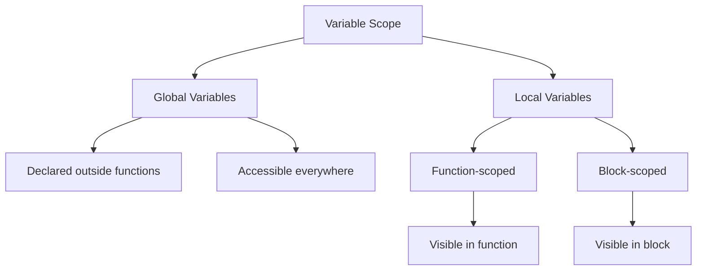

# C++ Dynamic Allocation & Functions
## Table of Contents
- [[#Pointers]]
- [[#Dynamic Memory Allocation]]
- [[#Functions]]
- [[#Parameter Passing]]
- [[#Structures]]

## Pointers
> [!info] Key Concepts
> - An address is a specific location in memory
> - A pointer is a variable that holds either:
>   - 0 (NULL)
>   - Address of another variable

### Syntax
```cpp
// Declaration
Type* pointerName;

// Initialization
pointerName = &variableName;

// Accessing value (dereferencing)
value = *pointerName;

// Modifying value
*pointerName = newValue;
```

### Example
```cpp
int main() {
    int i = 99;
    int *ptr;
    ptr = &i;
    return 0;
}
```

> [!warning] Common Pitfalls
> - Uninitialized pointers contain garbage values
> - Dereferencing NULL pointers causes crashes
> - Memory leaks from not freeing allocated memory
> - Dangling pointers after deallocation

## Dynamic Memory Allocation

### Single Variable Allocation
```cpp
// Allocation
int* ptr = new int;

// Usage
*ptr = 10;

// Deallocation
delete ptr;
```

### Array Allocation
```cpp
// 1D Array
int* arr = new int[size];
// ... use array ...
delete[] arr;

// 2D Array
int** arr = new int*[rows];
for(int i = 0; i < rows; i++) {
    arr[i] = new int[cols];
}
// Deallocation
for(int i = 0; i < rows; i++) {
    delete[] arr[i];
}
delete[] arr;
```

> [!tip] Best Practices
> - Always pair `new` with `delete`
> - Use `delete[]` for arrays
> - Set pointers to `nullptr` after deletion
> - Consider using smart pointers in modern C++
> - Check allocation success

### Structure Allocation
```cpp
struct Client {
    int code;
    float salary;
};

Client* person = new Client;
person->code = 1234;    // Note arrow operator
person->salary = 45000;
delete person;
```

## Functions

### Basic Syntax
```cpp
returnType functionName(parameterType1 param1, parameterType2 param2);
```

### Variable Scope



> [!note] Variable Scope Rules
> 1. Local variables shadow global variables
> 2. Block-scoped variables shadow function-scoped variables
> 3. Each function has its own set of local variables
> 4. Global variables should be used sparingly

## Parameter Passing

### Comparison Table

| Method | Syntax | Modifies Original | Performance | Use Case |
|--------|---------|-------------------|-------------|-----------|
| By Value | `void func(int x)` | ❌ | Copy overhead | Small objects |
| By Reference | `void func(int& x)` | ✅ | No copy | Large objects, need to modify |
| By Address | `void func(int* x)` | ✅ | No copy | Optional parameters (nullptr) |

### Examples

```cpp
// By Value
void incrementValue(int n, int i) {
    n = n + i;  // Original unchanged
}

// By Reference
void incrementRef(int& n, int i) {
    n = n + i;  // Original modified
}

// By Address
void incrementPtr(int* n, int i) {
    *n = *n + i;  // Original modified
}
```

## Structures

### Basic Structure
```cpp
struct Employee {
    int code;
    float salary;
};
```

> [!important] Structure Features
> - Can contain different data types
> - Can be assigned directly (unlike arrays)
> - Can be passed to functions
> - Can be recursive (self-referential)

### Parameter Passing with Structures

```cpp
// By Value
void modifyValue(Employee emp) {
    emp.salary += 1000;  // Original unchanged
}

// By Reference
void modifyRef(Employee& emp) {
    emp.salary += 1000;  // Original modified
}

// By Pointer
void modifyPtr(Employee* emp) {
    emp->salary += 1000;  // Original modified
}
```

> [!warning] Structure Pitfalls
> - Large structures passed by value cause performance overhead
> - Recursive structures need careful memory management
> - Arrow operator (`->`) for pointers vs dot (`.`) for direct access
> - Memory alignment can affect structure size

## Related Topics
- [[Memory Management]]
- [[C++ Best Practices]]
- [[Object-Oriented Programming]]
- [[Data Structures]]