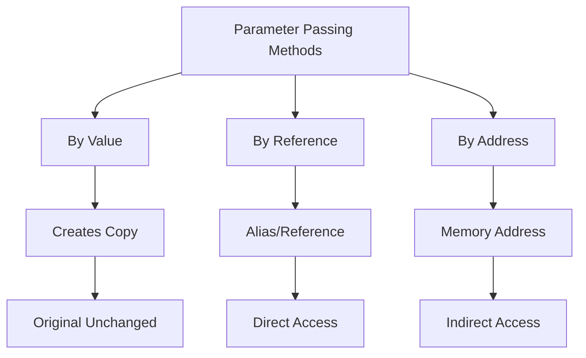
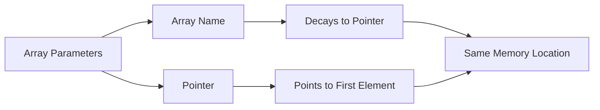

z# C++ Parameter Passing Deep Dive
## Table of Contents
- [[#Overview]]
- [[#By Value]]
- [[#By Reference]]
- [[#By Address]]
- [[#Arrays and Pointers]]
- [[#Common Pitfalls]]
- [[#Best Practices]]

## Overview



## By Value
> [!info] Characteristics
> - Creates a complete copy of the argument
> - Changes to parameter don't affect original
> - Most memory-intensive but safest
> - Default method in C++

### Examples with Different Types

#### 1. Basic Types
```cpp
void modifyInt(int x) {
    x += 10;  // Local copy modified
}

int main() {
    int num = 5;
    modifyInt(num);
    cout << num;  // Still 5
}
```

#### 2. Structures
```cpp
struct Point {
    int x, y;
};

void movePoint(Point p) {
    p.x += 10;  // Local copy modified
    p.y += 10;
}

int main() {
    Point p1 = {0, 0};
    movePoint(p1);
    cout << p1.x << p1.y;  // Still 0,0
}
```

> [!warning] Performance Impact
> - Large objects create significant overhead
> - Each call creates new stack frame
> - Avoid for large structures or classes

## By Reference
> [!info] Characteristics
> - Creates an alias for the original variable
> - Direct access to original memory
> - No copy overhead
> - Changes affect original variable

### Examples with Different Types

#### 1. Basic Types
```cpp
void modifyInt(int& x) {
    x += 10;  // Original modified
}

int main() {
    int num = 5;
    modifyInt(num);
    cout << num;  // Now 15
}
```

#### 2. Structures
```cpp
void movePoint(Point& p) {
    p.x += 10;  // Original modified
    p.y += 10;
}

int main() {
    Point p1 = {0, 0};
    movePoint(p1);
    cout << p1.x << p1.y;  // Now 10,10
}
```

> [!tip] When to Use References
> - Large objects to avoid copying
> - When modification is intended
> - In range-based for loops
> - As function return types

## By Address
> [!info] Characteristics
> - Passes memory address
> - Requires dereferencing
> - Can be null
> - Similar performance to references

### Examples with Different Types

#### 1. Basic Types
```cpp
void modifyInt(int* x) {
    if (x != nullptr) {
        *x += 10;  // Original modified through pointer
    }
}

int main() {
    int num = 5;
    modifyInt(&num);
    cout << num;  // Now 15
}
```

#### 2. Structures
```cpp
void movePoint(Point* p) {
    if (p) {
        p->x += 10;  // Original modified through pointer
        p->y += 10;
    }
}

int main() {
    Point p1 = {0, 0};
    movePoint(&p1);
    cout << p1.x << p1.y;  // Now 10,10
}
```

## Arrays and Pointers

### Array Parameter Special Cases



#### Different Ways to Pass Arrays

```cpp
// These are all equivalent for arrays
void processArray(int arr[]);
void processArray(int* arr);
void processArray(int arr[10]);  // Size ignored

// For 2D arrays, first dimension can be omitted
void process2DArray(int arr[][3]);
void process2DArray(int (*arr)[3]);
```

> [!important] Array vs Pointer Differences
> 1. Arrays
>    - Fixed size
>    - Cannot be reassigned
>    - Sizeof gives total array size
>
> 2. Pointers
>    - Can point anywhere
>    - Can be reassigned
>    - Sizeof gives pointer size only

### Examples of Array Handling

#### 1. One-Dimensional Arrays
```cpp
void modifyArray(int arr[], int size) {
    // arr is a pointer to first element
    arr[0] = 100;  // Modifies original array
    
    // These are equivalent:
    arr[1] = 200;
    *(arr + 1) = 200;
}

int main() {
    int numbers[5] = {1, 2, 3, 4, 5};
    modifyArray(numbers, 5);
    // numbers[0] is now 100
}
```

#### 2. Two-Dimensional Arrays
```cpp
void modify2DArray(int (*arr)[3], int rows) {
    // arr is a pointer to array of 3 ints
    arr[0][0] = 100;  // Modifies original array
    
    // These are equivalent:
    arr[1][0] = 200;
    (*(arr + 1))[0] = 200;
}

int main() {
    int matrix[2][3] = {{1,2,3}, {4,5,6}};
    modify2DArray(matrix, 2);
    // matrix[0][0] is now 100
}
```

## Common Pitfalls

> [!warning] Watch Out For
> 1. **Array Decay**
>    ```cpp
>    void func(int arr[]) {
>        // sizeof(arr) will NOT give array size!
>        // arr has decayed to pointer
>    }
>    ```
>
> 2. **Dangling References**
>    ```cpp
>    int& getDanglingRef() {
>        int x = 10;
>        return x;  // DANGEROUS! x destroyed after function
>    }
>    ```
>
> 3. **Null Pointer Dereferencing**
>    ```cpp
>    void func(int* ptr) {
>        *ptr = 10;  // Crashes if ptr is null
>    }
>    ```

## Best Practices

> [!tip] Tips for Parameter Passing
> 1. Use references for:
>    - Large objects to avoid copying
>    - When you need to modify the original
>    - In for-each loops
>
> 2. Use pointers for:
>    - Optional parameters (nullptr)
>    - Dynamic allocation
>    - C-style arrays
>
> 3. Use value for:
>    - Small objects (int, char, etc.)
>    - When you need a local copy
>    - When modification should be local

### Performance Comparison

| Method | Memory Usage | Speed | Safety | Use Case |
|--------|--------------|-------|---------|-----------|
| Value | High (copies) | Slower | Safest | Small objects |
| Reference | Low | Fastest | Safe | Large objects |
| Pointer | Low | Fast | Less safe | Optional/Arrays |

## Related Topics
- [[Memory Management]]
- [[C++ Arrays]]
- [[Pointer Arithmetic]]
- [[Reference Semantics]]