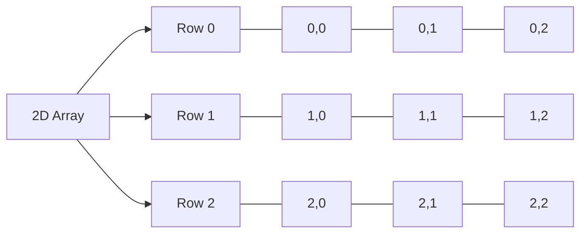

### 1. Basic Declaration
In C++, a 2D array (or double array) is essentially an array of arrays. A declaration like:

```cpp
int a[10][10];
```

declares a 2D array with 10 rows and 10 columns. Each element is accessed with two indices: one for the row and one for the column.

### 2. Dimension Specification Rules

When declaring a multidimensional array in C++, only the last dimension must be specified if the array is passed to a function:

- **`int a[][3]`**: This is valid since the last dimension is specified.
- **`int a[3][]`**: This is invalid because the last dimension is missing.

Example:

```cpp
int a[][3];  // ✅ OK - first dimension can be omitted
int a[3][];  // ❌ NOT OK - last dimension must be specified
```

> **Note**: In C++, the second dimension (or last for higher dimensions) must always be specified for memory layout purposes. 

### 3. Array Dimensions Explained
For a declaration like:

```cpp
int a[3][4];
```

- **First number (3)** = Number of rows
- **Second number (4)** = Number of columns
- **Total elements** = rows × columns (3 × 4 = 12 elements)

Example initialization:

```cpp
int a[3][3] = {
    {1, 2, 4},
    {1, 3, 5},
    {5, 6, 8}
};
```

Each entry, `a[i][j]`, represents an integer at row `i` and column `j`.

### 4. Function Parameter Declarations

In function parameters, partially specified dimensions are allowed, but only for the first dimension:

```cpp
void func(int a[][]);     // ❌ WRONG - last dimension must be specified
void func(int a[3][]);    // ❌ WRONG - last dimension must be specified
void func(int a[][3]);    // ✅ CORRECT - last dimension specified
void func(int *a[]);      // ❌ WRONG for 2D arrays
```

For 2D arrays, `int a[][3]` is valid as a function parameter since C++ only requires the last dimension to be specified. However, `int a[3][];` is invalid, as C++ needs the last dimension size to determine memory layout. 


### 5. 2D Array Declaration and Usage Rules

1. **Basic Declaration**  
   A 2D array in C++ is declared as `int a[rows][columns];`. For instance:
   ```cpp
   int a[3][3] = {
       {1, 2, 3},
       {4, 5, 6},
       {7, 8, 9}
   };
   ```
   This creates a 3x3 grid, where elements are accessed via `a[i][j]`.

2. **Dimension Specification Rules**  
   In C++, the last dimension in a 2D array must be specified to allow the compiler to calculate memory offsets. Examples:
   - **`int a[][3]`**: Valid—last dimension specified.
   - **`int a[3][]`**: Invalid—last dimension is missing.

   ```cpp
   int a[][3];  // ✅ OK - last dimension specified
   int a[3][];  // ❌ NOT OK - last dimension required
   ```

3. **Function Parameter Declaration**  
   When passing a 2D array to a function, you can omit the first dimension but must specify the second:
   ```cpp
   void func(int a[][3]);    // ✅ Correct
   void func(int a[][]);     // ❌ Incorrect - last dimension required
   void func(int *a[]);      // ❌ Incorrect for 2D arrays
   ```

4. **Memory Layout**  
   A 2D array is stored sequentially in memory:
   ```
   [1][2][3][4][5][6][7][8][9]
   ```

5. **Example Usage**
   ```cpp
   // Declaration and initialization
   int matrix[][3] = {
       {1, 2, 3},
       {4, 5, 6}
   };
   
   // Function to process the matrix
   void processMatrix(int arr[][3], int rows) {
       for(int i = 0; i < rows; i++) {
           for(int j = 0; j < 3; j++) {
               // Process arr[i][j]
           }
       }
   }
   
   // Function call
   processMatrix(matrix, 2);
   ```

6. **Common Pitfalls**
   - Forgetting to specify the second dimension
   - Omitting the second dimension in function parameters
   - Confusing arrays of pointers with true 2D arrays

### 6. Pointer vs Array Notation  
| Notation       | Meaning                          | Example                     |
| -------------- | -------------------------------- | --------------------------- |
| `int* a`       | Pointer to an integer            | `int* p = &x;`              |
| `int a[]`      | Array of integers                | `int arr[] = {1,2,3};`      |
| `int* a[]`     | Array of pointers to integers    | `int* ptrs[] = {&x, &y};`   |
| `int (*a)[3]`  | Pointer to an array of 3 integers| `int (*p)[3] = matrix;`     |
| `int a[][]`    | 2D array (requires full size)    | `int arr[][3] = {{1,2,3}};` |

> **Tips**:
> - Always specify the second dimension for 2D arrays.
> - For dynamic sizing, consider using `vector<vector<int>>`.

