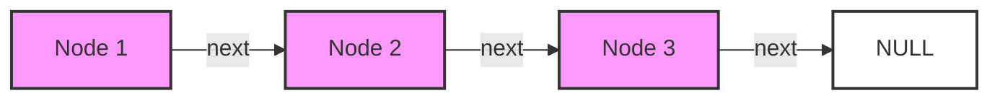
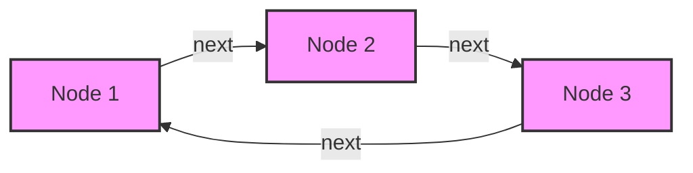
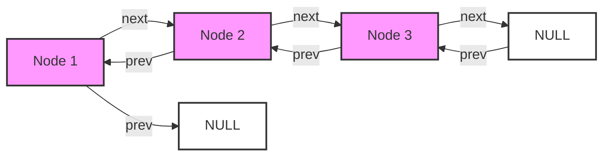

> [!note] Overview
> This note covers three types of linked lists:
> 1. Singly Linked Lists
> 2. Circular Linked Lists
> 3. Doubly Linked Lists

## Basic Structure



## 1. Singly Linked Lists 🔗

### Node Structure
```cpp
struct element {
    int info;      // Data (can be any type)
    element* suivant;  // Next pointer
};
```

### Essential Operations

#### Initialization
```cpp
void initialiser(element*& debut) {
    debut = NULL;
}
```

> [!tip] Best Practice
> Always initialize your list head to NULL to avoid undefined behavior

#### Traversal Operations

| Operation | Time Complexity | Space Complexity |
|-----------|----------------|------------------|
| Traverse  | O(n)          | O(1)             |
| Insert at Head | O(1)     | O(1)             |
| Insert at Tail | O(n)     | O(1)             |
| Delete at Head | O(1)     | O(1)             |
| Delete at Tail | O(n)     | O(1)             |

> [!warning] Common Pitfalls
> - Not updating the head pointer when inserting/deleting at the beginning
> - Memory leaks when deleting nodes
> - Not handling empty list cases
> - Not handling single node cases separately

### Key Operations Code

#### Insert Operations
1. **Insert at Head**
```cpp
void inserer_tete(element*& debut, int val) {
    element* nouveau = new element;
    nouveau->info = val;
    nouveau->suivant = NULL;
    
    if (debut == NULL) {
        debut = nouveau;
    } else {
        nouveau->suivant = debut;
        debut = nouveau;
    }
}
```

2. **Insert at Tail**
```cpp
void inserer_Fin(element*& debut, int x) {
    element* nouveau = new element;
    nouveau->val = x;
    nouveau->suivant = NULL;
    
    if (debut == NULL) {
        debut = nouveau;
    } else {
        element* courant = debut;
        while(courant->suivant != NULL) {
            courant = courant->suivant;
        }
        courant->suivant = nouveau;
    }
}
```

## 2. Circular Linked Lists ⭕



> [!info] Key Difference
> The last node points back to the first node instead of NULL

## 3. Doubly Linked Lists ⬅️➡️

### Node Structure
```cpp
struct element {
    int info;
    element* precedent;  // Previous pointer
    element* suivant;    // Next pointer
};
```



### Operations Comparison

| Operation | Singly Linked | Doubly Linked |
|-----------|---------------|---------------|
| Insert Head| O(1)         | O(1)          |
| Insert Tail| O(n)         | O(1)*         |
| Delete Head| O(1)         | O(1)          |
| Delete Tail| O(n)         | O(1)*         |
| Reverse Traversal| O(n)   | O(1)          |

*With tail pointer

> [!tip] When to Use Each Type
> - **Singly Linked**: When memory is constrained and you only need forward traversal
> - **Circular Linked**: For round-robin scheduling or circular buffer implementations
> - **Doubly Linked**: When you need bi-directional traversal or quick deletions given a node

### Memory Management Tips 🧠

1. Always delete nodes when removing them
2. Set pointers to NULL after deletion
3. Handle edge cases:
   - Empty list
   - Single node
   - Two nodes
   - Operations at head/tail

> [!warning] Critical Considerations
> 1. Memory Leaks
> 2. Dangling Pointers
> 3. Null Pointer Dereference
> 4. Lost Chain Links

## Related Topics
- [[Stack Implementation]]
- [[Queue Implementation]]
- [[Dynamic Memory Management]]
- [[Data Structures Basics]]

## Practice Exercises 📝
1. Implement a function to detect cycles in a linked list
2. Reverse a linked list iteratively and recursively
3. Find the middle element of a linked list
4. Merge two sorted linked lists
5. Implement a circular queue using circular linked list

#algorithms #data-structures #cpp


---


### Linked Lists in C++: Essential Primitives

---

#### 1. **Singly Linked Lists**

---

A singly linked list is a linear data structure where each element, or node, contains a data part (`info`) and a pointer (`suivant`) to the next node.

**Declaration**

```cpp
struct element {
    int info;         // data type can be primitive or composite
    element* suivant; // pointer to the next element
};
```

---

### Primitives for Singly Linked Lists

#### Initialization
Initializes a linked list by setting the starting pointer `debut` to `NULL`.

```cpp
void initialiser(element*& debut) {
    debut = NULL;
}
```

**Note:** This sets up an empty list.

---

#### Traversal
Traverses a linked list and prints each node’s `info`.

```cpp
void parcourir(element* debut) {
    element* courant = debut;
    while (courant != NULL) {
        cout << courant->info;
        courant = courant->suivant;
    }
}
```

**Common Pitfall:** Ensure that `courant` is initialized correctly; failing to do so may cause segmentation faults.

---

#### Insertion at the Head
Adds a new node at the beginning of the list.

```cpp
void inserer_tete(element*& debut, int val) {
    element* nouveau = new element;
    nouveau->info = val;
    nouveau->suivant = debut;
    debut = nouveau;
}
```

**Tip:** Head insertions are O(1), making them very efficient.

---

#### Insertion at the End
Adds a new node at the end of the list.

```cpp
void inserer_Fin(element*& debut, int x) {
    element* nouveau = new element;
    nouveau->info = x;
    nouveau->suivant = NULL;

    if (debut == NULL) {
        debut = nouveau;
    } else {
        element* courant = debut;
        while (courant->suivant != NULL) {
            courant = courant->suivant;
        }
        courant->suivant = nouveau;
    }
}
```

---

### **Table of Common Singly Linked List Operations**

| Operation                   | Complexity | Description                                                  |
|-----------------------------|------------|--------------------------------------------------------------|
| Initialize                  | O(1)       | Sets list to empty (NULL head).                              |
| Traverse                    | O(n)       | Visits each node to access or print values.                  |
| Insert at Head              | O(1)       | Efficiently adds node at the start.                          |
| Insert at Tail              | O(n)       | Traverses list to append a new node at the end.              |

---

### **Warnings**

> **⚠️ Warning:** While inserting nodes at the end, ensure the `courant->suivant` check is implemented correctly to avoid null pointer dereferencing.

> **⚠️ Warning:** When deleting nodes, freeing pointers without correct memory handling may lead to memory leaks.

---

### 2. **Circular Linked Lists**

---

A circular linked list is a variation where the last node points back to the first node, forming a closed loop.

---

### 3. **Doubly Linked Lists**

---

In a doubly linked list, each node contains two pointers: one to the next node and one to the previous node.

**Declaration**

```cpp
struct element {
    int info;           // data can be primitive or composite
    element* precedent; // pointer to the previous element
    element* suivant;   // pointer to the next element
};
```

---

#### **Doubly Linked List Primitives**

#### Insert at Head
Adds a new node at the beginning of a doubly linked list.

```cpp
void insererDebut(element*& debut, int x) {
    element* nouveau = new element;
    nouveau->info = x;
    nouveau->precedent = NULL;

    if (debut == NULL) {
        nouveau->suivant = NULL;
        debut = nouveau;
    } else {
        debut->precedent = nouveau;
        nouveau->suivant = debut;
        debut = nouveau;
    }
}
```

---

#### Insert at Tail
Appends a node to the end of the doubly linked list.

```cpp
void insererFin(element*& debut, int x) {
    element* nouveau = new element;
    nouveau->info = x;
    nouveau->suivant = NULL;

    if (debut == NULL) {
        debut = nouveau;
    } else {
        element* courant = debut;
        while (courant->suivant != NULL) {
            courant = courant->suivant;
        }
        courant->suivant = nouveau;
        nouveau->precedent = courant;
    }
}
```

---

### **Graphical Overview of Linked Lists**


---

### **Common Errors in Linked List Implementations**

1. **Memory Leaks**: Ensure `delete` is called after nodes are removed.
2. **Null Pointer Dereferencing**: Always check if a pointer is `NULL` before dereferencing.
3. **Double-Free Errors**: Avoid freeing a pointer twice by setting it to `NULL` after deletion.

