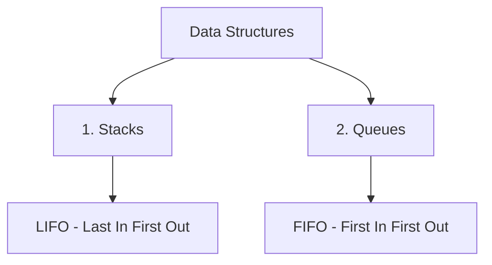

# Essential Primitives for Stacks and Queues

## 1. Stacks (Piles)

A stack is a Last-In-First-Out (LIFO) data structure that can be implemented using either contiguous arrays or linked lists.

### A. Contiguous Representation

In a contiguous representation, we use arrays to store elements with an integer to track the top position (`sommet`).

```cpp
const int Max = 100;
struct Pile {
    int element[Max];
    int sommet;
};
```

#### Primitive Operations

- **Initialize Stack**  
  Initializes the stack to an empty state.
  ```cpp
  void initPile(Pile &p) {
      p.sommet = 0;
  }
  ```

- **Check if Stack is Empty**  
  Returns `true` if the stack is empty, `false` otherwise.
  ```cpp
  bool pileVide(Pile p) {
      return p.sommet == 0;
  }
  ```

- **Push (Empiler) an Element**  
  Adds an element to the top of the stack.
  ```cpp
  void empiler(Pile &p, int val) {
      if (p.sommet == Max)
          cout << "Pile pleine";
      else {
          p.element[p.sommet] = val;
          p.sommet++;
      }
  }
  ```

- **Pop (Depiler) an Element**  
  Removes an element from the top of the stack and retrieves its value.
  ```cpp
  void depiler(Pile &p, int &val) {
      if (pileVide(p))
          cout << "Pile vide!";
      else {
          p.sommet--;
          val = p.element[p.sommet];
      }
  }
  ```

### B. Linked List Representation (Dynamic Stack)

In a linked list representation, each node points to the next, with the `sommet` pointer marking the stack's top.

```cpp
struct PileL {
    int info;
    PileL *suivant;
};
```

#### Primitive Operations

- **Initialize Stack**  
  ```cpp
  void initPile(PileL *&sommet) {
      sommet = NULL;
  }
  ```

- **Check if Stack is Empty**  
  ```cpp
  bool pileVide(PileL *sommet) {
      return sommet == NULL;
  }
  ```

- **Push (Empiler) an Element**  
  Same principle as `insererDebut` for linked lists.

- **Pop (Depiler) an Element**  
  Same principle as `supDebut`, but with value retrieval.

---


# Essential Data Structures: Stacks 
#data-structures #cpp #algorithms 



# 1. Stacks
#stack #lifo

## 1.1 Memory Representation
> [!info] Two Possible Methods
> 1. ✅ Using Arrays (contiguous representation)
> 2. ✅ Using Linear Linked Lists

## 1.2 Basic Structure
```cpp
const int Max = 100;
struct stack {
    int element[Max];  // can be any type
    int top;
};
```

## 1.3 Essential Operations (Primitives)

### A. Initialization
```cpp
// Version 1: Pass by reference
void initStack(stack &s) {
    s.top = 0;
}

// Version 2: Pass by address
void initStack(stack *s) {
    s->top = 0;
}
```

> [!tip] Parameter Passing
> Two methods shown:
> - By reference using &
> - By pointer using *

### B. Check if Stack is Empty
```cpp
// Version 1: Concise
bool isStackEmpty(stack s) {
    return s.top == 0;
}

// Version 2: Explicit
bool isStackEmpty(stack s) {
    if (s.top == 0)
        return 1;
    else
        return 0;
}
```

### C. Push Element
```cpp
void push(stack &s, int val) {
    if (s.top == Max)
        cout << "Stack is full ";
    else {
        s.element[s.top] = val;
        s.top++;
    }
}
```

### D. Pop Element
```cpp
void pop(stack &s, int &val) {
    if (isStackEmpty(s))
        cout << "Stack is empty! ";
    // Rest of implementation to be added
}
```

## 1.4 Common Pitfalls
> [!warning] Watch Out For
> - Stack overflow (when pushing)
> - Stack underflow (when popping)
> - Not updating top pointer
> - Incorrect parameter passing method
