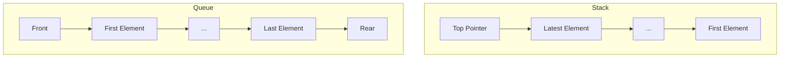

## 2. Queues (Files)

A queue is a First-In-First-Out (FIFO) data structure, implemented either as contiguous arrays or linked lists.

### A. Contiguous Representation

In this model, we use arrays to store elements with an integer tracking the number of elements (`nbrelement`).

```cpp
const int Max = 100;
struct FileT {
    int element[Max];
    int nbrelement;
};
```

#### Primitive Operations

- **Initialize Queue**  
  ```cpp
  void initFile(FileT &f) {
      f.nbrelement = 0;
  }
  ```

- **Check if Queue is Empty**  
  ```cpp
  bool fileVide(FileT f) {
      return f.nbrelement == 0;
  }
  ```

- **Enqueue (Enfiler) an Element**  
  Adds an element to the end of the queue.
  ```cpp
  void enfiler(FileT &f, int val) {
      if (f.nbrelement == Max)
          cout << "La file est pleine.";
      else {
          f.element[f.nbrelement] = val;
          f.nbrelement++;
      }
  }
  ```

- **Dequeue (Defiler) an Element**  
  Removes an element from the front of the queue.
  ```cpp
  void defiler(FileT &f, int &val) {
      if (fileVide(f))
          cout << "La file est vide.";
      else {
          val = f.element[0];
          for (int i = 0; i < f.nbrelement - 1; i++) {
              f.element[i] = f.element[i + 1];
          }
          f.nbrelement--;
      }
  }
  ```

### B. Linked List Representation (Dynamic Queue)

For a dynamic queue, we enqueue at one end and dequeue from the other.

```cpp
struct FileL {
    int info;
    FileL *suivant;
};
```

#### Primitive Operations

- **Initialize Queue**  
  ```cpp
  void initFile(FileL *&f) {
      f = NULL;
  }
  ```

- **Check if Queue is Empty**  
  ```cpp
  bool fileVide(FileL *f) {
      return f == NULL;
  }
  ```

- **Enqueue (Enfiler) an Element**  
  Similar to `insererDebut`.

- **Dequeue (Defiler) an Element**  
  Similar to `supFin`, retrieving the removed element's value.

---

### C. Circular Queue (File Circulaire)

In circular queues, insertion happens at one end while deletion occurs at the other, and both ends wrap around when reaching the array boundaries.

```cpp
const int DMax = 100;
struct FileC {
    int element[DMax];
    int IndiceIn, IndiceOut;
    bool pleine;
};
```

#### Primitive Operations

- **Initialize Circular Queue**  
  ```cpp
  void initFile(FileC &f) {
      f.IndiceIn = 0;
      f.IndiceOut = 0;
      f.pleine = false;
  }
  ```

- **Check if Queue is Empty**  
  ```cpp
  bool fileVide(FileC f) {
      return (f.IndiceIn == f.IndiceOut) && !f.pleine;
  }
  ```

- **Enqueue (Enfiler) an Element**  
  ```cpp
  void enfiler(FileC &f, int x) {
      if (f.pleine)
          cout << "File pleine";
      else {
          f.element[f.IndiceIn] = x;
          f.IndiceIn = (f.IndiceIn + 1) % DMax;
          if (f.IndiceIn == f.IndiceOut)
              f.pleine = true;
      }
  }
  ```

- **Dequeue (Defiler) an Element**  
  ```cpp
  void defiler(FileC &f, int &x) {
      if (fileVide(f))
          cout << "File vide";
      else {
          x = f.element[f.IndiceOut];
          f.IndiceOut = (f.IndiceOut + 1) % DMax;
          f.pleine = false;
      }
  }
  ```

---

This structured overview provides key information about stack and queue operations, covering contiguous, linked, and circular implementations. These primitives are essential for implementing data structures and understanding memory handling in C++.


---


# 2. Queues
#queue #fifo

## 2.1 Basic Structure
```cpp
const int Max = /*size*/;
struct queue {
    int element[Max];
    int numElements;
};
```

## 2.2 Essential Operations

### A. Initialization
```cpp
void initQueue(queue &q) {
    q.numElements = 0;
}
```

### B. Check if Queue is Empty
```cpp
bool isQueueEmpty(queue q) {
    if (q.numElements == 0)
        return 1;
    else
        return 0;
}
```

### C. Enqueue Element
```cpp
void enqueue(queue &q, int val) {
    if (q.numElements == Max)
        cout << "Queue is full.";
    // Rest of implementation to be added
}
```

## Operation Time Complexities

| Operation | Stack | Queue |
|-----------|-------|-------|
| Initialize| O(1)  | O(1)  |
| Push/Enqueue| O(1)| O(1)  |
| Pop/Dequeue | O(1)| O(1)  |
| isEmpty    | O(1) | O(1)  |

## Memory Management Visualization


> [!note] Implementation Differences
> - Stack uses single pointer (top)
> - Queue typically needs two pointers (front & rear)
> - Both use fixed-size arrays in this implementation

###### Tags
#data-structures #algorithms #cpp #stack #queue #university-course