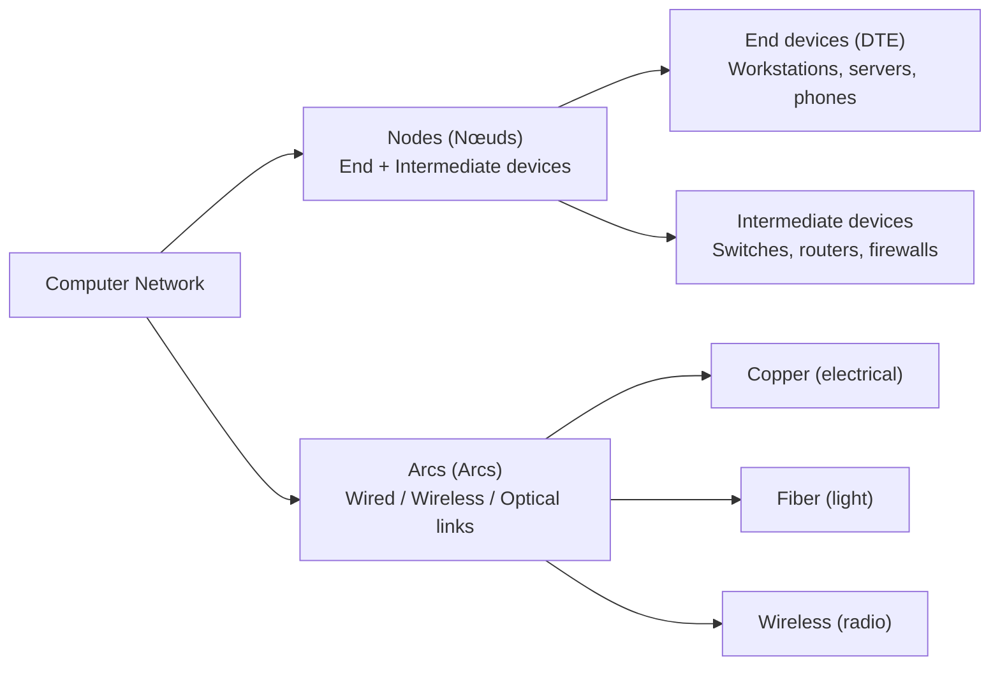

# 01.01 — What is a Computer Network?

> [!definition] Computer Network (Réseau Informatique)
> A **computer network** is an interconnection of **autonomous computing entities** (called *nodes* or *nœuds*) via **communication links** (called *arcs* or *moyens de communication*) for the purpose of exchanging information and sharing resources.

The two words to underline in that definition are *autonomous* and *interconnection*. **Autonomous** means each node has its own CPU, memory, and operating system — it is not a dumb peripheral of another node. A printer attached to a single PC via USB is *not* a network node; that same printer plugged into an Ethernet switch *is*. **Interconnection** means the links are bidirectional and standardized so that any node can in principle talk to any other node — not a fixed point-to-point channel like a serial console cable.

---

##  Objectives of Networking

Networks exist to solve four practical problems. Keep this list in mind whenever you encounter a new protocol — you can usually classify its purpose by mapping it to one of these objectives.

| # | Objective | Example |
| :-: | :--- | :--- |
| 1 | **Resource sharing** | One printer or file server used by 30 workstations; one GPU server shared by a research group. |
| 2 | **Communication** | Email, chat, VoIP, video conferencing. |
| 3 | **Collaborative work & gaming** | Real-time document editing, multiplayer game servers. |
| 4 | **Cost & time reduction** | Centralized backups, automated software updates, remote administration. |

A fifth objective that has grown dominant in the last decade is **data aggregation and analytics** — sensors and IoT devices streaming into central platforms — but in classical syllabi this is folded under "communication".

---

##  Core Architectural Components

Every network, regardless of scale, decomposes into two kinds of building blocks:

### Nodes (Nœuds)
Any device with a network interface. We split them into two categories (covered in detail in [[01 - Network Fundamentals/01.03 Device Classification|01.03]]):

- **End devices (DTE — Data Terminal Equipment):** workstations, laptops, servers, IP phones, surveillance cameras, smartphones, IoT sensors. These are the *originators and consumers* of traffic.
- **Intermediate devices:** repeaters, hubs, bridges, switches, routers, firewalls, gateways. These *forward, filter, or transform* traffic but typically do not originate it (with notable exceptions like OSPF hello packets or ICMP echo replies).

### Arcs (Arcs)
The physical or wireless medium that carries the signal. We classify them by the form of energy used to represent bits:

- **Copper (electrical):** twisted-pair Cat5e/6/6a/7, coaxial. Bits are voltage levels.
- **Fiber (light):** single-mode (long-haul, laser), multi-mode (campus, LED). Bits are light pulses.
- **Wireless (radio):** Wi-Fi, Bluetooth, GSM/4G/5G, LoRa, satellite. Bits are modulated electromagnetic waves.

The choice of medium governs bandwidth, attenuation, immunity to interference, and cost. We expand on this in [[01 - Network Fundamentals/01.04 Transmission Media|01.04]].

---

##  Interdisciplinary Interactions

Networking does not exist in a vacuum. It is the connective tissue between other computer-science disciplines. The roadmap explicitly calls out four:

- **Database Management Systems (Bases de données):** A distributed database is only as fast as the network that links its shards; conversely, application servers without a network have no reason to talk to a remote DB.
- **Information Security (Sécurité informatique):** Every security primitive — confidentiality, integrity, authentication, availability — is implemented on top of network protocols. TLS, IPsec, MACsec, 802.1X all live in the stack.
- **Cloud Computing:** The cloud is, fundamentally, "someone else's computer accessed over a network." Latency, bandwidth, and reliability of the network define the ceiling of what cloud applications can do.
- **Advanced Software Programming:** Modern applications are distributed by default. Microservices, message queues, RPC frameworks, and even build systems (CI/CD pipelines) all assume a working network — and break in interesting ways when it isn't.

> [!example] Concrete Example
> When you load `https://example.com` in a browser, you exercise **all four** disciplines:
> 1. **Networking:** DNS lookup, TCP handshake, TLS handshake, HTTP/2 request/response.
> 2. **Databases:** the origin server queries a replica DB for the page content.
> 3. **Security:** TLS validates the certificate; HSTS forces HTTPS.
> 4. **Cloud & advanced programming:** the server is probably a container in Kubernetes, talking to other microservices over an internal network.

---

##  A Note on the French Etymology

Many classical networking textbooks (and academic syllabi in francophone systems) use French terminology alongside English. You will encounter both throughout this vault:

| English | French | Used in |
| :--- | :--- | :--- |
| Node | Nœud | Topology, routing |
| Arc / Link | Arc / Moyen de communication | Topology |
| Source | Émetteur | Communication elements |
| Destination | Récepteur | Communication elements |
| Channel | Canal | Communication elements |
| Router | Routeur | Layer 3 |
| Switch | Commutateur | Layer 2 |
| Hub | Concentrateur | Layer 1 (legacy) |
| Bridge | Pont | Layer 2 (legacy) |
| Gateway | Passerelle | Layer 7 / inter-stack |
| Firewall | Pare-feu | Layer 3–7 security |

Knowing both is useful when reading RFCs in translation, working with French-speaking teams, or following legacy course material.

---

##  See Also

- [[01 - Network Fundamentals/01.02 Elements of Network Communication|01.02 Elements of Network Communication]] — narrows the lens to the four primitives every protocol assumes.
- [[01 - Network Fundamentals/01.03 Device Classification|01.03 Device Classification]] — expands the node/arc dichotomy.
- [[02 - Reference Models (OSI & TCP-IP)/02.00 Chapter Overview|Chapter 2 Overview]] — why this all becomes a 7-layer stack.
