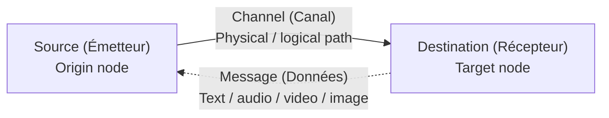

# 01.02 — Elements of Network Communication

> [!abstract] The Four Primitives
> Every networked conversation — from a single ARP request to a long-lived HTTP/2 stream — reduces to **four primitives**: a *message*, a *source*, a *destination*, and a *channel*. Mastering them gives you the vocabulary to read any protocol spec.

---

##  The Message

The **message** is the raw payload to be transmitted. It can take any digital form:

| Type | Examples | Typical size |
| :--- | :--- | :--- |
| Text | Email body, chat message, HTTP header | Bytes to kilobytes |
| Audio | VoIP frame, music stream | Kilobytes per second |
| Image | JPEG photo, screen share frame | Tens of kilobytes to megabytes |
| Video | Streaming chunk, conferencing frame | Megabytes per second |

Two important properties of a message drive most protocol design:

1. **Size** — large messages must be split into smaller chunks ([[05 - IP Datagram & Fragmentation/05.02 Fragmentation Mathematics|fragmentation]]) and reassembled.
2. **Loss tolerance** — a video frame can usually be dropped without breaking the experience; a banking transaction cannot. This drives the choice between TCP ([[10 - Transport Layer/10.06 TCP|reliable]]) and UDP ([[10 - Transport Layer/10.05 UDP|best-effort]]).

---

##  The Source (Émetteur)

The **source** is the node that originates the message. In a layered stack the source is *layer-aware*: a packet's L2 source MAC, L3 source IP, and L4 source port can all point to different entities once NAT ([[09 - NAT & Perimeter Security/09.00 Chapter Overview|Chapter 9]]) or proxies ([[09 - NAT & Perimeter Security/09.07 Proxy Servers|9.07]]) are in the path.

> [!warning] Common Confusion
> "Source" is relative to the layer you're inspecting. A NAT router rewrites the L3 source IP on outbound packets, but the L2 source MAC remains the router's interface. When debugging with Wireshark, *always* ask: "Source at which layer?"

---

##  The Destination (Récepteur)

The **destination** is the node (or group of nodes) the message is addressed to. Destinations come in three flavors, and this distinction drives the entire media-access layer:

| Destination Type | L2 Address Pattern | L3 Address Pattern | Reach |
| :--- | :--- | :--- | :--- |
| **Unicast** | Specific MAC | Specific IP | One node |
| **Multicast** | `01:00:5E:XX:XX:XX` (IPv4) | `224.0.0.0/4` | A subscribed group |
| **Broadcast** | `FF:FF:FF:FF:FF:FF` | `255.255.255.255` (limited) | All nodes on the local segment |

A fourth category, **anycast**, appears in IPv6 (and is sometimes used in IPv4 at the BGP level). An anycast address is *routed* to the topologically nearest node advertising that prefix — used heavily by DNS root servers and CDNs.

---

##  The Channel (Canal)

The **channel** is the physical or logical path the message travels from source to destination. Channels are layered:

- **Physical channel:** a copper pair, a fiber strand, a radio frequency band.
- **Logical channel:** a TCP connection, an SSH tunnel, a VPN, a Wi-Fi SSID — these are *abstractions* over a physical channel.

A channel has four key properties that constrain what can be sent across it:

| Property | Unit | Why It Matters |
| :--- | :-: | :--- |
| Bandwidth | bits/sec | Caps throughput |
| Latency | ms | Caps interactivity; affects TCP congestion window growth |
| Jitter | ms (variation) | Affects real-time media |
| Loss | % of packets | Affects reliability requirements |

The interplay of these four is the entire subject of **Quality of Service (QoS)** and **congestion control** — covered when we get to [[10 - Transport Layer/10.10 TCP Reliability & Congestion Control|TCP congestion control]].

---

##  How the Four Primitives Map to a Real Protocol

Consider a DNS lookup for `example.com`. Walk it through the four primitives:

| Primitive | Concrete value in this DNS lookup |
| :--- | :--- |
| Message | "What is the A record for example.com?" — a ~60-byte DNS query |
| Source | Your laptop, `192.168.1.42:53821` (ephemeral port) |
| Destination | Resolver, `8.8.8.8:53` (well-known port) |
| Channel | UDP over Ethernet over copper Cat6 to your home router, then fiber to your ISP, then BGP-routed to Google |

If any of the four is misconfigured — wrong destination IP, blocked channel (firewall), malformed message (truncated DNS packet) — the lookup fails. Troubleshooting is fundamentally *walking the four primitives and asking which one is broken*.

---

##  See Also

- [[01 - Network Fundamentals/01.01 What is a Computer Network|01.01 What is a Network]] — broader context.
- [[01 - Network Fundamentals/01.07 Transmission & Connection Modes|01.07 Transmission & Connection Modes]] — how messages actually flow across a channel.
- [[06 - ARP & Address Resolution/06.02 ARP Operation Lifecycle|ARP Operation Lifecycle]] — a concrete protocol that uses broadcast as its destination.
