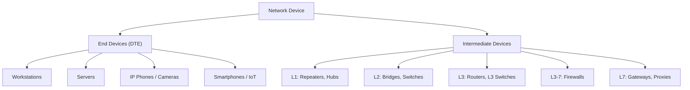

# 01.03 — Device Classification

> [!abstract] The Big Split
> Every network device falls into exactly one of two buckets: it either **originates or consumes traffic** (end device / DTE) or it **forwards, filters, or transforms traffic** (intermediate device). Knowing which bucket a device sits in tells you immediately what OSI layer it operates at and what its failure modes look like.

---

##  End Devices (DTE — Data Terminal Equipment)

**Role:** Provide the user-facing or application-facing interface to the network. DTEs are the *originators and consumers* of payload traffic.

| Category | Examples | Notes |
| :--- | :--- | :--- |
| Workstations | Desktops, laptops | The "classic" end device |
| Servers | Web, file, mail, database, DNS | Often rack-mounted in data centers |
| Networked peripherals | Printers, scanners, NAS | Once dumb, now full Linux boxes |
| Real-time endpoints | VoIP phones, teleconference cameras | Often PoE-powered |
| Surveillance | IP cameras, NVRs | Continuous streaming workloads |
| Mobile & handheld | Smartphones, tablets, barcode scanners | Often multi-interface (Wi-Fi + cellular) |
| IoT | Sensors, actuators, smart appliances | Constrained CPU/memory, often low-power radio |

A DTE typically has one or more **network interface cards (NICs)**. Each NIC has a hardware MAC address ([[03 - Physical & Data Link Layer/03.02 MAC Addressing|03.02]]), and the OS assigns it an IP address. From the network's perspective, the DTE *is* the IP address.

---

##  Intermediate Devices

**Role:** Provide connectivity, manage data flow, and form subnetworks. Intermediate devices do not typically generate user payload — they forward it. (Exceptions: routing protocol updates, ICMP errors, management traffic.)

We classify them by the highest OSI layer at which they make forwarding decisions:

### Layer 1 — Physical

| Device | Behavior | Status today |
| :--- | :--- | :--- |
| **Repeater** | Regenerates and retransmits a signal to extend distance. No address inspection. | Mostly historical; fiber SFPs have replaced discrete repeaters. |
| **Hub (Concentrateur)** | Multi-port repeater. Floods incoming bits out all other ports. | Effectively obsolete; replaced by switches. Useful as a teaching tool for *why* switches were invented. |

> [!warning] Hub mental model
> A hub is a single **collision domain** and a single **broadcast domain**. Every transmission collides with every other transmission, which forces hosts to use CSMA/CD. This is why hubs cap effective throughput well below the headline rate.

### Layer 2 — Data Link

| Device | Behavior | Status today |
| :--- | :--- | :--- |
| **Bridge (Pont)** | Connects two L2 segments, forwarding frames based on MAC address. | Largely absorbed into switches. |
| **Switch (Commutateur)** | Multi-port bridge. Learns source MACs, builds a CAM table, forwards frames only to the destination port. | The dominant L2 device in modern LANs. |

A switch creates **one collision domain per port** but shares a **single broadcast domain** across all ports (unless VLANs split it). See [[03 - Physical & Data Link Layer/03.04 Hubs vs Switches|03.04]] for the full comparison.

### Layer 3 — Network

| Device | Behavior |
| :--- | :--- |
| **Router (Routeur)** | Forwards packets between IP subnets based on a routing table. Runs routing protocols (RIP, OSPF, BGP, EIGRP). |
| **Layer 3 Switch** | A switch with routing hardware; can forward both L2 frames (intra-VLAN) and L3 packets (inter-VLAN) at line rate. |

Routers terminate broadcast domains — a broadcast frame arriving on one router interface is **not** forwarded out any other interface. This is the architectural reason IP uses broadcasts sparingly and preferentially uses multicasts for group communication.

### Layer 3–7 — Security Devices

| Device | Behavior |
| :--- | :--- |
| **Firewall (Pare-feu)** | Inspects traffic against a ruleset. Stateful firewalls track connections; next-gen firewalls (NGFW) do deep packet inspection and application awareness. |
| **IPS / IDS** | Intrusion Prevention / Detection System. IDS watches and alerts; IPS actively drops malicious traffic. |

### Layer 7 — Application Gateway

| Device | Behavior |
| :--- | :--- |
| **Gateway (Passerelle)** | A generic term for a device that translates between two protocol stacks. Today mostly lives as software (e.g., an IoT gateway translating Zigbee to IP). |
| **Proxy** | An intermediary that terminates and re-initiates connections on behalf of clients. See [[09 - NAT & Perimeter Security/09.07 Proxy Servers|09.07]]. |
| **Application Delivery Controller (ADC)** | A reverse proxy on steroids: TLS termination, load balancing, WAF, caching. Examples: F5 BIG-IP, HAProxy, NGINX. |

---

##  Mental Shortcut: "What Layer Is This Device?"

When confronted with a device you've never seen, ask:

1. **Does it inspect MAC addresses?** → Layer 2 (bridge, switch)
2. **Does it inspect IP addresses and decrement TTL?** → Layer 3 (router, L3 switch)
3. **Does it inspect TCP/UDP ports?** → Layer 4+ (stateful firewall, load balancer)
4. **Does it inspect HTTP headers or app payloads?** → Layer 7 (proxy, WAF, ADC)
5. **Does it only regenerate bits?** → Layer 1 (repeater, hub)

This shortcut will correctly classify ~95% of devices in production networks. The remaining 5% are usually hybrid devices (e.g., a wireless access point that bridges Wi-Fi to Ethernet at L2 but also runs a DHCP relay at L3).

---

##  See Also

- [[03 - Physical & Data Link Layer/03.04 Hubs vs Switches|03.04 Hubs vs Switches]] — deeper dive on the L1 vs L2 distinction.
- [[07 - IP Routing/07.05 Router Operations & Packet Processing|07.05 Router Operations]] — what a router actually does to a packet.
- [[09 - NAT & Perimeter Security/09.06 DMZ Architecture|09.06 DMZ]] — how firewalls and bastion hosts are arranged at the perimeter.
