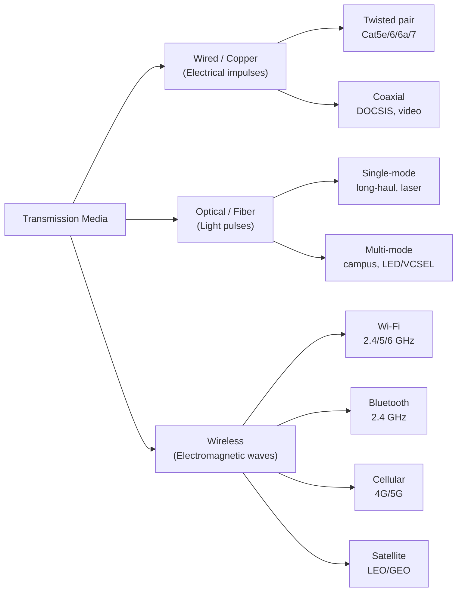

# 01.04 — Transmission Media

> [!abstract] The Three Families
> Every link in a network carries bits as some form of physical energy. We classify media into three families by the energy they use: **electrical** (copper), **optical** (light), and **radio** (wireless). Each family has a distinct trade-off between bandwidth, distance, cost, and immunity to interference.

---

##  Wired / Copper (Electrical)

Copper media represent bits as voltage levels on metal conductors. Two physical constructions dominate:

### Twisted Pair
- **Construction:** 4 pairs of copper wires, each pair twisted at a different pitch to cancel crosstalk.
- **Categories:** Cat5e (1 Gbps @ 100 m), Cat6 (10 Gbps @ 55 m), Cat6a (10 Gbps @ 100 m), Cat7 (10 Gbps @ 100 m, shielded).
- **Connectors:** RJ-45 (8P8C) for Ethernet; GG45/TERA for Cat7+.
- **Use cases:** In-building Ethernet drops, patch panels, server racks.

### Coaxial
- **Construction:** Central copper core, dielectric insulator, braided shield, outer jacket.
- **Use cases:** Cable TV / DOCSIS broadband, old-school 10BASE2 Ethernet (historical), RF antenna feeds.

> [!info] Why Twisted?
> Each pair is twisted so that electromagnetic interference induces a *common-mode* voltage on both wires equally. The receiver measures the *differential* voltage, which cancels the interference. This trick — *differential signaling* — is also why USB, CAN bus, and RS-485 are so noise-resistant.

---

##  Optical / Fiber (Light)

Fiber represents bits as pulses of light — typically infrared (1310 nm or 1550 nm for long-haul, 850 nm for short-range). Two flavors:

| Type | Light Source | Core Diameter | Distance | Cost | Use Case |
| :--- | :--- | :-: | :--- | :--- | :--- |
| **Single-mode (SMF)** | Laser | 8–10 µm | 10–80 km+ (no repeaters); 100+ km with optical amplifiers | High | Long-haul, datacenter interconnect, ISP backbone |
| **Multi-mode (MMF)** | LED or VCSEL | 50–62.5 µm | 100–550 m (depending on bandwidth grade) | Lower | Within a building or datacenter |

**Connectors:** SC, LC (most common today), ST (older), MPO/MTP (parallel optics for 40G/100G/400G).

**Why fiber wins on distance:** light in glass attenuates at ~0.2–0.4 dB/km, vs copper's loss of ~10 dB/km at high frequencies. Fiber is also **immune to electromagnetic interference** — you can run it next to a 100 kV power line with zero crosstalk. And it doesn't conduct electricity, so it eliminates ground loops and lightning-induced surges.

---

##  Wireless (Radio)

Wireless links represent bits as modulated radio waves. The key trade-off is **spectrum is shared** — only one transmitter may use a given frequency at a given time in a given area, enforced by various multiple-access schemes (CSMA/CA for Wi-Fi, TDMA/FDMA for cellular).

| Technology | Band | Range | Throughput | Use |
| :--- | :-: | :-: | :-: | :--- |
| **Wi-Fi (802.11)** | 2.4 / 5 / 6 GHz | 30–100 m | Up to 9.6 Gbps (Wi-Fi 7) | Home & enterprise LAN |
| **Bluetooth** | 2.4 GHz | 10–100 m | Up to 2 Mbps (BT 5) | Peripherals, audio, IoT |
| **Zigbee / Thread** | 2.4 GHz | 10–100 m | 250 kbps | Smart home, low-power mesh |
| **4G LTE** | 600 MHz – 2.5 GHz | 1–30 km | Up to 1 Gbps (peak) | Mobile broadband |
| **5G NR** | Sub-6 GHz + mmWave | 100 m – 10 km | Up to 10 Gbps (mmWave) | Mobile broadband, fixed wireless |
| **LoRaWAN** | Sub-GHz (433/868/915) | 2–15 km | 0.3–50 kbps | Long-range IoT |
| **Satellite (LEO)** | Ka/Ku band | Global | 50–250 Mbps typical | Starlink, OneWeb, rural broadband |
| **Satellite (GEO)** | Ka/Ku band | Continental | 1–25 Mbps (high latency) | VSAT, traditional internet in remote areas |

Wireless is convenient but introduces challenges wired links don't have: **interference** (microwaves, neighboring networks, weather), **hidden node** problems, **fading** (multipath), and **security** (anyone in range can listen).

---

##  Choosing a Medium

A network engineer choosing a medium weighs five factors:

1. **Bandwidth required** — fiber > copper > wireless, roughly.
2. **Distance** — fiber wins beyond ~100 m.
3. **Environment** — fiber if EMI is high (factory floor, near power lines); wireless if running cable is impractical.
4. **Cost** — copper is cheapest per port; fiber is cheap per meter but expensive per transceiver; wireless has high upfront AP cost but zero cabling.
5. **Security** — fiber can't be tapped without physically splicing; copper can be inductively sniffed; wireless is broadcast to anyone in range.

> [!example] Worked Example
> You're connecting a server rack to a switch 30 m away in the same data center. **Copper Cat6A** is the right choice — 30 m is well within copper's range, the transceivers (RJ-45 ports) are cheap, and the rack-to-switch run is short enough that bandwidth (10 Gbps) is comfortable.
>
> Now you're connecting two buildings 2 km apart. **Single-mode fiber** is the only sane choice — copper won't reach, wireless would be unreliable in rain, and fiber gives you effectively unlimited headroom for future upgrades.

---

##  Comparison Matrix

| Property | Copper (TP) | Fiber (SMF) | Wi-Fi |
| :--- | :-: | :-: | :-: |
| Max bandwidth | 10 Gbps (Cat6a, 100 m) | 400+ Gbps per λ; terabits with WDM | ~10 Gbps (Wi-Fi 7, shared) |
| Max distance | 100 m | 80+ km | 100 m (typical) |
| EMI immunity | Low | Perfect | Low (subject to interference) |
| Security | Moderate (physical tap) | High (hard to tap) | Low (anyone in range) |
| Cost per port | Low | High | Medium (one AP serves many) |
| Deployment effort | Medium (cable pulls) | High (fusion splicing) | Low (just mount the AP) |

---

##  See Also

- [[03 - Physical & Data Link Layer/03.00 Chapter Overview|Chapter 3]] — how bits become Ethernet frames.
- [[09 - NAT & Perimeter Security/09.08 VPN Fundamentals|09.08 VPN]] — when you can't physically run fiber, a VPN over the internet can simulate a private link.
- [[12 - Tunnels & Remote Access/12.00 Chapter Overview|Chapter 12]] — tunneling protocols that ride on top of any of these media.
