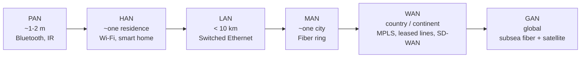

# 01.05 — Network Scale Classification

> [!abstract] The Geographic Ladder
> Networks are first classified by **geographic reach**. The same protocols (IP, Ethernet, TCP) work at every scale, but the *technologies*, *ownership*, and *economic models* differ wildly. The ladder runs: PAN → HAN → LAN → MAN → WAN → GAN.

---

##  PAN — Personal Area Network

- **Range:** ~1–2 meters, user-centric.
- **Technologies:** Bluetooth, Bluetooth Low Energy (BLE), Zigbee, Near Field Communication (NFC), Infrared (IrDA — legacy).
- **Use cases:** Wireless headphones, fitness trackers, smartwatches, contactless payments, wireless keyboards.
- **Ownership:** The user; the devices are typically personally owned.

A PAN is the smallest network you can meaningfully call a network. The defining trait is **the user is the network administrator** — there's no IT team managing the Bluetooth link between your phone and earbuds.

---

##  HAN — Home Area Network

- **Range:** A single residence.
- **Technologies:** Wi-Fi (dominant), Ethernet (for desktop PCs and NAS), MoCA / powerline (for retrofits).
- **Use cases:** Shared internet access, smart-home appliances (lights, thermostats, cameras), family printers, media streaming.
- **Ownership:** The homeowner; ISP owns the upstream link up to the demarc.

HANs are technically a subtype of LAN but warrant their own bucket because of the **consumer-grade equipment** and **non-expert operators**. Security is typically weak (default Wi-Fi passwords, unmanaged switches, no segmentation), which is why HANs are prime targets for IoT botnets like Mirai.

---

##  LAN — Local Area Network

- **Range:** < 10 km — a building, a campus, a factory floor.
- **Technologies:** Switched Ethernet (1/10/25/100 Gbps), Wi-Fi for client access, occasional FCoE in data centers.
- **Use cases:** Office networks, campus backbones, datacenter fabrics, factory floors.
- **Ownership:** A single organization; usually managed by an IT team.

LANs are where most network engineering happens. Key design concerns:

- **Collision/broadcast domain management** — switches split collision domains; VLANs split broadcast domains.
- **Spanning Tree Protocol (STP)** — prevents L2 loops in redundant topologies. See [[03 - Physical & Data Link Layer/03.05 Spanning Tree Protocol|03.05]].
- **Address planning** — internal subnets ([[04 - IPv4 Network Layer/04.05 FLSM|FLSM]] / [[04 - IPv4 Network Layer/04.06 VLSM|VLSM]]).
- **Internal routing** — usually OSPF or static; sometimes EIGRP.

---

##  MAN — Metropolitan Area Network

- **Range:** A city or metropolitan area (typically 5–50 km).
- **Technologies:** Fiber optic rings (often dark fiber lit by the operator), CWDM/DWDM, Carrier Ethernet, occasionally SONET/SDH (legacy).
- **Use cases:** Connecting multiple branches of a university, government, or bank within a city; municipal Wi-Fi backhaul; metro fiber to the home (FTTH).
- **Ownership:** Either a single large organization (private MAN) or a carrier selling lit services.

A MAN is typically structured as a **resilient fiber ring** with self-healing capabilities (e.g., ERP/G.8032 or legacy SONET APS). Traffic between any two points on the ring traverses at most half the ring's circumference.

---

##  WAN — Wide Area Network

- **Range:** Country, continental, or inter-continental scale.
- **Technologies:**
  - **Leased lines** — T1/E1, T3/E3, OC-3/12/48 (legacy SDH/SONET).
  - **MPLS L3 VPN** — carrier-provided any-to-any connectivity with QoS.
  - **Carrier Ethernet** — MetroE / VPLS extending L2 across cities.
  - **Internet VPNs** — IPsec site-to-site tunnels over the public internet.
  - **SD-WAN** — software-defined overlay that abstracts multiple underlay links (broadband + LTE + MPLS) and routes traffic per policy.
- **Use cases:** Branch office connectivity, datacenter interconnect, remote worker backhaul.
- **Ownership:** Typically hybrid — the organization owns the CPE (customer premise equipment) and the carrier owns the transport.

WAN bandwidth is expensive compared to LAN, so WAN design is dominated by **traffic engineering**: prioritize critical apps, deduplicate, compress, cache. The transition from TDM to MPLS to SD-WAN over the last 30 years is essentially a story of trading dedicated circuits for statistical multiplexing.

---

##  GAN — Global Area Network

- **Range:** Global.
- **Technologies:** Undersea fiber optic cables (the actual backbone of the global internet — 99% of intercontinental traffic), satellite constellations (LEO: Starlink, OneWeb, Kuiper; GEO: Viasat, Inmarsat — for areas the undersea cables don't reach).
- **Use cases:** Intercontinental internet, global corporate networks, maritime and aviation connectivity, military communications.
- **Ownership:** A handful of Tier 1 carriers and consortiums (e.g., the SUBCOM-1 cable is jointly owned by several carriers).

The internet itself is the canonical GAN. When you traceroute to a server in another continent, your packets likely traverse 2–4 undersea cables and a handful of Tier 1 ASes.

---

##  Comparison Matrix

| Scale | Range | Owner | Typical Tech | Latency |
| :--- | :--- | :--- | :--- | :-: |
| PAN | 1–2 m | Individual | Bluetooth, NFC | < 10 ms |
| HAN | One house | Homeowner | Wi-Fi, MoCA | 1–5 ms |
| LAN | < 10 km | Organization | Ethernet, Wi-Fi | < 1 ms (wired) |
| MAN | One city | Org or carrier | Fiber ring, Carrier Ethernet | 1–10 ms |
| WAN | Country | Carrier | MPLS, SD-WAN, IPsec | 10–100 ms |
| GAN | Global | Tier 1 carriers | Undersea fiber, satellite | 50–250 ms (fiber); 600+ ms (GEO) |

---

##  Common Pitfall: Confusing Scale with Topology

Scale (LAN/MAN/WAN) is about **geography and ownership**. Topology (star/mesh/ring) is about **how nodes are wired together**. A campus LAN can be a mesh; a global WAN can be a hub-and-spoke. Don't conflate the two.

---

##  See Also

- [[01 - Network Fundamentals/01.06 Network Topologies|01.06 Network Topologies]] — the shape of the wiring, orthogonal to the scale.
- [[09 - NAT & Perimeter Security/09.08 VPN Fundamentals|09.08 VPN]] — how WANs are often built today: overlay tunnels across the public internet.
- [[12 - Tunnels & Remote Access/12.00 Chapter Overview|Chapter 12]] — modern alternatives to traditional WAN technologies.
