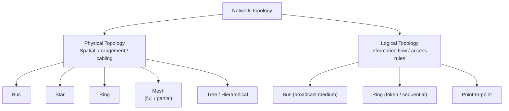
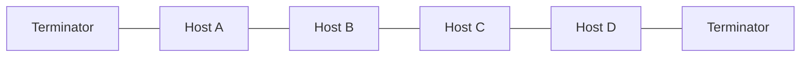
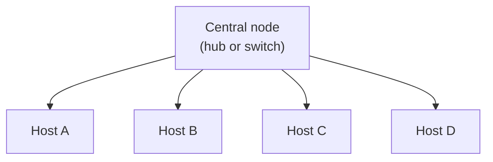
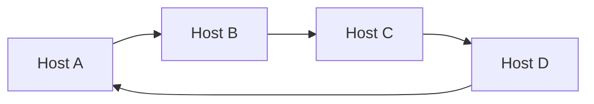
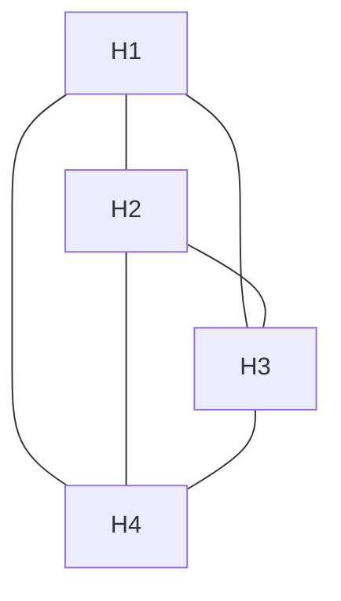
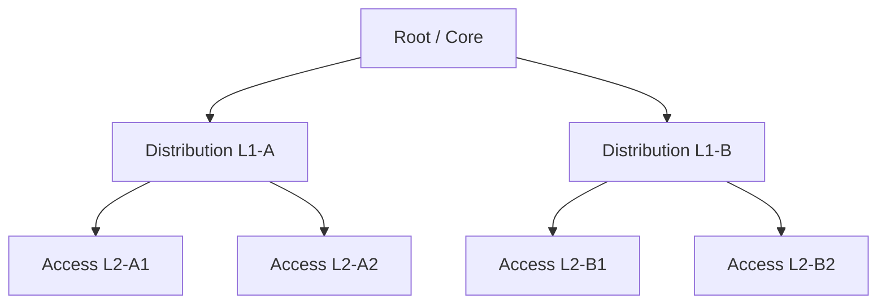

# 01.06 — Network Topologies

> [!abstract] Physical vs Logical
> A network has **two topologies**: the *physical* (how the cables are run) and the *logical* (how traffic actually flows). The two are often different. A modern wired LAN is physically a **star** (every cable home-runs to a switch) but logically a **bus** (one broadcast domain) or a **mesh** (if using STP-blocked redundant links).

---

##  Bus Topology

- **Mechanic:** All nodes share a single coaxial cable. A transmission from any node is seen by all others.
- **Terminators (bouchons):** Required at both ends to absorb the signal and prevent reflections.
- **Access:** CSMA/CD (in 10BASE5/10BASE2 Ethernet) — listen before transmit, detect collisions, back off.
- **Strengths:** Cheap, simple, uses less cable than a star.
- **Weaknesses:**
  - **Single sender constraint** — collisions degrade throughput under load.
  - **Single point of failure** — a cable break splits the network in two.
  - **Signal attenuation** limits total cable length.
- **Modern usage:** Effectively extinct in production LANs. Survives as a teaching example because every later topology is best understood as a reaction to bus topology's limitations.

---

##  Star Topology (Étoile)

- **Mechanic:** Every node has a dedicated point-to-point link to a central device.
- **Central device matters:**
  - **Hub at center:** The hub is a multi-port repeater — it floods every frame to every port. The star is physically a star but *logically a bus* (single collision domain, single broadcast domain).
  - **Switch at center:** The switch inspects MAC addresses and unicasts frames to the destination port only. The star is physically a star and *logically a collection of point-to-point links* — one collision domain per port, still a single broadcast domain.
- **Strengths:**
  - Easy to scale (add ports to the central device).
  - Easy to troubleshoot (a broken cable takes down one node, not the whole network).
  - Cable runs can be longer than bus.
- **Weaknesses:**
  - **Central point of failure** — if the central switch dies, the whole segment is down.
  - More cabling than bus.
- **Modern usage:** The dominant topology for access-layer LANs. Datacenter "spine-leaf" is a refinement of the star pattern (see Mesh, below).

> [!example] Hub vs Switch Behavior
> Host A sends a frame to Host C.
> - **Hub:** The frame is flooded out *all* ports. Hosts B, C, and D all receive it. Only Host C keeps it; the others drop it.
> - **Switch:** The switch looks up Host C's MAC in its CAM table and forwards the frame out *only* Host C's port. Hosts B and D never see it.
>
> This single difference is why a 100 Mbps hub achieves ~40 Mbps aggregate throughput under load, while a 100 Mbps switch achieves ~200 Mbps aggregate (100 Mbps each direction, full-duplex).

---

##  Ring Topology (Anneau)

- **Mechanic:** Each node connects point-to-point to its upstream and downstream neighbors, forming a closed loop. Data passes sequentially from node to node until it reaches the destination.
- **Two flavors:**
  - **Token Ring (IEEE 802.5):** A "token" circulates the ring; only the node holding the token may transmit. Eliminates collisions but wastes bandwidth when no one has data to send.
  - **FDDI / Resilient Packet Ring (RPR):** Dual counter-rotating rings for redundancy. If one ring breaks, traffic wraps around the other way.
- **Strengths:** Deterministic access (no collisions), predictable latency under load, fair bandwidth sharing.
- **Weaknesses:**
  - **Single node failure breaks the ring** (unless dual-ring with wrap).
  - Latency grows linearly with ring size.
- **Modern usage:** Largely historical for LANs. Survives in:
  - **SONET/SDH** metropolitan rings (carrier transport).
  - **Resilient Packet Ring (RPR / IEEE 802.17)** in some metro Ethernet deployments.
  - **Token-passing schemes** in some industrial control networks.

---

##  Mesh Topology (Maillé)

- **Mechanic:** Every node connects to multiple other nodes. Two sub-types:
  - **Fully meshed:** every node connects to every other node. $N$ nodes → $\frac{N(N-1)}{2}$ links.
  - **Partially meshed:** each node connects to a subset of other nodes. The most common production deployment.
- **Strengths:**
  - **High redundancy** — multiple paths between any two nodes; if one link fails, traffic reroutes.
  - **No central point of failure.**
  - Supports multipath routing and load sharing.
- **Weaknesses:**
  - **Cabling explosion** in fully meshed mode ($O(N^2)$ links).
  - **Complex to manage** — many adjacencies to maintain.
- **Modern usage:**
  - **Datacenter spine-leaf** is a two-tier mesh that scales better than full mesh.
  - **Internet backbone** — Tier 1 carriers mesh with each other at multiple exchange points.
  - **Wireless mesh** — Wi-Fi mesh systems (Eero, Nest WiFi), community meshes (Freifunk), and tactical military networks.

---

##  Tree / Hierarchical Topology (Arborescente)

- **Mechanic:** Combines star and bus features — a root node at the top, distribution layers below, and access switches at the leaves.
- **Strengths:**
  - **Scales very well** — adding a new branch doesn't disturb the rest.
  - **Clear hierarchy** for routing and policy (core → distribution → access).
  - Easy to summarize routes up the tree (see [[04 - IPv4 Network Layer/04.07 CIDR & Route Summarization|summarization]]).
- **Weaknesses:**
  - **Root becomes critical** — a core failure takes down everything beneath it. Mitigated with redundant cores.
  - Latency from leaf to leaf across the tree can be high.
- **Modern usage:** The classical **Cisco 3-layer architecture** (core / distribution / access) is a tree. Most campus networks are trees. Datacenter "spine-leaf" is a flatter variant that drops the distribution layer.

---

##  Physical vs Logical — The Trap

Consider a typical office LAN:

| Aspect | Reality |
| :--- | :--- |
| **Physical topology** | Star — every wall jack home-runs to a switch in the IDF closet. |
| **Logical topology (one VLAN)** | Bus — every host in the VLAN sees every broadcast. |
| **Logical topology (across VLANs)** | Mesh — multiple VLANs and inter-VLAN routing make traffic patterns arbitrary. |

The classic exam trap: "Is Ethernet a bus or a star topology?" The correct answer is "**physically a star (modern switched Ethernet), but historically a bus (10BASE2/10BASE5), and logically still a bus at the broadcast-domain level**." Be prepared to elaborate.

---

##  Topology Decision Matrix

| Topology | Cost | Scalability | Redundancy | Troubleshooting | Use When |
| :--- | :--- | :--- | :--- | :--- | :--- |
| Bus | Low | Poor | None | Hard | Never (legacy) |
| Star | Medium | Good | At center only | Easy | Access layer, small/medium LANs |
| Ring | Medium | Medium | With dual ring | Medium | Metro transport, deterministic latency |
| Mesh (partial) | High | Good | High | Hard | Backbones, datacenters |
| Mesh (full) | Very high | Poor (O(N²)) | Very high | Hard | Small critical cores, military |
| Tree | Medium | Excellent | At root only | Easy | Campus, datacenter, hierarchical routing |

---

##  See Also

- [[03 - Physical & Data Link Layer/03.04 Hubs vs Switches|03.04 Hubs vs Switches]] — concrete impact of central-device choice on a star topology.
- [[03 - Physical & Data Link Layer/03.05 Spanning Tree Protocol|03.05 STP]] — how we make a switched star-with-redundant-links logically loop-free.
- [[08 - Routing Protocols/08.05 OSPF Areas & Router Types|08.05 OSPF Areas]] — how hierarchical routing maps onto tree topologies.
