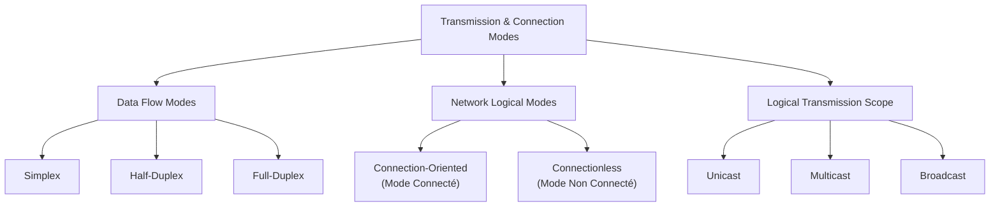
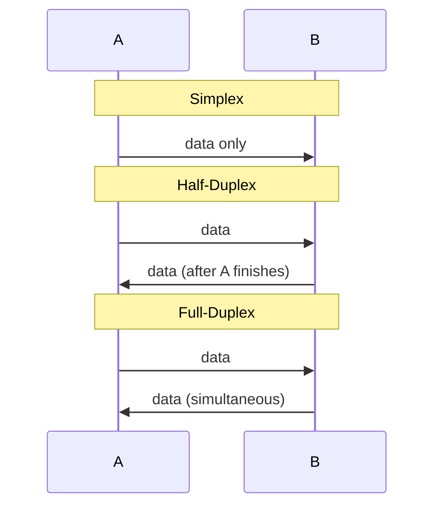

# 01.07 — Transmission & Connection Modes

> [!abstract] Three Orthogonal Axes
> Every communication can be classified along three **independent** axes: data-flow direction (simplex / half-duplex / full-duplex), connection behavior (connection-oriented / connectionless), and destination scope (unicast / multicast / broadcast). Understanding that these axes are independent is the key to reasoning about real protocols.

---

## 1⃣ Data Flow Modes (Direction)

| Mode | Direction | Example |
| :--- | :--- | :--- |
| **Simplex** | One-way only | Keyboard → PC; radio broadcast; GPS satellite → receiver |
| **Half-Duplex** | Either direction, but **not simultaneously** | Walkie-talkie ("over!"); legacy 10BASE2 Ethernet; CSMA/CD |
| **Full-Duplex** | Both directions simultaneously | Modern switched Ethernet; telephone; cellular |

The transition from half-duplex to full-duplex was the single biggest throughput improvement in Ethernet history. A 100 Mbps half-duplex link effectively achieves ~40 Mbps aggregate (due to collisions and CSMA/CD back-off). The same link full-duplex achieves 200 Mbps aggregate (100 in each direction simultaneously). Switched Ethernet made this possible by giving every port its own collision domain.

---

## 2⃣ Network Logical Modes (Connection Behavior)

### Connection-Oriented (Mode Connecté)

A connection-oriented protocol establishes a **session** before exchanging data. Three phases:

1. **Connection establishment** — handshake; both sides agree on parameters (sequence numbers, window size, encryption keys).
2. **Data transfer** — packets flow along the established path; reliability is enforced.
3. **Connection termination** — explicit teardown frees resources.

| Property | Connection-Oriented |
| :--- | :--- |
| Path reservation | Often (e.g., ATM virtual circuits) or session-maintained (e.g., TCP) |
| Reliability | Built-in |
| Ordering | Guaranteed |
| Overhead | Higher (handshake, state, ACKs) |
| Examples | **TCP** (transport), **ATM**, **Frame Relay**, **MPLS LSPs**, **X.25** (historical) |

### Connectionless (Mode Non Connecté)

A connectionless protocol sends data **without prior negotiation**. Each packet is routed independently — there is no session state on intermediate devices (with the modern exception of NAT, firewalls, and MPLS, which *do* maintain state).

| Property | Connectionless |
| :--- | :--- |
| Path reservation | None |
| Reliability | Best-effort (no ACKs) |
| Ordering | Not guaranteed |
| Overhead | Minimal |
| Examples | **IP**, **UDP**, **ICMP**, **Ethernet** itself |

> [!info] The Big Picture
> The **Internet Protocol (IP)** is connectionless. **TCP** rides on top of IP and *adds* connection-oriented behavior. **UDP** also rides on IP and stays connectionless. This is the core architectural decision that lets the internet scale — routers don't have to maintain per-flow state, only the endpoints do.

---

## 3⃣ Logical Transmission Scope (Destination Type)

| Scope | Recipients | L2 Pattern | L3 Pattern | Example |
| :--- | :--- | :--- | :--- | :--- |
| **Unicast** | One specific node | Specific MAC | Specific IP | HTTP request to a web server |
| **Multicast** | A subscribed group | `01:00:5E:XX:XX:XX` | `224.0.0.0/4` (IPv4) | OSPF hellos (`224.0.0.5`), IPTV, video conferencing |
| **Broadcast** | All nodes on the segment | `FF:FF:FF:FF:FF:FF` | `255.255.255.255` (limited) | ARP request, DHCP DISCOVER |

### Broadcasting (Diffusion générale)
- **One-to-all** within a broadcast domain.
- **L2 broadcast** (`FF:FF:FF:FF:FF:FF`) — flooded by switches to every port in the VLAN.
- **L3 limited broadcast** (`255.255.255.255`) — confined to the local subnet; **routers do not forward it**.
- **L3 directed broadcast** (e.g., `192.168.1.255` for `192.168.1.0/24`) — historically forwarded by routers; usually disabled by default now because of smurf attacks.

### Multicasting (Diffusion restreinte)
- **One-to-many** for a *defined subgroup* of interested receivers.
- Used heavily by routing protocols (OSPF, RIPv2, EIGRP), IPTV distribution, mDNS (`.local`), and some video conferencing systems.
- Multicasting requires special handling at L3 (IGMP for group management, PIM for distribution trees) and is *not* routable by default on the public internet — most multicast stays inside an AS.

### Unicast
- The default — one specific source, one specific destination.
- ~99% of internet traffic is unicast.

> [!warning] Broadcast is the Enemy of Scale
> Broadcast traffic grows with $O(N)$ where $N$ is the number of hosts in the broadcast domain. A flat /16 with 65,000 hosts generating ARP requests, DHCP requests, and NetBIOS broadcasts will collapse under broadcast storm conditions. This is why VLANs and subnetting exist — to cap broadcast domains at a manageable size. See [[04 - IPv4 Network Layer/04.05 FLSM|FLSM]] and [[04 - IPv4 Network Layer/04.06 VLSM|VLSM]].

---

##  Putting the Three Axes Together

Take a single concrete protocol and classify it on all three axes:

| Protocol | Flow Mode | Connection Mode | Destination Scope |
| :--- | :-: | :--- | :--- |
| HTTP/1.1 over TCP | Full-duplex | Connection-oriented | Unicast |
| ARP request | — (one-shot) | Connectionless | Broadcast |
| OSPF Hello | Half-duplex | Connectionless | Multicast (`224.0.0.5`) |
| DHCP DISCOVER | Half-duplex | Connectionless | Broadcast |
| Streaming video over UDP | Full-duplex (data + RTCP) | Connectionless | Usually unicast (or multicast for IPTV) |

Notice that "full-duplex" and "connection-oriented" are *not* the same thing. TCP is both; UDP is full-duplex-capable but connectionless; ARP is half-duplex and connectionless. Keep these axes separate in your head.

---

##  See Also

- [[10 - Transport Layer/10.06 TCP|10.06 TCP]] — the canonical connection-oriented protocol.
- [[10 - Transport Layer/10.05 UDP|10.05 UDP]] — the canonical connectionless protocol.
- [[06 - ARP & Address Resolution/06.02 ARP Operation Lifecycle|06.02 ARP Operation]] — concrete example of broadcast in action.
- [[08 - Routing Protocols/08.04 Link-State - OSPF|08.04 OSPF]] — concrete example of multicast in action.
