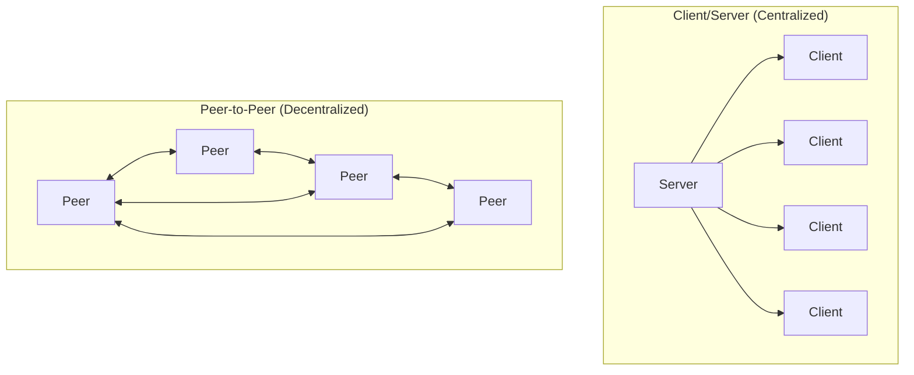
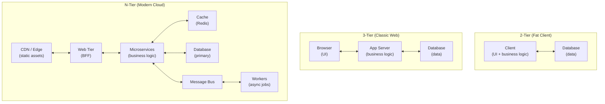

# 01.08 — Application Architectures

> [!abstract] Two Models, Endless Variations
> At the application layer, every networked system is either **client/server** (centralized: one party serves, the other requests) or **peer-to-peer** (decentralized: every node is both client and server). Most real-world systems are *hybrids* — pure models are useful as theoretical anchors.

---

##  Client/Server Architecture

The defining trait: **roles are asymmetric**. The server is a long-running process listening on a well-known port; clients initiate connections to it.

| Property | Client/Server |
| :--- | :--- |
| Direction of initiation | Client → Server (always) |
| Address discoverability | Server has a fixed, well-known address (DNS name → IP → port) |
| State | Often stateful on the server (sessions, databases) |
| Scalability bottleneck | Server capacity (CPU, bandwidth, connection slots) |
| Manageability | Centralized — easy to patch, audit, back up |
| Failure mode | Server down = entire service down |
| Examples | HTTP, SMTP, IMAP, SSH, DNS (client side) |

### Tiered Evolution

The client/server model has evolved through three architectural "tiers":

| Tier Count | When Used | Example |
| :--- | :--- | :--- |
| **2-tier** | Desktop apps talking directly to a DB | Classic VB6 + SQL Server, MS Access frontend |
| **3-tier** | The classic web app | Browser → PHP/Apache → MySQL (the original LAMP stack) |
| **n-tier** | Modern cloud-native apps | Browser → CDN → API gateway → microservices → cache/DB/queue |

Each added tier buys **separation of concerns** and **independent scaling** at the cost of **latency** and **operational complexity**. The current cloud-native pattern (microservices + service mesh + observability stack) is essentially n-tier taken to its extreme.

---

##  Peer-to-Peer (P2P) Architecture

The defining trait: **roles are symmetric**. Every node can be both a client and a server. There is no single point of authority.

| Property | Peer-to-Peer |
| :--- | :--- |
| Direction of initiation | Either direction |
| Address discoverability | Usually via a DHT (Distributed Hash Table) or a bootstrap node list |
| State | Distributed (often eventually consistent) |
| Scalability bottleneck | Network diameter, churn rate, free-rider problem |
| Manageability | Decentralized — patching, auditing, and trust are hard |
| Failure mode | Graceful degradation — losing a node reduces capacity but doesn't kill the service |
| Examples | BitTorrent, IPFS, Bitcoin/Ethereum, Skype (super-nodes), Tox |

### Sub-patterns

- **Pure P2P** — no central server at all. Example: Gnutella, IPFS.
- **Hybrid P2P (with bootstrap)** — a central server helps peers discover each other, but data flows peer-to-peer. Example: BitTorrent (tracker helps discovery; chunks transfer peer-to-peer), original Skype (supernodes).
- **Unstructured P2P** — peers connect arbitrarily; queries flood the network. Example: early Gnutella.
- **Structured P2P** — peers form a deterministic overlay (usually a DHT). Lookups are $O(\log N)$. Example: Kademlia (used by BitTorrent's DHT, IPFS, Ethereum node discovery).

### The Free-Rider Problem

In any P2P system where contributing is optional, most participants will *leech* without contributing. Measurements on early Gnutella showed ~70% of users shared no files. Solutions:
- **BitTorrent's tit-for-tat:** upload to peers who upload to you; choke non-contributors.
- **Economic incentives:** Bitcoin mining rewards, Filecoin storage payments.
- **Trust metrics:** EigenTrust and similar reputation systems.

---

##  Side-by-Side Comparison

| Dimension | Client/Server | Peer-to-Peer |
| :--- | :--- | :--- |
| Central authority | Yes | No |
| Single point of failure | Yes (the server) | No (graceful degradation) |
| Scalability | Vertical (bigger server) and horizontal (more servers) | Horizontal (more peers) — theoretically unlimited |
| Cost model | Server CAPEX + bandwidth | Distributed — peers pay their own bandwidth |
| Performance predictability | High (server is dedicated) | Variable (peers are unreliable) |
| Security model | Easy (authenticate against server) | Hard (no central authority) |
| Legal & regulatory | Central operator is liable | Often legally ambiguous (Napster, early BitTorrent) |
| Best for | Transactions requiring consistency and audit | Massive distribution of static content (software updates, media) |

---

##  Real-World Hybrids

Most systems you use daily are hybrids:

| System | Client/Server Part | P2P Part |
| :--- | :--- | :--- |
| **WhatsApp** | Login, contact list, message storage | End-to-end encrypted media delivery may use direct peer links |
| **Skype (legacy)** | Login, presence, contacts | Voice/video media (peer-to-peer via supernodes) |
| **Spotify** | Catalog, search, recommendations | Older versions used P2P for cached track distribution |
| **Bitcoin** | Centralized exchanges (Coinbase, Binance) | The blockchain itself — fully P2P |
| **Microsoft Teams** | Auth, chat history, meeting scheduling | Some media paths use direct peer connections |
| **GitHub** | Entirely C/S, *but* Git itself supports P2P clones via SSH |  |

Hybrids exist because **client/server is easy to build and operate** but **doesn't scale infinitely cheap**, while **P2P scales cheaply** but **is hard to secure and monetize**. Pick the part of your system that needs each property.

---

##  Decision Heuristic

When designing a new networked application, ask:

1. **Does the data need to be authoritative?** → Client/server (e.g., banking, e-commerce).
2. **Does the data need to be censorship-resistant?** → P2P (e.g., publishing tools, monetary systems).
3. **Is the workload dominated by distribution of large static content?** → Hybrid (C/S for control, P2P for content).
4. **Are peers unreliable?** → C/S (you can't run a database on consumer laptops).
5. **Do you need to operate without a central operator (legal, cost, or resilience)?** → P2P.

---

##  See Also

- [[10 - Transport Layer/10.02 Ports & Sockets|10.02 Ports & Sockets]] — how client/server is implemented at the transport layer.
- [[11 - Application Layer/11.01 DNS & Domain Resolution|11.01 DNS]] — a hybrid: hierarchical C/S for the namespace, but each level can be cached anywhere.
- [[11 - Application Layer/11.02 HTTP & HTTPS|11.02 HTTP/HTTPS]] — the dominant client/server protocol of our era.
- [[12 - Tunnels & Remote Access/12.00 Chapter Overview|Chapter 12]] — tunneling tools (Ngrok, Cloudflare) that make local C/S services reachable from the public internet.
