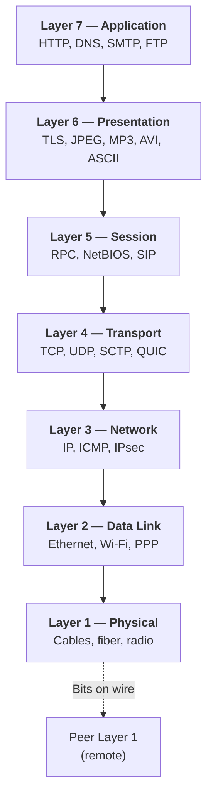

# 02.02 — The OSI 7-Layer Model

> [!abstract] The Universal Reference
> The OSI model partitions every networking task into **7 layers**, stacked vertically. Each layer uses the services of the layer below and provides services to the layer above. The model is a *teaching framework* — almost no real system implements all 7 layers strictly — but it remains the universal language for describing protocols.

---

##  Layer-by-Layer

### Layer 7 — Application
- **Responsibility:** Provides services directly to user applications. This is where HTTP, DNS, SMTP, FTP, SSH, and countless other application protocols live.
- **Does NOT include:** The applications themselves (your browser is *not* Layer 7; HTTP is Layer 7).
- **PDU name:** Data
- **Examples:** HTTP/1.1, HTTP/2, HTTP/3, DNS, SMTP, POP3, IMAP, FTP, SSH, Telnet, SNMP, DHCP.

### Layer 6 — Presentation
- **Responsibility:** Translation, encryption, compression. Translates between the application's data format and a network-Portable format.
- **Examples:** TLS (the modern home of Layer 6), JPEG/GIF/PNG image encodings, MP3/AVI media encodings, ASCII/UTF-8 character encodings, MIME types.
- **Note:** TLS sits *between* L7 and L4 in modern implementations — it doesn't perfectly fit the OSI model, but its job is pure presentation (encryption + integrity).

### Layer 5 — Session
- **Responsibility:** Dialog management — opening, maintaining, and synchronizing sessions between applications on different hosts. Checkpointing, restart, dialog control (simplex/half/full-duplex).
- **Examples:** NetBIOS, RPC, SIP, PPTP (the control channel).
- **Reality check:** Most modern applications collapse Session into Application (HTTP cookies + TLS sessions do session work without a separate Layer 5). The layer is included for completeness but is rarely seen in isolation.

### Layer 4 — Transport
- **Responsibility:** End-to-end delivery between *processes* (not hosts). Multiplexing via ports. Reliability, ordering, flow control, congestion control.
- **PDU name:** Segment (TCP) or Datagram (UDP)
- **Examples:** TCP, UDP, SCTP, QUIC (which actually merges L4 + L5 + parts of L6 and L7 — see [[11 - Application Layer/11.02 HTTP & HTTPS|HTTP/3]]).
- **Key insight:** Layer 4 is the *first* layer that cares about processes. Layers 1–3 care about hosts.

### Layer 3 — Network
- **Responsibility:** End-to-end delivery between *hosts* across multiple networks. Logical addressing (IP). Routing. Fragmentation.
- **PDU name:** Packet (or Datagram)
- **Examples:** IPv4, IPv6, ICMP, ICMPv6, IPsec (ESP/AH), OSPF, BGP.
- **Key insight:** Layer 3 is responsible for global reachability. A packet may traverse dozens of Layer 2 networks on its way to its Layer 3 destination.

### Layer 2 — Data Link
- **Responsibility:** Node-to-node delivery across a single physical link. Frames MAC addressing. Error detection (CRC/FCS). Media access control.
- **Sublayers:**
  - **LLC (Logical Link Control, IEEE 802.2)** — software interface to the Network layer.
  - **MAC (Media Access Control)** — hardware-driven access to the shared medium.
- **PDU name:** Frame
- **Examples:** Ethernet (802.3), Wi-Fi (802.11), PPP, Token Ring (legacy), Frame Relay (legacy).

### Layer 1 — Physical
- **Responsibility:** Transmission of raw bits across a physical medium. Voltage levels, light pulses, radio modulation. Connector and cable specifications.
- **PDU name:** Bit
- **Examples:** 1000BASE-T, 10GBASE-SR, 802.11ac physical layer, DSL, SONET, RS-232 (legacy).

---

##  The Golden Rules of Layering

Three rules govern how layers interact. Memorize these and you understand 80% of the model:

### 1. Same-Layer Communication (Logical)
Two layers at the same level on different hosts *appear* to talk directly to each other. They don't really — they communicate via the layers below — but they exchange headers as if they did.

> Example: A web server in Tokyo and a browser in Paris both think they have a TCP connection. In reality, TCP segments are wrapped in IP packets, wrapped in Ethernet frames, sent over fiber, unwrapped, rewrapped, etc. — but both endpoints operate on the same TCP segment.

### 2. Adjacent-Layer Communication (Physical)
A layer talks to the layer immediately above and below it *on the same machine* via service primitives (request, indication, response, confirm).

> Example: The TCP layer asks the IP layer to "send this segment to 192.0.2.5". The IP layer asks the Ethernet layer to "send this packet to next-hop MAC 00:1A:2B:3C:4D:5E".

### 3. Information Hiding
A layer knows nothing about the internal structure of the layers above or below. The IP layer doesn't know whether the payload is TCP, UDP, ICMP, or anything else — it just looks at the Protocol field (one byte) and hands the payload up. This is what allows layers to evolve independently.

---

##  The Two Key Distinctions

When you're stuck on a layer question, ask:

1. **Host-to-host or process-to-process?**
   - Layer 3 (Network) = host-to-host.
   - Layer 4 (Transport) = process-to-process (via ports).
2. **Single link or end-to-end?**
   - Layer 2 (Data Link) = single link — the frame header changes at every hop.
   - Layer 3 (Network) = end-to-end — the IP header stays the same from source to destination (modulo TTL decrement and NAT).

---

##  Quick-Reference Table

| # | Layer | PDU | Addressing | Device | Example Protocols |
| :-: | :--- | :--- | :--- | :--- | :--- |
| 7 | Application | Data | URL / hostname | Application gateway, proxy | HTTP, DNS, SMTP |
| 6 | Presentation | Data | (none) | (gateway) | TLS, JPEG, MIME |
| 5 | Session | Data | Session ID | (gateway) | RPC, NetBIOS, SIP |
| 4 | Transport | Segment / Datagram | Port number | Firewall, load balancer | TCP, UDP |
| 3 | Network | Packet / Datagram | IP address | Router, L3 switch | IP, ICMP |
| 2 | Data Link | Frame | MAC address | Switch, bridge | Ethernet, Wi-Fi |
| 1 | Physical | Bit | (none) | Repeater, hub, cable | 1000BASE-T |

---

##  See Also

- [[02 - Reference Models OSI & TCP-IP/02.03 The TCP-IP DoD Model|02.03 TCP/IP Model]] — the 4-layer version that actually runs the internet.
- [[02 - Reference Models OSI & TCP-IP/02.04 Encapsulation & PDUs|02.04 Encapsulation & PDUs]] — how PDUs are nested as they descend the stack.
- [[02 - Reference Models OSI & TCP-IP/02.05 OSI vs TCP-IP Comparison|02.05 Comparison]].
