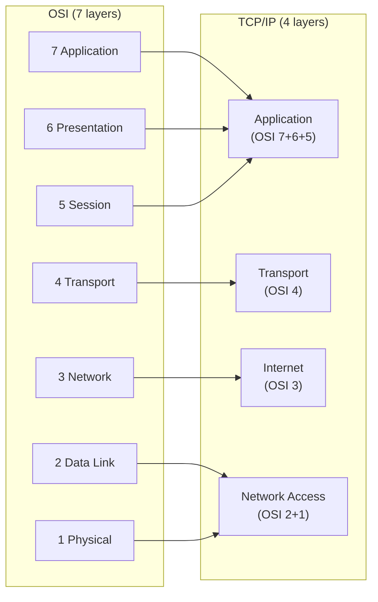
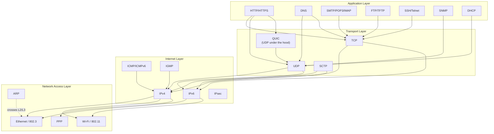

# 02.03 — The TCP/IP (DoD) Model

> [!abstract] The Model That Actually Runs
> The OSI model is academically pure but rarely implemented as-is. The **TCP/IP model** (also called the **DoD model**, after the US Department of Defense which funded it) is the *practical* 4-layer model that actually runs the internet. It collapses OSI's top three layers into one and OSI's bottom two into one.

---

##  The Four Layers

### 1. Application Layer (merges OSI 7+6+5)
- **What's here:** Every protocol that touches user-facing applications — HTTP, DNS, SMTP, FTP, SSH, DHCP, TLS, QUIC, SIP, etc.
- **Why merged:** In practice, application protocols do their own session management (HTTP cookies) and presentation work (TLS, JSON). Splitting them into 3 layers was academic overhead with no implementation benefit.
- **PDU:** Data / Message

### 2. Transport Layer (OSI 4)
- **What's here:** TCP and UDP. The end-to-end, process-to-process delivery layer.
- **PDU:** Segment (TCP) / Datagram (UDP)

### 3. Internet Layer (OSI 3)
- **What's here:** IP (v4 and v6), ICMP, ICMPv6, IGMP, IPsec. Logical addressing and routing.
- **PDU:** Packet / Datagram

### 4. Network Access Layer (merges OSI 2+1) — also called Link Layer
- **What's here:** Ethernet, Wi-Fi, PPP, ARP. Everything below IP.
- **PDU:** Frame (L2) / Bits (L1)
- **Note:** ARP sits in a strange spot — it crosses L2 and L3. We treat it as a Network Access Layer helper in the TCP/IP model. See [[06 - ARP & Address Resolution/06.00 Chapter Overview|Chapter 6]].

---

##  TCP/IP vs OSI: When to Use Which

| Use case | Model to invoke |
| :--- | :--- |
| Teaching protocol responsibilities | OSI (the 7 layers map cleanly to conceptual functions) |
| Reading RFCs or vendor docs | TCP/IP (most docs use TCP/IP terminology) |
| Cert exam (Cisco CCNA, CompTIA Network+) | Both — usually tested side-by-side |
| Casual conversation | TCP/IP — fewer layers, less jargon |
| Debugging with Wireshark | OSI — the Wireshark UI uses OSI-style layer labels |
| Designing a new protocol stack | TCP/IP — pragmatic and proven |

---

##  The TCP/IP Protocol Suite — Full Picture

A few interesting things to notice:
- **QUIC** carries HTTP/3 over UDP — it's a transport protocol that itself uses a transport protocol. This is the modern pattern: build new transports inside UDP because middleboxes (NATs, firewalls) block unknown L4 protocols.
- **ARP** is technically a Network Access protocol in the TCP/IP model but operates between L2 and L3 — it's the bridge that lets IP find MACs.
- **ICMP** rides inside IP (Protocol number 1) but is *not* a transport protocol — it's a control protocol. ping and traceroute use ICMP.

---

##  See Also

- [[02 - Reference Models OSI & TCP-IP/02.02 The OSI 7-Layer Model|02.02 OSI 7-Layer Model]] — the 7-layer version.
- [[02 - Reference Models OSI & TCP-IP/02.04 Encapsulation & PDUs|02.04 Encapsulation & PDUs]] — how PDUs nest.
- [[02 - Reference Models OSI & TCP-IP/02.05 OSI vs TCP-IP Comparison|02.05 Comparison]] — the side-by-side table.
