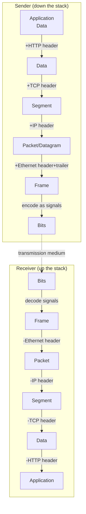
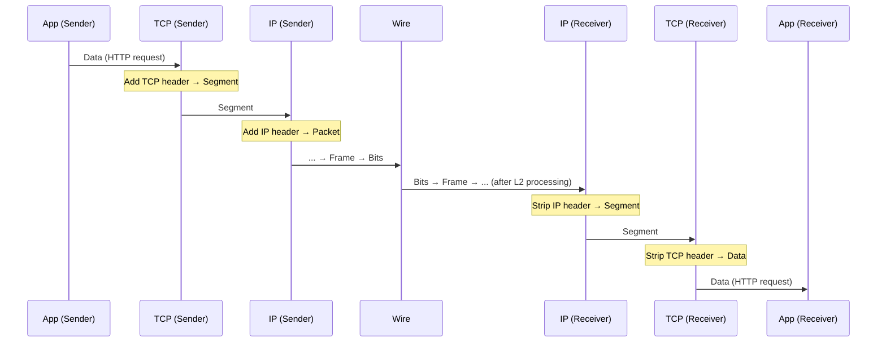

# 02.04 — Encapsulation & PDUs

> [!abstract] The Russian Doll of Networking
> As data flows **down** the stack from application to physical wire, each layer wraps the data in its own header (and sometimes trailer). The result is a nested structure like Russian dolls. As data flows **up** the stack on the receiving host, each layer strips its header and hands the inner payload to the layer above. The wrapped unit at each layer is called a **Protocol Data Unit (PDU)**.



---

##  PDU Names by Layer

| OSI Layer | TCP/IP Layer | PDU Name | Addressing |
| :-: | :-: | :--- | :--- |
| 7, 6, 5 | Application | **Data** / Message | URL, hostname |
| 4 | Transport | **Segment** (TCP) / **Datagram** (UDP) | Port number |
| 3 | Internet | **Packet** / **Datagram** | IP address |
| 2 | Network Access | **Frame** | MAC address |
| 1 | Physical | **Bit** | (none) |

> [!warning] Common Terminology Confusion
> "Datagram" is ambiguous. In TCP/IP it means **a connectionless packet** (UDP datagram, IP datagram). In OSI it's sometimes used as the L3 PDU name. When in doubt, say "segment" for TCP and "packet" for IP — those are unambiguous.

---

##  Downward Encapsulation (Sender Side)

Let's trace a single HTTP request from a browser to a web server. Assume the browser is on `192.168.1.42:53821` and the server is at `93.184.216.34:80`.

### Step 1: Application Layer
The browser generates an HTTP request:
```
GET / HTTP/1.1
Host: example.com
User-Agent: Mozilla/5.0
```
This is the **Data** PDU. It's handed down to TCP.

### Step 2: Transport Layer
TCP adds its header (20 bytes minimum, up to 60 with options):

| Field | Value |
| :--- | :--- |
| Source Port | 53821 |
| Destination Port | 80 |
| Sequence Number | 1 |
| Ack Number | 1 |
| Flags | ACK, PSH |
| Window Size | 64240 |
| Checksum | (calculated) |

The result is a **Segment**. TCP hands it down to IP.

### Step 3: Internet Layer
IP adds its header (20 bytes minimum):

| Field | Value |
| :--- | :--- |
| Version | 4 |
| IHL | 5 (20 bytes) |
| TTL | 64 |
| Protocol | 6 (TCP) |
| Source IP | 192.168.1.42 |
| Destination IP | 93.184.216.34 |
| Header Checksum | (calculated) |

The result is a **Packet**. IP hands it down to Ethernet.

### Step 4: Network Access Layer
Ethernet adds its header (14 bytes) and trailer (4 bytes FCS):

| Field | Value |
| :--- | :--- |
| Destination MAC | (default gateway's MAC, learned via ARP) |
| Source MAC | 00:1A:2B:3C:4D:5E (sender's NIC) |
| EtherType | 0x0800 (IPv4) |
| **Payload** | (the IP packet from step 3) |
| FCS | (CRC32) |

The result is a **Frame**, ready for the NIC to encode as bits.

### Step 5: Physical Layer
The NIC encodes the frame as electrical signals on the copper pair (or light pulses on fiber, or modulated radio waves for Wi-Fi). These are the **Bits** on the wire.

---

##  Upward Decapsulation (Receiver Side)

The receiver does the exact reverse:

1. **Physical Layer** — receives bits, decodes them as a frame.
2. **Data Link Layer** — verifies FCS (drops if CRC fails), checks destination MAC matches, strips Ethernet header/trailer, hands the payload (the IP packet) up.
3. **Network Layer** — verifies IP header checksum, checks destination IP matches a local interface or should be forwarded, decrements TTL, strips IP header, hands payload up based on the Protocol field (Protocol=6 → TCP).
4. **Transport Layer** — TCP verifies the segment checksum, processes the sequence/ack numbers, may buffer for ordering, strips TCP header, hands payload up to the application identified by destination port 80.
5. **Application Layer** — the web server receives the HTTP request bytes and processes them.

---

##  Same-Layer Communication — The Illusion

Each layer on the sender communicates *logically* with the same layer on the receiver, even though the data physically passes through all lower layers on both sides.



The dotted line between `TcpA` and `TcpB` is the *logical* TCP-to-TCP communication. From TCP's perspective, it sent a segment and the peer received it. The fact that the segment was wrapped in IP, wrapped in Ethernet, transmitted as bits, unwrapped, etc. is invisible.

---

##  The Encapsulation Math

For an Ethernet-frame carrying an IP packet carrying a TCP segment carrying an HTTP request:

| Layer | Header | Payload | Trailer | Total |
| :--- | :-: | :-: | :-: | :-: |
| HTTP | (none) | 100 B | (none) | 100 B |
| TCP | 20 B | 100 B | (none) | 120 B |
| IP | 20 B | 120 B | (none) | 140 B |
| Ethernet | 14 B | 140 B | 4 B (FCS) | 158 B |
| (preamble) | 8 B | — | — | +8 B on wire |

So a 100-byte HTTP request becomes ~166 bytes on the wire. This is the **encapsulation overhead** — about 60% overhead for tiny payloads, less than 5% for a full-sized 1460-byte TCP segment.

> [!info] MTU and MSS
> The Maximum Transmission Unit (MTU) of Ethernet is 1500 bytes (excluding header/trailer). To avoid IP fragmentation (see [[05 - IP Datagram & Fragmentation/05.02 Fragmentation Mathematics|Chapter 5]]), TCP picks a Maximum Segment Size (MSS) that fits:
>
> $$\text{MSS} = \text{MTU} - \text{IP header} - \text{TCP header} = 1500 - 20 - 20 = 1460 \text{ bytes}$$

---

##  Mnemonic

> "**D**ata **S**egments **P**roduce **F**rames **B**it by bit"
> → **D**ata → **S**egment → **P**acket → **F**rame → **B**its

Or, in reverse (decapsulation):

> "**B**its **F**orm **P**ackets' **S**ubstance **D**ownward"

More mnemonics in [[14 - Memory Aids & Mnemonics/14.00 Chapter Overview|Chapter 14]].

---

##  See Also

- [[02 - Reference Models OSI & TCP-IP/02.02 The OSI 7-Layer Model|02.02 OSI 7-Layer Model]]
- [[05 - IP Datagram & Fragmentation/05.01 IP Header Fields|05.01 IP Header Fields]] — every IP header field in detail.
- [[10 - Transport Layer/10.07 TCP Header Fields|10.07 TCP Header Fields]] — every TCP header field.
- [[03 - Physical & Data Link Layer/03.03 Ethernet II Frame Structure|03.03 Ethernet II Frame]] — the L2 PDU structure.
