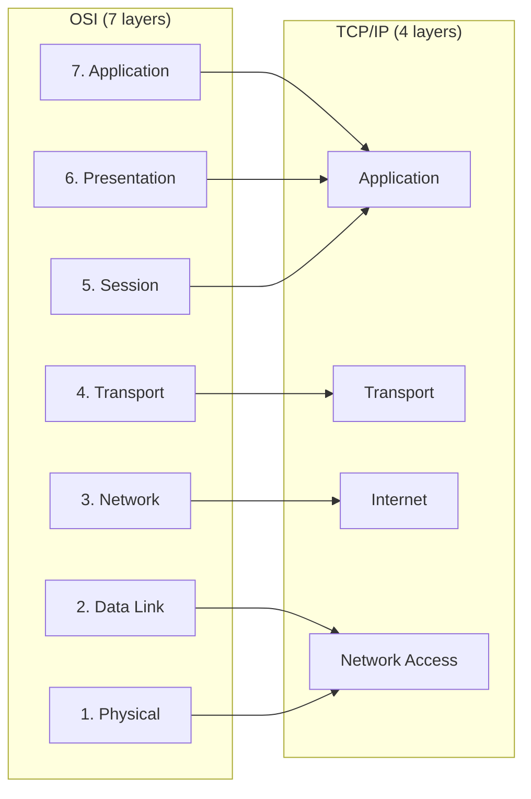

# 02.05 — OSI vs TCP/IP Comparison

> [!abstract] Two Models, One Internet
> The **OSI model** is the universal teaching framework; the **TCP/IP model** is what actually runs the internet. Both are useful — knowing when to invoke each is part of network literacy.

---

##  Side-by-Side Layer Mapping

| OSI Layer | TCP/IP Layer | What's the Same | What's Different |
| :-: | :-: | :--- | :--- |
| 7 — Application | Application | Both contain user-facing protocols | TCP/IP merges OSI 5+6+7 into one |
| 6 — Presentation | (merged into Application) | Encoding, encryption, compression | OSI separates; TCP/IP says "do it in your app" |
| 5 — Session | (merged into Application) | Dialog control | OSI separates; TCP/IP says "do it in your app" |
| 4 — Transport | Transport | End-to-end delivery via ports | Almost identical |
| 3 — Network | Internet | Logical addressing, routing | OSI calls it Network; TCP/IP calls it Internet |
| 2 — Data Link | Network Access | Framing, MAC addressing | TCP/IP merges OSI 1+2 |
| 1 — Physical | (merged into Network Access) | Bits on wire | TCP/IP says "L1 is the medium's problem" |

---

##  Conceptual Differences

### 1. Strict Layering vs Pragmatic Layering
- **OSI** is a *reference* model — strict layering, you must not skip layers.
- **TCP/IP** is a *protocol suite* — pragmatic, layers can be skipped when it makes sense (e.g., ARP crosses L2/L3, ICMP rides inside IP but is not a transport protocol, QUIC is a transport protocol built on UDP).

### 2. Generality vs Specificity
- **OSI** is general — applies to *any* networking context, including theoretical ones that never shipped.
- **TCP/IP** is specific — it's the model that the internet protocols actually implement.

### 3. Session & Presentation — Do They Exist?
- **OSI** says yes, they're separate layers.
- **TCP/IP** says no — applications do their own session management (HTTP cookies, SSH channels) and presentation (TLS, JSON, Protobuf). Splitting them is academic overhead.

### 4. Where Does the Network Access Layer Stop?
- **OSI** cleanly separates L1 (cables) from L2 (framing).
- **TCP/IP** doesn't really care — the Network Access layer is "whatever IP rides on", whether that's Ethernet, Wi-Fi, PPP, or carrier pigeon (RFC 1149, yes really).

---

##  Historical Note

| Year | Event |
| :-: | :--- |
| 1974 | IBM releases SNA — proprietary, mainframe-centric |
| 1978 | ISO begins work on OSI reference model |
| 1981 | RFC 791 (IPv4) and RFC 793 (TCP) published |
| 1983 | ARPANET switches from NCP to TCP/IP — "flag day" Jan 1, 1983 |
| 1984 | ISO publishes OSI reference model as ISO/IEC 7498 |
| 1989 | OSI implementations finally ship — late, expensive, slow |
| 1995 | TCP/IP definitively wins; OSI protocols survive only in telecom niches |
| 2000s | OSI model remains the universal *teaching* framework |
| Today | TCP/IP runs the internet; OSI organizes the textbooks |

---

##  When to Use Which Model

| Situation | Use |
| :--- | :--- |
| Reading a textbook or syllabus | OSI (most textbooks still use it) |
| Reading an RFC or vendor datasheet | TCP/IP (this is what they describe) |
| Designing a new protocol | TCP/IP (pragmatic) |
| Teaching concept of layering | OSI (cleaner separation) |
| Describing real internet traffic | TCP/IP (matches reality) |
| CompTIA Network+ or CCNA exam | Both — be fluent in mapping |
| Lab work with Wireshark | OSI (Wireshark's UI uses OSI labels) |
| Casual conversation with peers | TCP/IP — fewer layers, less jargon |

---

##  Exam Tips

1. **"Which layer does X belong to?"** — Look for the telltale signal: ports → L4, IP addresses → L3, MAC addresses → L2, voltage/light → L1, HTTP/SMTP/DNS → L7.
2. **"Which model has 4 layers?"** — TCP/IP (DoD).
3. **"Which model has 7 layers?"** — OSI.
4. **"Where does TLS sit?"** — Between L6 and L4 (depends on who you ask). It's a *presentation* layer function (encryption, integrity) but implemented on top of TCP.
5. **"Where does ARP sit?"** — Between L2 and L3. It translates L3 addresses to L2 addresses.

---

##  See Also

- [[02 - Reference Models OSI & TCP-IP/02.02 The OSI 7-Layer Model|02.02 OSI 7-Layer Model]]
- [[02 - Reference Models OSI & TCP-IP/02.03 The TCP-IP DoD Model|02.03 TCP/IP Model]]
- [[02 - Reference Models OSI & TCP-IP/02.04 Encapsulation & PDUs|02.04 Encapsulation & PDUs]]
- [[00 - Master Index/Quick Reference Cheatsheet| Cheatsheet]]
