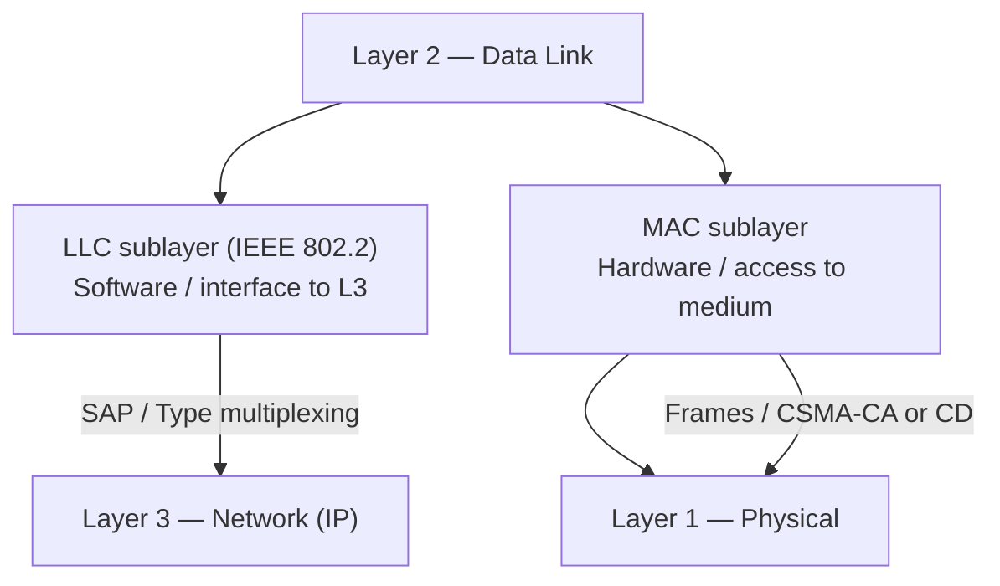

# 03.01 — LLC & MAC Sublayers

> [!abstract] Splitting Layer 2
> IEEE 802 splits the Data Link layer (OSI L2) into two sublayers: **Logical Link Control (LLC)** on top — software-facing, talks to L3 — and **Media Access Control (MAC)** on the bottom — hardware-facing, talks to L1. This split lets the same LLC talk to multiple physical media (Ethernet, Wi-Fi, Token Ring) without modification.

---

##  Logical Link Control (LLC) — IEEE 802.2

The LLC sublayer is the **interface between L3 and L2**. It provides three services:

1. **Multiplexing / demultiplexing** — When an Ethernet frame arrives, the LLC looks at the EtherType field (or the IEEE 802.2 SNAP header) to decide which L3 protocol should receive the payload: IP, ARP, IPX, AppleTalk, etc.
2. **Flow control** (optional) — sliding-window flow control between adjacent L2 nodes.
3. **Error control** (optional) — retransmission of lost frames (rarely used in modern Ethernet because the upper layers — TCP — handle reliability).

LLC headers carry **Service Access Points (SAPs)** — the L2 equivalent of ports. The most common today is `DSAP=AA, SSAP=AA` indicating a SNAP (Subnetwork Access Protocol) header follows, which carries the actual EtherType.

> [!info] Why You Rarely See LLC Headers
> Modern Ethernet uses **Ethernet II framing** (EtherType field directly), not 802.3 + LLC. Wireshark will show you LLC headers only when capturing old-style 802.3 frames (rare on modern LANs) or Wi-Fi management frames (which use LLC for some control traffic).

---

##  Media Access Control (MAC) — IEEE 802.3 / 802.11 / etc.

The MAC sublayer is the **hardware-facing half of L2**. Its job is to:

1. **Encapsulate** L3 packets into L2 frames with a header (Dst MAC, Src MAC, EtherType) and trailer (FCS).
2. **Address** frames using 48-bit MAC addresses.
3. **Access the shared medium** — decide when it's safe to transmit. Two main approaches:
   - **CSMA/CD** (Carrier Sense Multiple Access with Collision Detection) — used by half-duplex Ethernet. Listen, transmit, detect collisions, back off.
   - **CSMA/CA** (Collision Avoidance) — used by Wi-Fi. Listen, wait random backoff, transmit, await ACK.
4. **Detect errors** — calculate and verify the 32-bit Frame Check Sequence (FCS).

The MAC sublayer is implemented in the **Network Interface Card (NIC)** itself — the silicon that does this work is called the MAC controller. The OS talks to it through a device driver.

---

##  LLC vs MAC at a Glance

| Property | LLC | MAC |
| :--- | :--- | :--- |
| Standard | IEEE 802.2 | IEEE 802.3 (Ethernet), 802.11 (Wi-Fi), etc. |
| Location | Software (driver) | Hardware (NIC) |
| Faces | L3 (Network) | L1 (Physical) |
| Addressing | SAPs (Service Access Points) | 48-bit MAC addresses |
| Functions | Multiplex L3 protocols, optional flow/error control | Frame L3 packets, access medium, detect errors |
| Visible in Wireshark | Only when 802.3 framing is used | Always (the Ethernet header) |

---

##  Why the Split Matters

The split is what lets IP run unchanged over Ethernet, Wi-Fi, DSL, and PPP. Each medium has its own MAC sublayer (802.3, 802.11, etc.), but they all share the same LLC interface to IP. From IP's perspective, every link looks the same: "give me a MAC address and I'll give you a frame."

This is also why **ARP** ([[06 - ARP & Address Resolution/06.00 Chapter Overview|Chapter 6]]) is necessary. IP addresses are L3 abstractions that work over any MAC. ARP is the bridge that says "for this IP, what's the MAC?" — and the answer depends on which MAC sublayer you're using (Ethernet MAC vs Wi-Fi MAC vs PPP, which has no MAC at all).

---

##  See Also

- [[03 - Physical & Data Link Layer/03.02 MAC Addressing|03.02 MAC Addressing]] — the addresses the MAC sublayer uses.
- [[03 - Physical & Data Link Layer/03.03 Ethernet II Frame Structure|03.03 Ethernet II Frame]] — the PDU the MAC sublayer produces.
- [[06 - ARP & Address Resolution/06.00 Chapter Overview|Chapter 6 — ARP]] — the bridge between L3 IP and L2 MAC.
