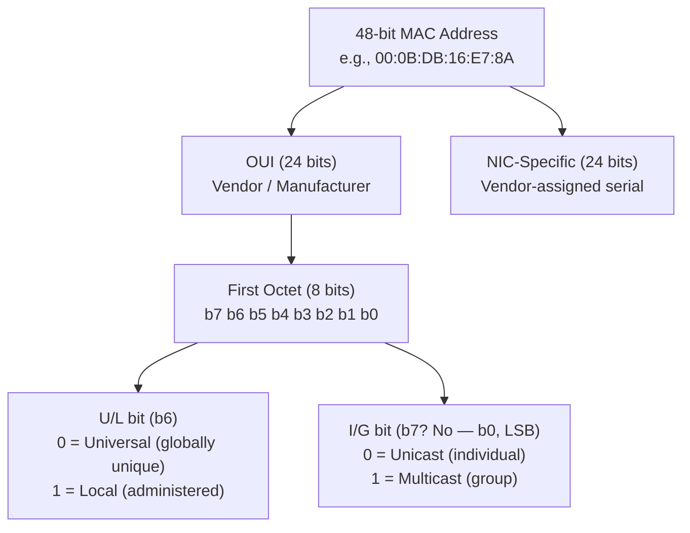

# 03.02 — MAC Addressing

> [!abstract] The 48-bit Hardware Identity
> A **Media Access Control (MAC) address** is a 48-bit (6-octet) hardware identifier burned into a NIC at manufacture. It's how Ethernet frames are addressed at Layer 2 — without it, the switch wouldn't know which port to send a frame to.

> [!warning] I/G bit is the LSB, not MSB
> A common mistake: people assume the leftmost bit is the "first" bit. In Ethernet framing, octets are transmitted **LSB first**, so the I/G bit is the *least significant bit* of the first octet — i.e., the rightmost bit of the leftmost hex digit pair. See the hex extraction trick below.

---

##  Structure

A MAC is 48 bits = 6 octets = 12 hex digits. Two representations are common:
- Colon-separated: `00:0B:DB:16:E7:8A` (Cisco, Linux `ip` command)
- Hyphen-separated: `00-0B-DB-16-E7-8A` (Windows `ipconfig`)

The 48 bits split into:

| Field | Bits | Octets | Description |
| :--- | :-: | :-: | :--- |
| **OUI** (Organizationally Unique Identifier) | 24 | 3 | Vendor / manufacturer (assigned by IEEE) |
| **NIC-specific** | 24 | 3 | Vendor-assigned serial number |

**Example:** `00:0B:DB` is the OUI for Dell. `16:E7:8A` is the serial Dell assigned to this particular NIC.

### Special bits in the first octet

| Bit (in first octet, transmitted LSB first) | Name | Meaning |
| :--- | :-: | :--- |
| **b0 (LSB)** | **I/G** (Individual/Group) | `0` = Unicast, `1` = Multicast/Broadcast |
| **b1** | **U/L** (Universal/Local) | `0` = Globally unique (burned-in), `1` = Locally administered |

> [!example] Decoding `00:0B:DB:16:E7:8A`
> - First octet: `0x00` = `00000000` in binary
> - I/G bit (LSB) = `0` → **Unicast**
> - U/L bit (next bit) = `0` → **Universal** (burned-in by Dell)
> - OUI: `00:0B:DB` → Dell
> - NIC serial: `16:E7:8A`

---

##  Address Types

| Type | Format | Example | Reach |
| :--- | :--- | :--- | :--- |
| **Unicast** | LSB of first octet = `0` | `00:0B:DB:16:E7:8A` | One specific NIC |
| **Multicast** | LSB of first octet = `1` | `01:00:5E:AB:CD:EF` | A subscribed group |
| **Broadcast** | All 48 bits = `1` | `FF:FF:FF:FF:FF:FF` | Every node on the segment |

### Multicast MAC construction (IPv4)
IPv4 multicast addresses (`224.0.0.0/4`) map to MAC multicast addresses by:
- OUI: `01:00:5E` (always)
- Last 23 bits: copy of the low 23 bits of the IPv4 multicast address

So `224.0.0.5` (OSPF) → MAC `01:00:5E:00:00:05`. `239.1.2.3` → MAC `01:00:5E:01:02:03`.

> [!warning] Why 23 bits, not 28?
> The IPv4 multicast range is 224.0.0.0/4 — 28 bits of multicast address. But the MAC OUI `01:00:5E:XX:XX:XX` only has 24 bits, and one of those is reserved (`0`). So we use 23 bits — meaning **32 different IPv4 multicast addresses map to the same MAC**. Receivers must filter at L3 to disambiguate. This is a historical cost-saving decision from when Ethernet was a shared medium.

---

##  Hex Extraction Trick — Classify in 2 Seconds

To classify any MAC as unicast or multicast, **look at the second hex digit of the first octet** (i.e., the rightmost hex digit of the leftmost pair):

| Second hex digit | Binary (LSB) | Classification |
| :---: | :---: | :--- |
| `0`, `2`, `4`, `6`, `8`, `A`, `C`, `E` | LSB = 0 | **Unicast** |
| `1`, `3`, `5`, `7`, `9`, `B`, `D`, `F` | LSB = 1 | **Multicast** |
| (entire MAC is `FF:FF:FF:FF:FF:FF`) | all 1s | **Broadcast** |

### Worked examples

| Address | First Octet | 2nd hex digit | Class |
| :--- | :---: | :---: | :--- |
| `01-00-5E-AB-CD-EF` | `01` | `1` (odd) | **Multicast** (IPv4 multicast OUI) |
| `00-00-25-47-EF-CD` | `00` | `0` (even) | **Unicast** |
| `11-52-AB-9B-DC-12` | `11` | `1` (odd) | **Multicast** |
| `00-01-4B-B4-A2-EF` | `00` | `0` (even) | **Unicast** |
| `FF:FF:FF:FF:FF:FF` | `FF` | (all 1s) | **Broadcast** |
| `33:33:00:00:00:01` | `33` | `3` (odd) | **Multicast** (IPv6 multicast OUI) |

---

##  The Source MAC Validity Constraint

A **source MAC** address in an Ethernet frame header must **always be a Unicast address**. This is intuitive: a single NIC transmits the frame, so the source must identify that single NIC. A multicast or broadcast source would be meaningless — "this frame came from a group of devices" makes no physical sense.

> [!tip] Exam trick
> If asked which MAC addresses can appear in the **source** field of an Ethernet frame, disqualify any address where the second hex digit of the first octet is odd. So `01-...`, `03-...`, `09-...`, `FF-FF-FF-FF-FF-FF` are all invalid source MACs.

---

##  Locally Administered MACs

Setting the U/L bit to `1` lets you override the burned-in MAC with a locally administered one. Use cases:
- **Virtualization:** hypervisors assign locally-administered MACs to VMs (e.g., VMware uses `00:50:56:XX:XX:XX` — but check the U/L bit on a modern ESXi; it's actually `00:50:56` which has U/L=0 — they have their own OUI).
- **MAC randomization:** modern phones randomize their Wi-Fi MAC on each connection for privacy (iOS "Private Wi-Fi Address", Android similar). These are locally administered.
- **Container networking:** Docker assigns MACs to container veth interfaces starting with `02:42:...` (the `02` has U/L=1).

> [!warning] MAC Spoofing
> Because the U/L bit exists, MAC spoofing is trivial — any OS can change its MAC via `ip link set dev eth0 address 02:00:00:00:00:01`. MAC-based authentication (port security on switches, hotspot login pages) is therefore a *weak* control. Don't rely on it as your only security layer.

---

##  See Also

- [[03 - Physical & Data Link Layer/03.01 LLC & MAC Sublayers|03.01 LLC & MAC Sublayers]] — context for why MACs exist.
- [[03 - Physical & Data Link Layer/03.03 Ethernet II Frame Structure|03.03 Ethernet II Frame]] — where MACs appear in the frame header.
- [[06 - ARP & Address Resolution/06.02 ARP Operation Lifecycle|06.02 ARP Operation]] — how L3 IP finds L2 MAC.
