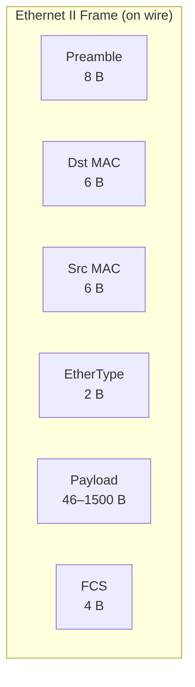

# 03.03 — Ethernet II Frame Structure

> [!abstract] The L2 PDU
> An **Ethernet II frame** is the unit of transmission at Layer 2. It wraps an L3 packet (IP, ARP, etc.) with source/destination MAC addresses, an EtherType indicator, and an error-detection trailer. The frame size is bounded: minimum 64 bytes (excl. preamble), maximum 1518 bytes (excl. preamble).



> [!note] Ethernet II vs IEEE 802.3
> There are two Ethernet frame formats:
> - **Ethernet II** (a.k.a. DIX Ethernet) — has an **EtherType** field. Used by virtually all IP traffic today.
> - **IEEE 802.3** — has a **Length** field instead, followed by an LLC header. Used by some legacy protocols (NetBIOS, IPX) and by Wi-Fi management frames.
>
> The two are distinguished by the value of the 2-byte field after the source MAC: if the value is ≤ 1500, it's a Length (802.3); if it's ≥ 1536, it's an EtherType (Ethernet II). Wireshark auto-detects this.

---

##  Field-by-Field

| Field | Size | Purpose |
| :--- | :-: | :--- |
| **Preamble** | 8 B | 7 bytes of `10101010...` for clock sync, then 1 byte SFD (`10101011`) to mark frame start. Not counted in frame size. |
| **Destination MAC** | 6 B | Hardware address of the receiving interface (or `FF:FF:FF:FF:FF:FF` for broadcast). |
| **Source MAC** | 6 B | Hardware address of the transmitting interface. **Must be unicast.** |
| **EtherType** | 2 B | Identifies the upper-layer protocol in the payload. |
| **Payload (Data)** | 46–1500 B | The encapsulated L3 packet (or ARP request, etc.). |
| **Padding** (if needed) | 0–46 B | Added when payload is < 46 B to reach minimum frame size. |
| **FCS (Frame Check Sequence)** | 4 B | CRC-32 over Dst+Src+Type+Payload for error detection. |

### Common EtherType values

| EtherType (hex) | Protocol |
| :-: | :--- |
| `0x0800` | IPv4 |
| `0x0806` | ARP |
| `0x86DD` | IPv6 |
| `0x8100` | 802.1Q VLAN tag |
| `0x8847` | MPLS unicast |
| `0x8848` | MPLS multicast |
| `0x8863` | PPPoE Discovery |
| `0x8864` | PPPoE Session |
| `0x888E` | 802.1X (EAPOL) |
| `0x8906` | FCoE |

---

##  Frame Size Boundaries

- **Minimum frame (excl. preamble & FCS):** 64 bytes → Dst(6) + Src(6) + Type(2) + Payload(46) = 64.
- **Maximum frame (excl. preamble & FCS):** 1518 bytes → Dst(6) + Src(6) + Type(2) + Payload(1500) = 1514. (Plus FCS = 1518 if FCS is counted, which Cisco doesn't but IEEE does.)
- **Jumbo frames (non-standard):** up to 9000 bytes payload, supported by most modern NICs and switches. Used in storage networks (iSCSI, FCoE) and datacenter east-west traffic to reduce header overhead.

### Why the 64-byte minimum?

In CSMA/CD (half-duplex Ethernet), a sender must keep transmitting long enough to detect a collision. The minimum frame time is the time it takes a signal to traverse the maximum cable length and back — for 10BASE5/10BASE2 at the maximum segment diameter of ~2.5 km, this was 51.2 µs, which at 10 Mbps = 64 bytes. So the minimum Ethernet frame size is 64 bytes to make collision detection reliable.

> [!example] Padding in Action
> An ARP request has a 28-byte payload. To meet the 64-byte minimum, the NIC adds 18 bytes of padding (zeroes) before the FCS. Wireshark will show "Padding: 18 bytes" below the ARP layer.

---

##  Walkthrough: Decoding a Raw Hex Capture

Given this hex dump from `tcpdump -x`:

```
ffff ffff ffff 09ab 14d8 0548 0806 0001
0800 0604 0001 09ab 14d8 0548 7d05 300a
0000 0000 0000 7d12 6e03
```

Decode field by field:

| Bytes (hex) | Field | Value | Interpretation |
| :--- | :--- | :--- | :--- |
| `ffff ffff ffff` | Destination MAC | `FF:FF:FF:FF:FF:FF` | **Broadcast** — every host should read this |
| `09ab 14d8 0548` | Source MAC | `09:AB:14:D8:05:48` | Unicast (first octet `0x09` → binary `00001001` → LSB=1 → multicast! But this is a capture, so the NICs accepted it anyway. Actually wait, 0x09 ends in 1 → multicast. This is unusual — a frame with multicast source MAC, which violates the spec. Could be a malformed frame or a virtualized adapter.) |
| `0806` | EtherType | `0x0806` | **ARP** payload |
| `0001 0800 0604 0001 09ab 14d8 0548 7d05 300a 0000 0000 0000 7d12 6e03` | Payload | (28 bytes ARP) | ARP request: HW type=Ethernet(1), Proto type=IPv4(0x0800), HW len=6, Proto len=4, Op=Request(1), Sender MAC=09:AB:14:D8:05:48, Sender IP=125.5.48.10, Target MAC=00:00:00:00:00:00, Target IP=125.18.110.3 |
| (no explicit padding shown but ARP=28B, payload min=46B, so 18B padding was added in transmission) | | | |

> [!tip] Reading hex dumps
> 1. The first 6 bytes are always Dst MAC.
> 2. The next 6 bytes are always Src MAC.
> 3. The next 2 bytes are EtherType — this tells you what to parse the rest as.
> 4. For ARP (`0x0806`), parse the next 28 bytes as the ARP packet structure (see [[06 - ARP & Address Resolution/06.03 ARP Packet Format|06.03]]).
> 5. Any remaining bytes up to the FCS are padding.

---

##  Frame Check Sequence (FCS)

The 4-byte FCS is a **CRC-32** checksum computed over the destination MAC, source MAC, EtherType, and payload (not the preamble). The receiver recomputes the CRC and compares:
- **Match** → accept the frame, strip FCS, pass payload up.
- **Mismatch** → discard the frame silently (Ethernet doesn't retransmit at L2; that's a job for upper layers like TCP).

FCS catches **transmission errors** (bit flips on the wire) but is useless against **malicious tampering** — an attacker can recompute the CRC after modifying the payload. For integrity against adversaries, use TLS or IPsec.

---

##  See Also

- [[03 - Physical & Data Link Layer/03.02 MAC Addressing|03.02 MAC Addressing]] — the addresses in the frame.
- [[06 - ARP & Address Resolution/06.03 ARP Packet Format|06.03 ARP Packet Format]] — what the payload looks like for ARP.
- [[05 - IP Datagram & Fragmentation/05.01 IP Header Fields|05.01 IP Header Fields]] — what the payload looks like for IPv4.
