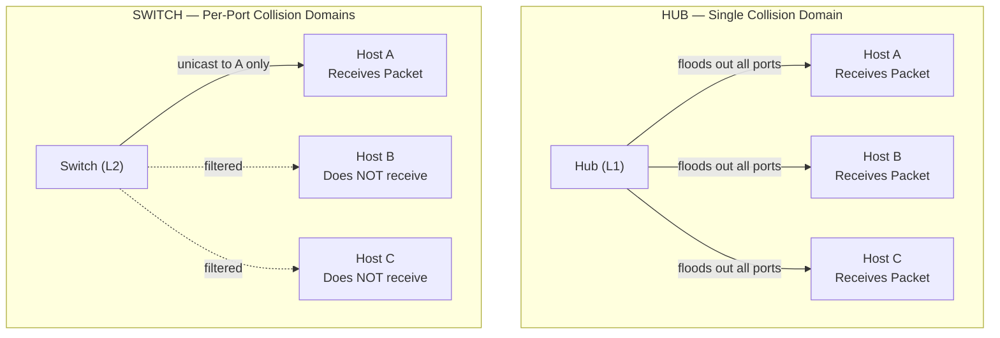
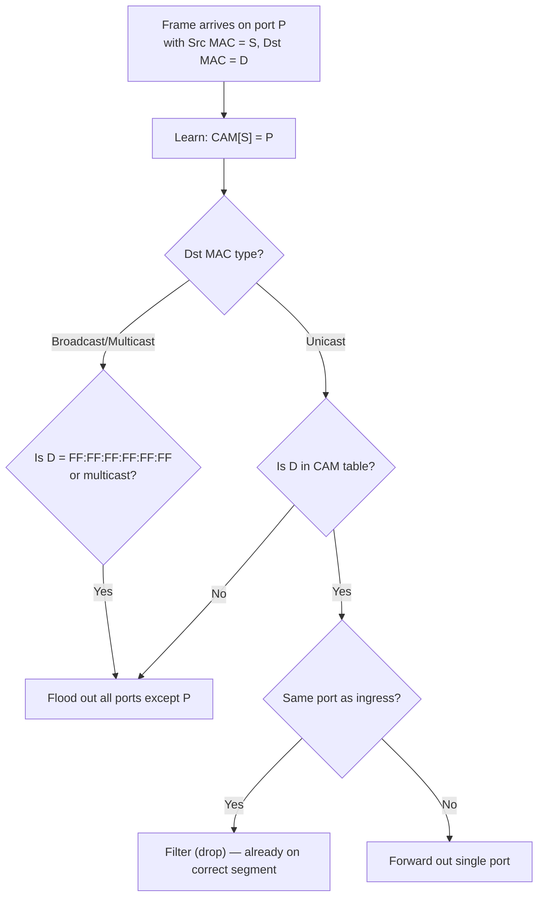

# 03.04 — Hubs vs Switches

> [!abstract] The Central Device Matters
> Both hubs and switches sit at the center of a star topology. But a hub is a **multi-port repeater** (L1) that floods every frame out every port, while a switch is a **multi-port bridge** (L2) that learns MAC-to-port mappings and forwards frames only where needed. This single difference explains why hubs are obsolete and switches are universal.



---

##  Hub — Layer 1 Repeater

| Property | Hub |
| :--- | :--- |
| OSI Layer | 1 (Physical) |
| Inspects | Nothing — pure bit repeater |
| Behavior | Regenerates signal, floods out all ports except ingress |
| Collision domain | **One shared** across all ports |
| Broadcast domain | **One shared** across all ports |
| Half/Full duplex | Half only (CSMA/CD required) |
| Throughput | Shared — aggregate ≈ 40% of headline rate under load |
| Status | Obsolete. Replaced by switches ca. 2000. |

A hub doesn't even know what a MAC address is. It receives a signal on port X, regenerates it, and retransmits it out *every other port*. Every host sees every frame, and only the host whose MAC matches keeps it. The rest drop it.

Because every host sees every transmission, only one host can transmit at a time — otherwise collisions corrupt both signals. CSMA/CD enforces this: listen, transmit, detect collision, jam, back off. This is why a "100 Mbps hub" effectively achieves ~40 Mbps aggregate under load.

---

##  Switch — Layer 2 Multi-Port Bridge

| Property | Switch |
| :--- | :--- |
| OSI Layer | 2 (Data Link) |
| Inspects | Frame headers (Dst MAC, Src MAC, EtherType) |
| Behavior | Learns Src MAC → port mappings, forwards Dst MAC → port |
| Collision domain | **One per port** (each port is isolated) |
| Broadcast domain | **One shared** across all ports (unless VLANs) |
| Half/Full duplex | Full duplex (no CSMA/CD needed) |
| Throughput | Sum of port bandwidths — `N × 2 × port_speed` for full-duplex |
| Status | Universal in modern LANs |

### How a Switch Learns: The CAM Table

A switch maintains a **Content-Addressable Memory (CAM) table** (also called **MAC address table**), mapping MAC addresses to switch ports. It populates this table by inspecting the **source MAC** of every incoming frame:

```
Frame arrives on port 3 with Src MAC = 00:0B:DB:16:E7:8A
→ Switch records: CAM["00:0B:DB:16:E7:8A"] = port 3
→ Frame's Dst MAC = 00:1A:2B:3C:4D:5E
→ Switch looks up CAM["00:1A:2B:3C:4D:5E"]
   → If found (e.g., port 7): forward out port 7 only
   → If not found: flood out all ports except port 3 (unknown unicast flooding)
```

Entries in the CAM table age out after a configurable timer (typically 5 minutes). If a host stops transmitting, its entry eventually disappears, and future frames to it will be flooded until it transmits again.

### Forwarding Decision Tree



Three reasons a switch floods a frame:
1. **Broadcast destination** — every host needs to see it.
2. **Multicast destination** — unless IGMP snooping is enabled (advanced feature).
3. **Unknown unicast** — the destination MAC isn't in the CAM table yet. Switch floods to make sure the frame reaches its destination, and the destination's reply will teach the switch the right port.

---

##  Side-by-Side Comparison

| Dimension | Hub (L1) | Switch (L2) |
| :--- | :--- | :--- |
| Collision domain | 1 per hub (shared) | 1 per port (isolated) |
| Broadcast domain | 1 per hub | 1 per VLAN (default: 1 per switch) |
| Max effective throughput | ~40% of headline rate | Sum of port speeds |
| Half/full duplex | Half only | Full duplex |
| CSMA/CD needed | Yes | No (point-to-point links) |
| MAC learning | No | Yes |
| VLAN support | No | Yes (802.1Q) |
| Security (sniffability) | Any host can sniff all traffic | Sniffing limited to broadcasts/own traffic |
| Price (historical) | Cheap | Expensive (1990s) |
| Price (today) | Discontinued | Cheap |

---

##  Spanning Tree Protocol — Switch Port Status

When you cable a switch with redundant links (e.g., two cables between Switch A and Switch B for resilience), L2 frames can loop forever: A sends to B, B sends back to A, repeat. Broadcast frames are the worst case — a single broadcast can saturate both links indefinitely (**broadcast storm**).

**Spanning Tree Protocol (STP, IEEE 802.1D)** solves this by computing a loop-free tree of switches and **blocking** redundant ports. Blocked ports listen to BPDUs but don't forward data. If the active link fails, STP reconverges and unblocks a previously-blocked port.

### Port States (Classic STP, 802.1D)

| State | Behavior | Duration | LED Color (Cisco) |
| :--- | :--- | :--- | :--- |
| **Disabled** | Administratively down | — | Off |
| **Blocking** | Receives BPDUs only, no data, no MAC learning | ~20 s | Amber |
| **Listening** | Sends/receives BPDUs, no data, no MAC learning | ~15 s | Amber |
| **Learning** | Adds MAC addresses to CAM table, no data | ~15 s | Amber |
| **Forwarding** | Full operation — sends/receives data and BPDUs | Until failure | Green |

Total convergence time from blocking to forwarding: ~30–50 seconds. This is why plugging in a cable to a Cisco switch sometimes "takes 30 seconds to come up" — STP is going through Listening → Learning → Forwarding.

> [!tip] Speeding Up STP
> Modern variants shorten convergence dramatically:
> - **RSTP (Rapid STP, 802.1w)** — convergence in <1 second for point-to-point links.
> - **PortFast** — Cisco feature for end-host ports; skips Listening/Learning, goes straight to Forwarding. **Only safe on ports connected to a single host (not another switch)**, otherwise loops can form before STP converges.
> - **BPDU Guard** — paired with PortFast; if a BPDU arrives on a PortFast port (meaning someone plugged in a switch), the port is error-disabled.

---

##  See Also

- [[03 - Physical & Data Link Layer/03.05 Spanning Tree Protocol|03.05 Spanning Tree Protocol]] — deeper dive.
- [[03 - Physical & Data Link Layer/03.06 CAM Table vs ARP Cache|03.06 CAM vs ARP]] — the two L2 mapping tables.
- [[01 - Network Fundamentals/01.06 Network Topologies|01.06 Topologies]] — why star topologies are dominant.
