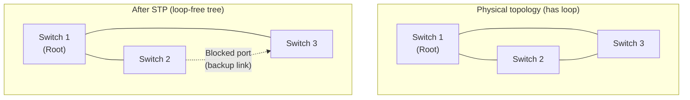

# 03.05 — Spanning Tree Protocol (STP)

> [!abstract] Preventing L2 Loops
> Redundant links are good for resilience but fatal at Layer 2 — a single broadcast frame can loop forever and bring down a network in seconds. **Spanning Tree Protocol (STP, IEEE 802.1D)** computes a loop-free tree of switches by selectively blocking ports. The result is a logically loop-free topology that still has physical redundancy waiting in the wings.

---

##  Why STP Exists

Without STP, a redundant L2 topology has three catastrophic failure modes:

1. **Broadcast storms** — A broadcast frame is flooded by every switch to every port. With a loop, the broadcast comes back to the original switch and is flooded again. Network saturates in milliseconds.
2. **Multiple frame copies** — A unicast frame may arrive at the destination via two paths, causing duplicate delivery.
3. **CAM table instability** — The same MAC appears to come from different ports alternately, thrashing the CAM table.

STP prevents all three by ensuring there is exactly one path between any two switches in the topology — the rest of the redundant links are blocked.

---

##  How STP Works — The Algorithm

STP uses the **Bridge Protocol Data Unit (BPDU)** to exchange topology information. Each switch sends BPDUs every 2 seconds (the **Hello timer**) with:
- **Bridge ID** = Priority (2 bytes) + MAC address (6 bytes) — used to elect the root.
- **Root ID** — the Bridge ID of the switch the sender thinks is root.
- **Root Path Cost** — cumulative cost from the sender to the root.

### Step 1: Elect the Root Bridge
The switch with the **lowest Bridge ID** wins. Default priority is 32768; administrators lower it on the intended root. If priorities tie, lowest MAC address wins.

> [!tip] Best Practice
> Always configure the root bridge priority explicitly on your core switches. Don't let the election happen by default — you may end up with an access-layer switch as root just because its MAC is numerically lowest, and your traffic will flow through suboptimal paths.

### Step 2: Compute the Root Port on Each Non-Root Switch
Each non-root switch picks one port — its **Root Port** — that has the lowest total cost to reach the root. Cost is the sum of link costs along the path. Cost values:

| Link Speed | STP Cost (802.1D-1998) | STP Cost (802.1D-2004, RSTP) |
| :--- | :-: | :-: |
| 10 Mbps | 100 | 2,000,000 |
| 100 Mbps | 19 | 200,000 |
| 1 Gbps | 4 | 20,000 |
| 10 Gbps | 2 | 2,000 |

The 2004 revision scales costs to handle 100G+ links without going to cost 0.

### Step 3: Elect Designated Ports on Each Link
For each network segment (link between two switches), one switch is the **Designated Bridge** for that segment. Its port on that link is the **Designated Port** and is the only one allowed to forward traffic onto the segment. The other switch's port becomes a **Non-Designated Port** and is **blocked**.

### Step 4: Block All Other Ports
Any port that is not a Root Port or a Designated Port is **blocked**. Blocked ports still listen to BPDUs (so they can take over if a link fails) but do not forward data.

---

##  Port States (Classic 802.1D)

| State | Forwards Data? | Learns MACs? | Listens to BPDUs? | Duration |
| :--- | :-: | :-: | :-: | :-: |
| **Disabled** | No | No | No | — |
| **Blocking** | No | No | Yes | ~20 s (max age) |
| **Listening** | No | No | Yes | ~15 s (forward delay) |
| **Learning** | No | Yes | Yes | ~15 s (forward delay) |
| **Forwarding** | Yes | Yes | Yes | Steady state |

Total time from plugin to forwarding: **30–50 seconds**. This is the infamous "switch port takes 30 seconds to come up" symptom every network engineer meets.

---

##  RSTP — Rapid Spanning Tree Protocol (802.1w)

RSTP replaces the 4-state model with a 3-state model and adds fast convergence mechanisms:

| State | Forwards? | Learns? |
| :--- | :-: | :-: |
| **Discarding** (merges Blocking + Listening + Disabled) | No | No |
| **Learning** | No | Yes |
| **Forwarding** | Yes | Yes |

RSTP converges in **under 1 second** on point-to-point links by:
- Using explicit handshakes (Proposal/Agreement) between switches instead of timer-driven state transitions.
- Treating full-duplex ports as point-to-point (vs. half-duplex = shared).
- Allowing alternate and backup ports to be pre-computed, so they switch to forwarding immediately when the root port fails.

RSTP is backward-compatible with STP — they interoperate, but RSTP's fast convergence only kicks in when both ends are RSTP-capable.

---

##  STP Enhancements You Should Know

### PortFast (Cisco) / Edge Port (RSTP)
Skips Listening/Learning, goes straight to Forwarding. Used on end-host ports (servers, PCs). **Must not be used on switch-to-switch links** — a loop could form before STP converges. Pair with **BPDU Guard** to be safe.

### BPDU Guard
If a BPDU arrives on a PortFast-enabled port (meaning someone plugged in a switch), the port is error-disabled. Prevents rogue switches from disrupting your STP topology.

### Root Guard
Prevents a switch from becoming root by forcing a port to stay in "designated" role. If a superior BPDU arrives (lower Bridge ID), the port is put in **root-inconsistent** state.

### Loop Guard
Detects when a blocking port stops receiving BPDUs (e.g., due to a unidirectional link failure) and keeps it blocked instead of transitioning to forwarding. Prevents loops caused by fiber cuts that leave one direction working.

### UDLD (Unidirectional Link Detection)
Cisco-proprietary protocol that detects one-way fiber links and shuts them down. Complements Loop Guard.

---

##  Common Operational Tips

1. **Always set root priority explicitly.** `spanning-tree vlan 1 priority 4096` (or `0`) on your core; `8192` on your backup core.
2. **Enable PortFast + BPDU Guard on all access ports.** Saves 30s of downtime when users unplug/replug and protects against rogue switches.
3. **Use RSTP, not classic STP.** Modern switches default to RSTP or MSTP. Confirm with `show spanning-tree summary`.
4. **Don't disable STP.** Ever. Even on a single-switch LAN, someone will plug both ends of a cable into the same switch someday, and without STP you'll have a broadcast storm in seconds.
5. **Monitor STP topology changes.** A topology change every minute is normal; thousands per minute means a flapping link. Use SNMP traps or `show spanning-tree detail`.

---

##  See Also

- [[03 - Physical & Data Link Layer/03.04 Hubs vs Switches|03.04 Hubs vs Switches]] — context for why we have switches in the first place.
- [[01 - Network Fundamentals/01.06 Network Topologies|01.06 Topologies]] — redundant mesh topologies that necessitate STP.
- [[13 - Cisco IOS CLI/13.02 Essential Configuration|13.02 Cisco Config]] — commands to enable PortFast and BPDU Guard.
