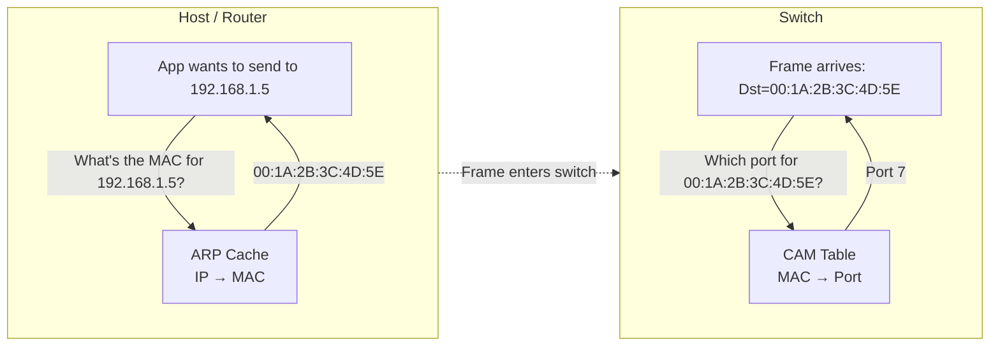
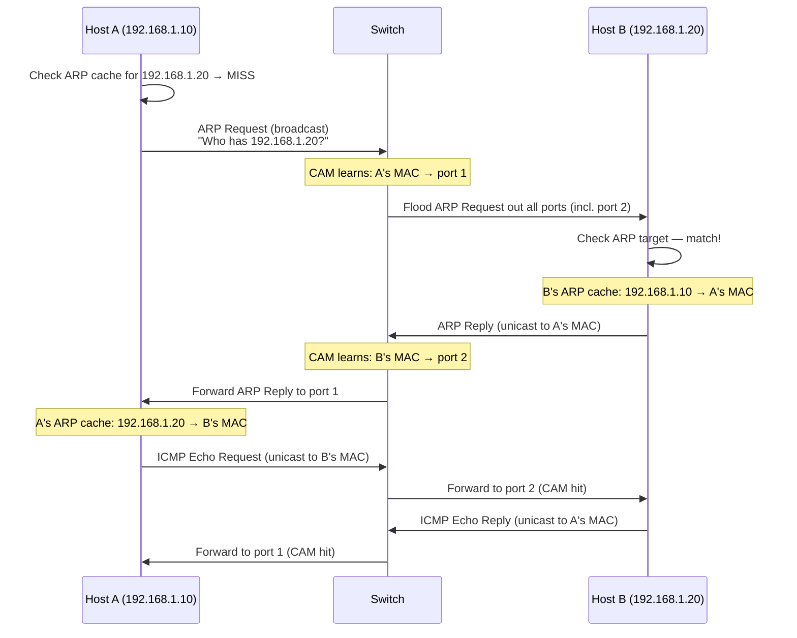

# 03.06 — CAM Table vs ARP Cache

> [!abstract] Two Tables, Two Devices, Two Layers
> Both tables map MAC addresses — but to different things, on different devices, for different purposes. The **CAM table** (Content-Addressable Memory) lives on a **switch** and maps MACs to **switch ports**. The **ARP cache** lives on a **host or router** and maps **IP addresses to MACs**. Confusing them is one of the most common beginner mistakes.

---

##  Side-by-Side

| Dimension | ARP Cache (ARP Table) | CAM Table (MAC Address Table) |
| :--- | :--- | :--- |
| **Primary device** | Layer 3 devices — hosts, routers, L3 switches | Layer 2 devices — switches, bridges |
| **Layer of operation** | L2.5 / L3 boundary (maps L3 → L2) | L2 (maps L2 → physical port) |
| **Core mapping** | IP Address → MAC Address | MAC Address → Switch Port |
| **Purpose** | Find the destination MAC needed to build a Layer 2 frame | Find the destination port needed to forward a Layer 2 frame |
| **How it's populated** | Dynamically via ARP Request/Reply exchanges, or configured statically | Dynamically by inspecting **source MAC** of incoming frames |
| **How it's read** | When sending a packet: "what's the MAC for this destination IP?" | When forwarding a frame: "what port do I send this destination MAC to?" |
| **Aging timer** | Typically 4 hours (OS-dependent; can be tuned) | Typically 5 minutes (configurable; Cisco default 300s) |
| **CLI verification** | `arp -a` (Windows/Linux/macOS), `show arp` (Cisco IOS) | `show mac-address-table` (Cisco IOS) |
| **Failure mode if missing** | Host sends an ARP request broadcast; transmission delayed ~1 ms | Switch floods the frame out all ports (unknown unicast flooding) |
| **VLAN awareness** | Usually per-VLAN on routers, single-table on simple hosts | Per-VLAN on managed switches |

---

##  How They Cooperate

Consider Host A (`192.168.1.10`) sending its first packet to Host B (`192.168.1.20`) on the same subnet, both plugged into the same switch:

Two things to notice:
1. **The switch's CAM table is populated as a side effect** of forwarding frames. It doesn't actively probe for MACs — it just watches what comes in.
2. **The host's ARP cache is populated by an explicit query-response**. The ARP protocol exists precisely because IP needs to actively resolve MACs.

---

##  CLI Commands Cheat Sheet

| Task | Windows / Linux / macOS | Cisco IOS |
| :--- | :--- | :--- |
| View ARP cache | `arp -a` | `show arp` |
| View CAM table | (n/a — hosts don't have CAM tables) | `show mac-address-table` |
| Add static ARP entry | `arp -s 192.168.1.5 00-11-22-33-44-55` | `arp 192.168.1.5 0011.2233.4455 arpa` |
| Add static CAM entry | (n/a) | `mac-address-table static 0011.2233.4455 vlan 1 interface fa0/7` |
| Clear ARP cache | `arp -d *` (Windows) / `ip neigh flush all` (Linux) | `clear arp-cache` |
| Clear CAM table | (n/a) | `clear mac-address-table dynamic` |

---

##  Common Confusion: "ARP Table on a Switch?"

A Layer 3 switch or a switch with a management IP will have **both** tables:
- The **CAM table** for switching traffic between ports.
- The **ARP cache** for its own management traffic (e.g., when the switch itself pings the gateway or replies to SSH).

This is normal — the switch is *both* an L2 device (for user traffic) and an L3 host (for management). Just remember: the CAM table is for *forwarding user traffic*, the ARP cache is for *the switch's own communication*.

---

##  Diagnostic Workflow

When a host can't reach another host on the same subnet, walk this checklist:

1. **On the source host:** `arp -a | grep <dst_ip>` — is there an ARP entry?
   - **No entry:** the ARP request isn't getting through, or the destination isn't responding. Check cable, switch port, destination firewall.
   - **Incomplete entry:** the request was sent but no reply came back. Same causes.
   - **Entry exists:** MAC is known; problem is at L2 or above.
2. **On the switch:** `show mac-address-table | include <dst_mac>` — is the destination MAC in the CAM table?
   - **Yes:** confirm the port. Walk to the destination switch if it's a different one.
   - **No:** the destination hasn't sent any traffic recently. Force it to send something (ping the gateway, for example) and re-check.
3. **On the destination host:** is the firewall blocking ICMP? Is the IP actually configured?

This workflow resolves ~80% of "host can't reach host" L2/L3 issues.

---

##  See Also

- [[03 - Physical & Data Link Layer/03.04 Hubs vs Switches|03.04 Hubs vs Switches]] — how the CAM table is used.
- [[06 - ARP & Address Resolution/06.00 Chapter Overview|Chapter 6 — ARP]] — full deep dive on the ARP cache.
- [[13 - Cisco IOS CLI/13.03 Diagnostics & Verification|13.03 Cisco Diagnostics]] — verification commands.
