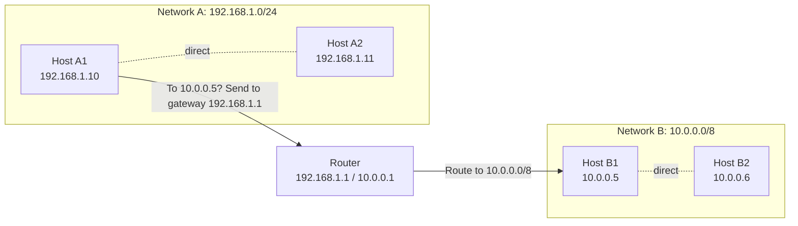

# 04.01 — IPv4 Address Architecture

> [!abstract] The 32-bit Logical Identity
> An **IPv4 address** is a 32-bit logical identifier assigned to each network interface. It is hierarchical: part identifies the *network* (`NET_ID`), part identifies the *host within that network* (`HOST_ID`). This hierarchy is what lets routers scale to the size of the global internet — they only need to forward based on `NET_ID`, not track every individual host.

---

##  Structure

- **Length:** 32 bits = 4 octets = 4 bytes.
- **Representation:** Dotted-decimal, `X.X.X.X` where each $X$ is $0 \le X \le 255$.
- **Binary equivalent:** e.g., `192.168.1.42` = `11000000.10101000.00000001.00101010`.

```
192      .168      .1        .42
11000000 .10101000 .00000001 .00101010
└─────── NET_ID ───────┘└── HOST_ID ──┘
   (depends on mask / prefix length)
```

The split between `NET_ID` and `HOST_ID` is **not encoded in the address itself** — it's encoded in the **subnet mask** (or equivalently, the CIDR prefix length). The same IPv4 address with two different masks identifies two different networks.

---

##  The Logical Interconnection Principle

The whole point of L3 addressing is this rule:

| Hosts on the same `NET_ID` | Hosts on different `NET_ID`s |
| :--- | :--- |
| Communicate **directly** via L2 (ARP resolves the MAC, frame goes host-to-host) | Must communicate via a **Layer 3 gateway (router)** that has interfaces in both networks |

This is the foundational principle of routed networking. Everything else in this chapter — subnetting, summarization, gateway configuration — is a consequence of it.



When Host A1 wants to talk to Host B1:
1. A1 looks at destination `10.0.0.5` and its own mask `/24`. `10.0.0.5` is not in `192.168.1.0/24`, so the destination is in a *different* network.
2. A1 sends the packet to its configured default gateway (`192.168.1.1`, the router). To do this, it ARP-resolves the router's MAC and sends an Ethernet frame with the router's MAC as destination.
3. The router receives the frame, decapsulates it, looks at the IP destination `10.0.0.5`, looks up its routing table, and forwards it out its `10.0.0.0/8` interface.
4. The router ARP-resolves `10.0.0.5` on its `10.0.0.0/8` interface and sends an Ethernet frame to B1.

Step 1 ("is the destination in my subnet?") is implemented as a **bitwise AND** of the destination IP with the local mask, compared to the bitwise AND of the local IP with the local mask:

```
A1's IP:      192.168.1.10 = 11000000.10101000.00000001.00001010
A1's mask:    255.255.255.0= 11111111.11111111.11111111.00000000
A1's NET:     192.168.1.0   = 11000000.10101000.00000001.00000000

Dst IP:       10.0.0.5      = 00001010.00000000.00000000.00000101
Dst & mask:   0.0.0.0       = 00000000.00000000.00000000.00000000

192.168.1.0 ≠ 0.0.0.0 → different network → use gateway
```

---

##  IPv4 vs MAC — Why Two Addresses?

| Property | MAC (L2) | IPv4 (L3) |
| :--- | :--- | :--- |
| Length | 48 bits | 32 bits |
| Assignment | Burned into NIC at factory (OUI + serial) | Configured per-interface (DHCP or static) |
| Scope | Local to the L2 segment | Global (or at least to the routed domain) |
| Hierarchy | Flat (no network/host structure) | Hierarchical (NET_ID / HOST_ID) |
| Used by | Switches (L2 forwarding) | Routers (L3 forwarding) |
| Changes when moving? | No (same NIC) | Yes (different network, different IP) |

The key insight: **MAC addresses are physical and location-independent; IP addresses are logical and location-dependent.** When your laptop moves from home (192.168.1.x) to the office (10.0.0.x), your MAC stays the same but your IP changes. This is why both are needed — MAC for the local physical delivery, IP for the global logical routing.

---

##  Interface ≠ Host

A single host can have multiple network interfaces, each with its own IP:

| Host | Interface | IP |
| :--- | :--- | :--- |
| Laptop | Wi-Fi | 192.168.1.42/24 |
| Laptop | Ethernet | 192.168.1.43/24 |
| Laptop | Loopback | 127.0.0.1/8 |
| Laptop | Docker bridge | 172.17.0.1/16 |
| Laptop | VPN tunnel | 10.8.0.5/24 |

When we say "a host's IP" we usually mean its primary interface's IP. But strictly speaking, IPs are assigned to *interfaces*, not hosts. A router is the extreme case — every interface has a different IP, in a different subnet.

---

##  See Also

- [[04 - IPv4 Network Layer/04.02 Classful Addressing|04.02 Classful Addressing]] — how the 32 bits were originally split.
- [[04 - IPv4 Network Layer/04.05 FLSM|04.05 FLSM]] — first technique for moving the NET_ID/HOST_ID boundary.
- [[07 - IP Routing/07.00 Chapter Overview|Chapter 7 — IP Routing]] — what routers actually do with these addresses.
