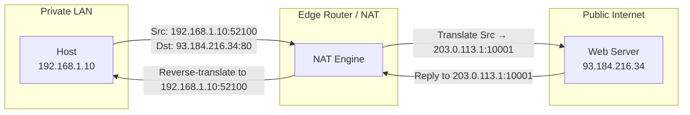

# 04.04 — Public vs Private IPv4 Addresses (RFC 1918)

> [!abstract] Two Spaces, One Internet
> **Public IPv4 addresses** are globally unique and routable on the internet. **Private IPv4 addresses** (defined by RFC 1918) are non-routable on the internet but reusable inside any private network. Network Address Translation (NAT) bridges the two spaces — translating private to public at the network boundary. Without this design, the internet would have exhausted IPv4 addresses in the 1990s.

---

##  Public IPv4 Addresses

- **Allocation:** IANA → RIRs (ARIN, RIPE NCC, APNIC, AFRINIC, LACNIC) → ISPs → end users.
- **Property:** Globally unique; advertised via BGP on the public internet.
- **Cost:** Recurring fees to your ISP / RIR. Increasingly expensive as the IPv4 market tightens.
- **Examples:** `8.8.8.8` (Google DNS), `1.1.1.1` (Cloudflare DNS), `93.184.216.34` (example.com).

Public IPs are required for any service that must be reachable *inbound* from the internet — web servers, mail servers, DNS resolvers, game servers, etc.

##  Private IPv4 Addresses (RFC 1918)

RFC 1918 (February 1996) carved three blocks out of the IPv4 space and declared them **private** — they may be used freely inside any organization but must never appear on the public internet:

| Class | Block | CIDR | Size |
| :-: | :--- | :--- | :--- |
| A | `10.0.0.0` – `10.255.255.255` | `10.0.0.0/8` | 16,777,216 addresses |
| B | `172.16.0.0` – `172.31.255.255` | `172.16.0.0/12` | 1,048,576 addresses |
| C | `192.168.0.0` – `192.168.255.255` | `192.168.0.0/16` | 65,536 addresses |

> [!warning] Common confusion: `172.16.0.0/12` is bigger than just `172.16`
> The private Class B range is **`172.16.0.0` to `172.31.255.255`** — that's 16 contiguous `/16`s. It is NOT just `172.16.0.0/16`. A common exam trap is to claim `172.32.0.5` is private — it isn't.

### Why three blocks of different sizes?

- The `/8` (Class A) block lets very large enterprises use a single flat internal network with 16M hosts if they want to.
- The `/12` (Class B range) gives medium orgs 1M addresses — plenty for any enterprise.
- The `/16` (Class C range) is right-sized for home and small-office networks — most consumer routers default to `192.168.1.0/24` or `192.168.0.0/24`.

### Properties

- **Non-routable on the public internet** — ISPs filter RFC 1918 source/destination addresses at their borders (BCP 38 / RFC 2827).
- **Reusable** — every home in the world can use `192.168.1.0/24` simultaneously; the addresses only need to be unique *within* their private network.
- **Free** — no allocation, no recurring cost.
- **Must be translated** — to reach the public internet, traffic from a private address must pass through a NAT device that swaps the private source IP for a public one.

---

##  The NAT Bridge

Because private addresses can't be routed on the internet, every private network has a **boundary device** (router, firewall, home gateway) that performs **Network Address Translation (NAT)**:

The NAT device maintains a **translation table** mapping `(private IP, private port)`  `(public IP, public port)`. This is what allows thousands of internal hosts to share a single public IP via PAT — see [[09 - NAT & Perimeter Security/09.04 PAT NAT Overload|09.04]].

---

##  Cisco NAT Terminology

Cisco IOS uses specific terms for the four corners of a NAT translation:

| Term | Meaning |
| :--- | :--- |
| **Inside Local** | The private IP of an internal host (e.g., `192.168.1.10`) — what the host thinks its IP is |
| **Inside Global** | The public IP that the NAT device translates the inside host to (e.g., `203.0.113.1`) — what the outside world sees |
| **Outside Local** | The IP of an external host as seen from the inside (rarely used; usually the same as Outside Global) |
| **Outside Global** | The public IP of an external destination host (e.g., `93.184.216.34`) |

Most troubleshooting only needs **Inside Local  Inside Global** — the outside terms are mostly relevant for advanced bidirectional NAT scenarios.

---

##  Other Reserved Blocks Worth Knowing

| Block | Purpose |
| :--- | :--- |
| `100.64.0.0/10` | **CGN (Carrier-Grade NAT)** — RFC 6598; used by ISPs that ran out of public IPs to NAT their customers behind a smaller pool |
| `192.0.2.0/24`, `198.51.100.0/24`, `203.0.113.0/24` | **TEST-NET** blocks for documentation (RFC 5737) — used in textbooks and examples so they never conflict with real networks |
| `198.18.0.0/15` | **Benchmark testing** (RFC 2544) |
| `0.0.0.0/8` | "This network" |
| `127.0.0.0/8` | Loopback |
| `169.254.0.0/16` | Link-local (APIPA) |
| `224.0.0.0/4` | Multicast |

> [!tip] Documentation block tip
> If you're writing a tutorial or a config example, use `192.0.2.0/24`, `198.51.100.0/24`, or `203.0.113.0/24` instead of `8.8.8.8` or `1.1.1.1`. They're guaranteed to never be assigned to anyone, so your readers won't accidentally try to reach a real server.

---

##  Choosing Your Internal Range

If you're designing a private network:

1. **Pick `10.0.0.0/8` for any non-trivial network.** It gives you 16M addresses and is unlikely to conflict with anything else (cloud VPCs, acquisitions, VPN overlays). Use structured subnetting like `10.<site>.<vlan>.0/24`.
2. **Avoid `192.168.0.0/24` and `192.168.1.0/24`** — they're the defaults on every consumer router. If your remote workers connect to your office VPN and their home network is `192.168.1.0/24` while the office is also `192.168.1.0/24`, routing breaks.
3. **Avoid overlapping with common cloud ranges.** AWS uses `172.16.0.0/12` heavily for VPC defaults. If you're hybrid-cloud, plan your private ranges to not collide.

---

##  See Also

- [[04 - IPv4 Network Layer/04.02 Classful Addressing|04.02 Classful Addressing]]
- [[04 - IPv4 Network Layer/04.03 Special & Reserved Addresses|04.03 Special & Reserved]]
- [[09 - NAT & Perimeter Security/09.00 Chapter Overview|Chapter 9 — NAT]] — the deep dive on how NAT actually works.
- [[09 - NAT & Perimeter Security/09.04 PAT NAT Overload|09.04 PAT]] — the most common NAT flavor.
