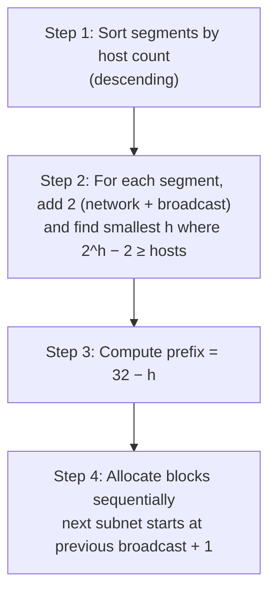

# 04.06 — VLSM (Variable-Length Subnet Masking)

> [!abstract] Right-Sized Subnets
> **VLSM** lets you assign different prefix lengths to different subnets within the same network block. A subnet with 60 hosts gets a `/26`; a WAN link with 2 hosts gets a `/30`. The result: minimal IP address wastage and support for route summarization. VLSM is the production-standard subnetting technique.

---

##  The Design Protocol

Follow these five steps for any VLSM design:

1. **List all subnets** and their required host counts.
2. **Add 2** to each requirement (for network ID and broadcast address).
3. **Sort descending** by required host count. **Always allocate the biggest subnet first** — this prevents fragmentation.
4. **For each subnet**, find the smallest $h$ such that $2^h - 2 \ge$ required hosts. The prefix is $32 - h$.
5. **Allocate sequentially** — the next subnet's network address is the previous subnet's broadcast address + 1.

> [!warning] The Golden Rule
> **Largest subnet first, then next largest, then smallest.** If you allocate small subnets first, the small subnet's block boundary may not align with what the large subnet needs later, forcing you to waste space.

---

##  Practical Case Study

**Given block:** `192.168.40.0/24` (256 total addresses).

**Segment requirements:**
| Subnet | Required hosts |
| :--- | :-: |
| Siège-LAN1 | 50 |
| Siège-LAN2 | 50 |
| Agence1-LAN1 | 30 |
| Agence1-LAN2 | 12 |
| WAN link | 2 |

### Sorted (descending):
50, 50, 30, 12, 2.

### Step-by-step allocation

#### Subnet 1: Siège-LAN1 (50 hosts)
- $2^h - 2 \ge 50 \Rightarrow h = 6$ ($2^6 - 2 = 62 \ge 50$). 
- Prefix: $32 - 6 = /26$. Mask: `255.255.255.192`.
- **Subnet address:** `192.168.40.0/26`
- **First usable:** `192.168.40.1`
- **Last usable:** `192.168.40.62`
- **Broadcast:** `192.168.40.63`

#### Subnet 2: Siège-LAN2 (50 hosts)
- Same calculation: $h=6$, `/26`.
- Next subnet starts at `192.168.40.64` (prev broadcast `+1`).
- **Subnet address:** `192.168.40.64/26`
- **First usable:** `192.168.40.65`
- **Last usable:** `192.168.40.126`
- **Broadcast:** `192.168.40.127`

#### Subnet 3: Agence1-LAN1 (30 hosts)
- $2^h - 2 \ge 30 \Rightarrow h = 5$ ($2^5 - 2 = 30 \ge 30$). 
- Prefix: $32 - 5 = /27$. Mask: `255.255.255.224`.
- **Subnet address:** `192.168.40.128/27`
- **First usable:** `192.168.40.129`
- **Last usable:** `192.168.40.158`
- **Broadcast:** `192.168.40.159`

#### Subnet 4: Agence1-LAN2 (12 hosts)
- $2^h - 2 \ge 12 \Rightarrow h = 4$ ($2^4 - 2 = 14 \ge 12$). 
- Prefix: $32 - 4 = /28$. Mask: `255.255.255.240`.
- **Subnet address:** `192.168.40.160/28`
- **First usable:** `192.168.40.161`
- **Last usable:** `192.168.40.174`
- **Broadcast:** `192.168.40.175`

#### Subnet 5: WAN link (2 hosts)
- $2^h - 2 \ge 2 \Rightarrow h = 2$ ($2^2 - 2 = 2 \ge 2$). 
- Prefix: $32 - 2 = /30$. Mask: `255.255.255.252`.
- **Subnet address:** `192.168.40.176/30`
- **First usable:** `192.168.40.177`
- **Last usable:** `192.168.40.178`
- **Broadcast:** `192.168.40.179`

### Final Allocation Summary

| Subnet | Prefix | Network | First Host | Last Host | Broadcast | Allocated |
| :--- | :-: | :--- | :--- | :--- | :--- | :-: |
| Siège-LAN1 | /26 | .0 | .1 | .62 | .63 | 64 |
| Siège-LAN2 | /26 | .64 | .65 | .126 | .127 | 64 |
| Agence1-LAN1 | /27 | .128 | .129 | .158 | .159 | 32 |
| Agence1-LAN2 | /28 | .160 | .161 | .174 | .175 | 16 |
| WAN link | /30 | .176 | .177 | .178 | .179 | 4 |
| **Free space** | — | .180 | — | — | .255 | 76 |

Total allocated: 180 addresses (out of 256). Wasted: 76 — but these are *unused*, not wasted on oversized subnets. If we'd used FLSM `/26` for all five subnets, we'd have needed 5 × 64 = 320 addresses — more than the /24 could hold, so we'd have needed a /23.

---

##  Quick Hosts-to-Prefix Table

| Hosts needed | h bits | Prefix | Mask | Block size |
| :-: | :-: | :-: | :--- | :-: |
| 2 | 2 | /30 | 255.255.255.252 | 4 |
| 6 | 3 | /29 | 255.255.255.248 | 8 |
| 14 | 4 | /28 | 255.255.255.240 | 16 |
| 30 | 5 | /27 | 255.255.255.224 | 32 |
| 62 | 6 | /26 | 255.255.255.192 | 64 |
| 126 | 7 | /25 | 255.255.255.128 | 128 |
| 254 | 8 | /24 | 255.255.255.0 | 256 |
| 510 | 9 | /23 | 255.255.254.0 | 512 |
| 1022 | 10 | /22 | 255.255.252.0 | 1024 |

> [!tip] Memorize this table
> It's worth memorizing the row for /30 (2 hosts, perfect for WAN links) and /26 (62 hosts, perfect for a medium office). These two cover ~80% of real-world VLSM designs.

---

##  Benefits of VLSM

1. **Minimizes IP address wastage** — right-sized subnets.
2. **Supports route summarization** — because each subnet aligns to a power-of-two boundary, multiple subnets can be aggregated back into a single summary route.
3. **Scales better** — a single /16 can serve an entire enterprise with hundreds of subnets.

##  Limitations of VLSM

1. **Complexity of planning** — you must document every subnet allocation carefully.
2. **Higher configuration error risk** — a typo in a mask can silently corrupt routing.
3. **Compatibility with classful routing protocols** — VLSM requires **classless** routing protocols (RIPv2, OSPF, EIGRP, IS-IS, BGP). **RIPv1 and IGRP cannot carry subnet masks** — they auto-summarize to classful boundaries and break VLSM. See [[08 - Routing Protocols/08.01 Distance-Vector - RIP|08.01]].

---

##  Mnemonics

> "**Big Fish Eat First**" — biggest subnet gets allocated first.

> "/26 = 62 hosts, /27 = 30 hosts, /28 = 14, /29 = 6, /30 = 2" — memorize these five; they handle 90% of VLSM cases.

> Hosts roughly halve each step down.

More mnemonics in [[14 - Memory Aids & Mnemonics/14.01 IPv4 Subnetting Memory Tricks|14.01]].

---

##  See Also

- [[04 - IPv4 Network Layer/04.05 FLSM|04.05 FLSM]] — the simpler equal-sized variant.
- [[04 - IPv4 Network Layer/04.07 CIDR & Route Summarization|04.07 CIDR]] — VLSM enables summarization.
- [[08 - Routing Protocols/08.01 Distance-Vector - RIP|08.01 RIP]] — why RIPv2 (not v1) supports VLSM.
