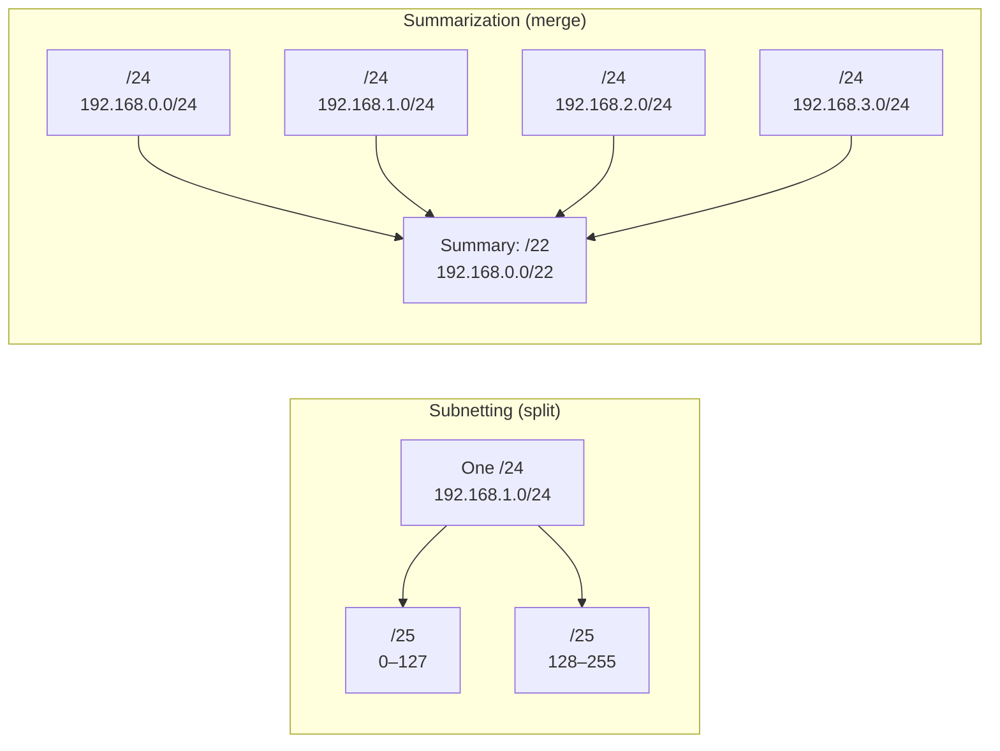

# 04.07 — CIDR & Route Summarization

> [!abstract] The Opposite of Subnetting
> **Subnetting** splits one network into many smaller ones. **Route summarization** (also called **supernetting** or **aggregation**) combines many smaller networks into one larger one. CIDR (Classless Inter-Domain Routing, RFC 1519, 1993) is the framework that made both possible by discarding rigid Class A/B/C boundaries in favor of flexible prefix lengths.

---

##  CIDR — What and Why

Before CIDR (1993), the internet used **classful addressing** — every network was a Class A (/8), B (/16), or C (/24). This was catastrophically inefficient:
- A medium-sized org needing 500 hosts got a Class B (/16) — wasting 65,000 addresses.
- Or they got two Class Cs (/24 each) — but BGP had to advertise each one separately, swelling the global routing table.

CIDR discarded the class boundaries. With CIDR:
- A medium org gets a `/22` (1024 addresses) — just right.
- A block of 16 contiguous `/24`s can be advertised as a single `/20` — shrinking the global routing table.

Today, every routing protocol except RIPv1 supports CIDR. The internet's BGP tables would be unmanageable without it.

---

##  The Summarization Algorithm

To summarize a list of contiguous subnets:

1. **Convert** the differing octets of each subnet's network address to binary.
2. **Align** the binary representations and count the **matching bits from left to right**.
3. **The summary address** is formed by keeping the matching bits and setting the rest to `0`.
4. **The summary prefix length** is the number of matching bits.

> [!warning] Contiguity Required
> Summarization only works on **contiguous, aligned** subnets. The subnets must form a complete power-of-two block. If you have `192.168.1.0/24` and `192.168.3.0/24` but not `192.168.2.0/24`, you cannot summarize them as `/23` — you'd accidentally include networks you don't own.

---

##  Worked Example

**Given subnets:**
- `192.168.10.0/24`
- `192.168.11.0/24`
- `192.168.12.0/24`
- `192.168.13.0/24`
- `192.168.14.0/24`
- `192.168.15.0/24`

### Step 1: Convert the changing octet (third) to binary

| Decimal | Binary |
| :---: | :---: |
| 10 | `00001`**010** |
| 11 | `00001`**011** |
| 12 | `00001`**100** |
| 13 | `00001`**101** |
| 14 | `00001`**110** |
| 15 | `00001`**111** |

### Step 2: Count matching bits

The first **5 bits** of the third octet are identical: `00001`. The remaining 3 bits vary (`010`, `011`, `100`, `101`, `110`, `111`).

### Step 3: Compute the summary prefix

- First octet: 8 matching bits.
- Second octet: 8 matching bits.
- Third octet: 5 matching bits.
- **Total prefix: $8 + 8 + 5 = 21$ → `/21`.**

### Step 4: Compute the summary address

Keep the matching bits, zero out the rest:
- Third octet matching portion: `00001`. Append `000` for the rest: `00001000` = `8`.

**Summary route: `192.168.8.0/21`** (mask `255.255.248.0`).

### Verify
- `/21` covers 32 × /24 subnets ($2^{24-21} = 8$ subnets actually — wait, $2^{3} = 8$ subnets, each /24 has 256 addresses, so /21 has $8 \times 256 = 2048$ addresses).
- Address range: `192.168.8.0` to `192.168.15.255`.
- We have 6 /24s we want to summarize. Does the /21 contain exactly those 6 plus 2 more (8.0 and 9.0)? Yes! The summary covers `8.0`, `9.0`, `10.0`, `11.0`, `12.0`, `13.0`, `14.0`, `15.0` — that's 8 /24s.
- We own 6 of them. If we don't own `.8.0/24` and `.9.0/24`, we shouldn't summarize — we'd be advertising routes for networks we don't have. **In production, summarize only if you own every subnet the summary covers.**

> [!warning] Don't advertise summaries that include networks you don't own
> A common operational mistake: an admin summarizes `192.168.8.0/21` because they own `.10`–`.15`, but `.8` and `.9` belong to another department or another company. Traffic destined for `.8` or `.9` will be black-holed to your router. Always verify the summary covers only your own subnets.

---

##  CIDR Block Sizes

| Prefix | Addresses | Equivalent Classful |
| :-: | :-: | :--- |
| /32 | 1 | Host route |
| /31 | 2 | P2P link (RFC 3021) |
| /30 | 4 | 2-host subnet |
| /29 | 8 | 6-host subnet |
| /28 | 16 | 14-host subnet |
| /27 | 32 | 30-host subnet |
| /26 | 64 | 62-host subnet |
| /25 | 128 | Half a Class C |
| /24 | 256 | 1 Class C |
| /23 | 512 | 2 Class Cs |
| /22 | 1024 | 4 Class Cs |
| /21 | 2048 | 8 Class Cs |
| /20 | 4096 | 16 Class Cs |
| /19 | 8192 | 32 Class Cs |
| /18 | 16384 | 64 Class Cs |
| /17 | 32768 | 128 Class Cs |
| /16 | 65536 | 1 Class B |
| /8 | 16M | 1 Class A |

---

##  Why Summarization Matters

### 1. Shrinks the global routing table
The internet BGP table has ~950,000 routes (as of 2024). Without aggregation, every individual /24 would be advertised — that would be 16+ million routes, requiring terabytes of RAM in core routers.

### 2. Hides network complexity
A core router doesn't need to know every internal subnet of a branch office. It just needs one summary route pointing toward the branch's WAN router.

### 3. Improves convergence
When an internal subnet flaps, only the local router knows. The summary route stays stable upstream — no convergence churn.

### 4. Reduces CPU and bandwidth
Fewer routes to advertise, store, recompute, and propagate.

---

##  Subnetting vs Summarization

| Aspect | Subnetting | Summarization |
| :--- | :--- | :--- |
| Direction | Split one network into many | Merge many networks into one |
| Bit manipulation | Borrow host bits → longer prefix | Combine network bits → shorter prefix |
| Use case | Right-size internal subnets | Shrink routing tables |
| Tools | FLSM, VLSM | CIDR, route aggregation |

Both rely on the same underlying binary math: count matching bits, set the rest to zero, that's your boundary.

---

##  Mnemonics

> "**Subnetting Splits. Summarization Squashes.**"

> Summarization recipe: "**B M C M**" → **B**inary, **M**atch, **C**ount, **M**ask.
> Pronounce: "Be My Classmate, Mate."

More in [[14 - Memory Aids & Mnemonics/14.01 IPv4 Subnetting Memory Tricks|14.01]].

---

##  See Also

- [[04 - IPv4 Network Layer/04.05 FLSM|04.05 FLSM]]
- [[04 - IPv4 Network Layer/04.06 VLSM|04.06 VLSM]]
- [[07 - IP Routing/07.06 Route Aggregation|07.06 Route Aggregation]] — how summaries propagate through routing protocols.
- [[08 - Routing Protocols/08.04 Link-State - OSPF|08.04 OSPF]] — ABRs summarize between areas.
