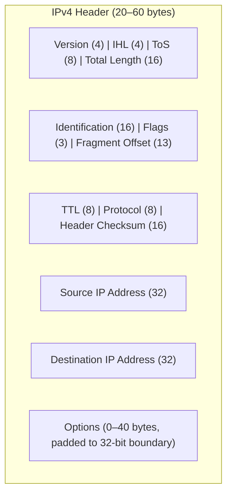

# 05.01 — IPv4 Header Fields

> [!abstract] The Shipping Label
> The IPv4 header is the "shipping label" on every IP packet. It carries the source and destination addresses, the TTL, the protocol of the payload, and the metadata needed for fragmentation and reassembly. The header is **20 to 60 bytes** — 20 bytes minimum, up to 40 bytes of options.

---

##  Field-by-Field

| Field | Bits | Purpose |
| :--- | :-: | :--- |
| **Version** | 4 | IP version. `0100` for IPv4, `0110` for IPv6. |
| **IHL** (Internet Header Length) | 4 | Header length in 32-bit words. Min `5` (20 B), max `15` (60 B). $\text{Bytes} = \text{IHL} \times 4$. |
| **ToS / DSCP** (Type of Service) | 8 | QoS marking — priority, delay, throughput, reliability. Modern use: DSCP (6 bits) + ECN (2 bits). |
| **Total Length** | 16 | Total packet size (header + payload), in bytes. Max 65,535. |
| **Identification** | 16 | Unique ID for the original datagram. All fragments share this. |
| **Flags** | 3 | Reserved (1), **DF** (Don't Fragment, 1), **MF** (More Fragments, 1). |
| **Fragment Offset** | 13 | Position of this fragment's payload in the original, in **8-byte blocks**. |
| **TTL** (Time to Live) | 8 | Hop counter. Decremented by each router. When 0, packet dropped + ICMP Time Exceeded sent. |
| **Protocol** | 8 | Identifies the next-level protocol in the payload. |
| **Header Checksum** | 16 | Error detection for the header only (not payload). |
| **Source IP** | 32 | Sender's IP address. |
| **Destination IP** | 32 | Receiver's IP address. |
| **Options** | 0–320 | Optional fields (record route, timestamp, etc.). Padded to 32-bit boundary. |

---

##  IHL — Internet Header Length

The IHL field is the **header length in 32-bit (4-byte) words**, not bytes.

$$\text{Header length (bytes)} = \text{IHL} \times 4$$

- IHL = `5` → 20-byte header (minimum; no options).
- IHL = `15` → 60-byte header (maximum; 40 bytes of options).

The IHL exists because the header length varies with options. Without it, the receiver wouldn't know where the payload starts.

### Useful Derived Formulas

- $\text{Payload size} = \text{Total Length} - (\text{IHL} \times 4)$
- $\text{Header length in bytes} = \text{IHL} \times 4$

---

##  Flags

| Bit | Name | Meaning |
| :-: | :--- | :--- |
| 0 | Reserved | Must be `0` |
| 1 | **DF** (Don't Fragment) | `0` = router may fragment if too big; `1` = router must drop the packet and send ICMP Type 3 Code 4 if too big |
| 2 | **MF** (More Fragments) | `0` = this is the last fragment; `1` = more fragments follow |

> [!info] Why DF exists
> Modern hosts set DF=1 to avoid fragmentation (which is expensive and fragile). They rely on PMTUD ([[05 - IP Datagram & Fragmentation/05.04 Path MTU Discovery|05.04]]) to discover the path MTU and size their packets accordingly.

---

##  Fragment Offset

The Fragment Offset field is **13 bits**, so it can express values 0 to 8191. But offsets can be up to 65,528 bytes (max payload 65535 − 20 header = 65515, rounded down to a multiple of 8). To fit this range into 13 bits, the offset is expressed in **8-byte blocks**, not bytes:

$$\text{Offset value} = \frac{\text{Byte position of fragment's payload in original}}{8}$$

This is why the payload size of every fragment **except the last** must be a multiple of 8 — so the next fragment's offset is a whole number.

---

##  Protocol Field

Identifies the L4 protocol encapsulated in the payload. Common values:

| Value | Protocol |
| :-: | :--- |
| 1 | ICMP |
| 2 | IGMP |
| 6 | TCP |
| 17 | UDP |
| 41 | IPv6 encapsulation |
| 47 | GRE |
| 50 | ESP (IPsec) |
| 51 | AH (IPsec) |
| 89 | OSPF |
| 103 | PIM |
| 132 | SCTP |

The IANA maintains the full list at https://www.iana.org/assignments/protocol-numbers.

---

##  TTL — Time to Live

The TTL was originally meant to be a **time in seconds** (hence the name). In practice it became a **hop count** — each router decrements it by 1, regardless of how long it held the packet.

- **TTL = 0 or 1 on receipt** → router drops the packet and sends an ICMP Type 11 Code 0 (Time Exceeded) back to the source.
- This is how **traceroute** works — send packets with progressively increasing TTL (1, 2, 3, ...) and listen for ICMP Time Exceeded from each router along the path.

Common default TTL values by OS:
- Linux: 64
- Windows: 128
- macOS: 64
- Network devices (Cisco): 255

> [!tip] OS fingerprinting
> The TTL in a packet you receive hints at the sender's OS. If `ping` shows `ttl=119`, the packet likely started at 128 (Windows) and traversed 9 hops. If `ttl=51`, started at 64 (Linux) and traversed 13 hops.

---

##  Header Checksum

The Header Checksum is a 16-bit one's-complement sum over the entire IPv4 header (including options). It validates only the header — not the payload. The payload is expected to have its own checksum (TCP/UDP both include one).

Every router that forwards the packet must **recompute** the checksum because the TTL changed. This is one reason IPv6 dropped the header checksum entirely — end-to-end checksums (TCP/UDP) suffice, and removing the per-hop checksum saves work in hardware.

---

##  Options (Rarely Used)

IP options can carry:
- **Record Route** — each router appends its IP, tracing the path. Limited to 9 hops due to header size.
- **Strict / Loose Source Route** — sender specifies the path the packet must take. Mostly blocked by routers today (security risk).
- **Timestamp** — each router appends its IP + timestamp. Used for network delay measurement.
- **Router Alert** — "this packet should be examined by every router, not just forwarded." Used by IGMP and RSVP.

Options are rare in production because:
- Many firewalls drop packets with options (security).
- Hardware routers may punt option-bearing packets to the slow path (CPU).
- IPv6 uses extension headers instead, which are more flexible.

---

##  Header Mnemonic

The header fields in order, with a memory phrase:

| Letter | Field |
| :-: | :--- |
| V | Version |
| I | IHL |
| T | Total Length |
| I | Identification |
| F | Flags |
| F | Fragment Offset |
| T | TTL |
| P | Protocol |
| C | Checksum |
| S | Source IP |
| D | Destination IP |

> "**Very Intelligent Teachers Identify Fragmented Files Through Proper Communication Systems Daily.**"

More in [[14 - Memory Aids & Mnemonics/14.02 IP Fragmentation Memory Tricks|14.02]].

---

##  See Also

- [[05 - IP Datagram & Fragmentation/05.02 Fragmentation Mathematics|05.02 Fragmentation Mathematics]]
- [[05 - IP Datagram & Fragmentation/05.04 Path MTU Discovery|05.04 PMTUD]]
- [[10 - Transport Layer/10.07 TCP Header Fields|10.07 TCP Header]] — what rides inside the IP payload when Protocol=6.
