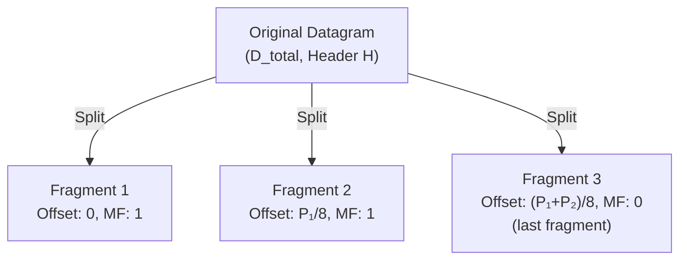

# 05.02 — Fragmentation Mathematics

> [!abstract] The Four-Step Recipe
> When an IP packet exceeds the Maximum Transmission Unit (MTU) of the next link, the router (or the source host) splits it into fragments. The math is always the same four steps: isolate the payload, compute max payload per fragment, compute the number of fragments, build the table.

---

##  The Math, Step by Step

### Step 1: Isolate the Payload

The original datagram has total size $D_{\text{original}}$ and header size $H$ (typically 20 bytes for IPv4 without options).

$$D_{\text{data}} = D_{\text{original}} - H$$

### Step 2: Determine Maximum Payload per Fragment

The MTU is the total packet size the next link can carry (header + payload). So the maximum payload a fragment can carry is $\text{MTU} - H$.

But the **Fragment Offset** field counts in 8-byte blocks, so every fragment's payload (except the last) must be a multiple of 8. We compute:

$$P_{\text{max}} = \left\lfloor \frac{\text{MTU} - H}{8} \right\rfloor \times 8$$

> [!warning] The 8-byte alignment is the rule students forget most often.
> Without it, the fragment offset would be a fractional value, which the 13-bit offset field can't represent. So intermediate fragments' payloads MUST be a multiple of 8.

### Step 3: Calculate Number of Fragments

$$N_{\text{frag}} = \left\lceil \frac{D_{\text{data}}}{P_{\text{max}}} \right\rceil$$

(ceiling function — even 1 remaining byte needs its own fragment)

### Step 4: Build the Fragment Table

For each fragment $i$ (where $0 \le i < N_{\text{frag}}$):

| Property | Formula |
| :--- | :--- |
| **Payload size** $P_i$ | For intermediate ($i < N-1$): $P_i = P_{\text{max}}$. For last ($i = N-1$): $P_i = D_{\text{data}} - (i \times P_{\text{max}})$ |
| **Total packet length** $L_i$ | $L_i = P_i + H$ |
| **MF flag** | `1` for all fragments except the last; `0` for the last |
| **Fragment offset** (value in the header) | $\text{FO}_i = \dfrac{i \times P_{\text{max}}}{8}$ |
| **Identification** | Same value in every fragment (copied from the original) |
| **Source/Dest IP, Protocol** | Copied unchanged from the original |

---

##  Worked Example — 2000-byte Datagram, 512-byte MTU

**Given:**
- Total datagram size: $D_{\text{original}} = 2000$ bytes
- Header size: $H = 20$ bytes
- MTU of next link: $512$ bytes
- Identification: `10`

### Step 1 — Payload
$$D_{\text{data}} = 2000 - 20 = 1980 \text{ bytes}$$

### Step 2 — Max payload per fragment
$$\text{Raw capacity} = 512 - 20 = 492 \text{ bytes}$$
$$\frac{492}{8} = 61.5 \implies \text{not a multiple of 8}$$
$$P_{\text{max}} = \lfloor 61.5 \rfloor \times 8 = 61 \times 8 = 488 \text{ bytes}$$

### Step 3 — Number of fragments
$$N = \left\lceil \frac{1980}{488} \right\rceil = \lceil 4.057 \rceil = 5 \text{ fragments}$$

### Step 4 — Build the table

| Fragment | Identification | Total Length $L_i$ | Payload $P_i$ | Offset (bytes) | Offset (value) | MF |
| :-: | :-: | :-: | :-: | :-: | :-: | :-: |
| 1 | 10 | $488 + 20 = \mathbf{508}$ | 488 | 0 | $0 / 8 = \mathbf{0}$ | 1 |
| 2 | 10 | $488 + 20 = \mathbf{508}$ | 488 | 488 | $488 / 8 = \mathbf{61}$ | 1 |
| 3 | 10 | $488 + 20 = \mathbf{508}$ | 488 | 976 | $976 / 8 = \mathbf{122}$ | 1 |
| 4 | 10 | $488 + 20 = \mathbf{508}$ | 488 | 1464 | $1464 / 8 = \mathbf{183}$ | 1 |
| 5 | 10 | $44 + 20 = \mathbf{64}$ | $1980 - (488 \times 4) = \mathbf{44}$ | 1952 | $1952 / 8 = \mathbf{244}$ | 0 |

### Verification

Sum of payloads: $488 \times 4 + 44 = 1952 + 44 = 1996$. Plus header in each fragment (5 × 20 = 100 bytes total). Original was 2000 bytes; we have $1980 + 100 = 2080$ bytes on the wire (the extra 100 bytes are the per-fragment headers). Total payload sums to $1980$  (matches $D_{\text{data}}$).

### The Offset Trick

Notice the offset values: `0, 61, 122, 183, 244`. Each is the previous + 61. This is because each intermediate fragment carries 488 bytes = 61 × 8. You can compute offsets mentally by adding 61 each time, instead of multiplying by $P_{\text{max}}$ every step.

> [!tip] Mental offset calculation
> $$\text{Offset}_i = i \times \frac{P_{\text{max}}}{8}$$
> So if $P_{\text{max}} = 488$, the offset increment is 61. Count up: 0, 61, 122, 183, 244.

---

##  Reassembly

Reassembly happens **only at the destination**, not at intermediate routers. The destination:
1. Groups fragments by their Identification + Source IP + Protocol.
2. Sorts them by Fragment Offset.
3. Concatenates their payloads in offset order.
4. When the fragment with `MF=0` arrives, reassembly is complete.

If any fragment is missing when the **reassembly timer** expires (default 30s on Linux, 60s on Windows), the entire datagram is discarded. There's no partial delivery.

> [!warning] Why reassembly is end-to-end
> If intermediate routers reassembled, they'd need to buffer fragments from every flow — memory-intensive. By pushing reassembly to the destination, the internet scales: routers just forward fragments like any other packet.

---

##  MTU Reference Values

| Medium | MTU |
| :--- | :-: |
| Ethernet (default) | 1500 bytes |
| Ethernet + 802.1Q VLAN | 1504 bytes (effective payload 1496) |
| PPPoE (DSL) | 1492 bytes |
| GRE tunnel | 1476 bytes |
| IPsec ESP tunnel | ~1422 bytes (depends on cipher) |
| Wi-Fi | 2304 bytes (but usually capped at 1500 for IP) |
| Jumbo Ethernet (datacenter) | 9000 bytes |
| IPv6 minimum MTU | 1280 bytes (mandated by spec) |
| IPv4 minimum MTU | 576 bytes (every host must be able to receive) |

> [!info] The 1500-byte Ethernet MTU
> This is why TCP's Maximum Segment Size (MSS) defaults to **1460 bytes** = 1500 − 20 (IP header) − 20 (TCP header). Fitting TCP+IP headers + 1460 bytes of payload exactly fills a 1500-byte Ethernet frame, maximizing efficiency without fragmentation.

---

##  Mnemonic — "D M N T"

> "**Don't Make Networking Terrifying**"
> → **D**ata → **M**ax → **N**umber → **T**able

Or for individual fragments: "**P L O M**" → Payload, Length, Offset, MF.

> "**PLOM**" — pronounced "Plum"

More in [[14 - Memory Aids & Mnemonics/14.02 IP Fragmentation Memory Tricks|14.02]].

---

##  See Also

- [[05 - IP Datagram & Fragmentation/05.01 IP Header Fields|05.01 IP Header Fields]]
- [[05 - IP Datagram & Fragmentation/05.03 Practical Walkthroughs|05.03 Walkthroughs]]
- [[05 - IP Datagram & Fragmentation/05.04 Path MTU Discovery|05.04 PMTUD]]
- [[10 - Transport Layer/10.08 TCP Connection Lifecycle|10.08 TCP Connection]] — where MSS negotiation happens.
