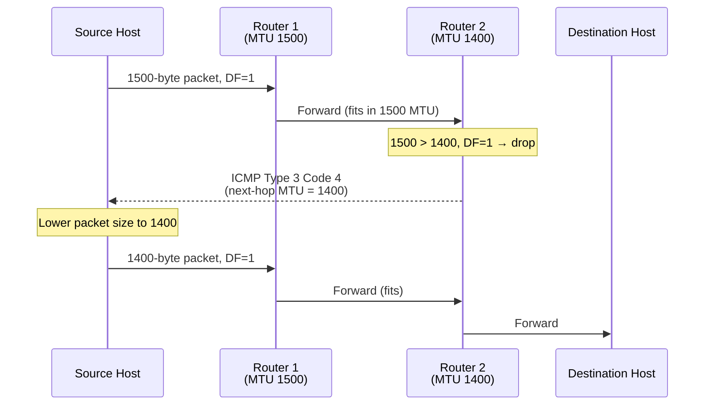

# 05.04 — Path MTU Discovery (PMTUD)

> [!abstract] Avoid Fragmentation Altogether
> Fragmentation is expensive (router CPU), fragile (loss of one fragment loses the whole datagram), and dangerous (attackers can crash hosts via overlapping-fragment exploits). **Path MTU Discovery** lets a source host discover the smallest MTU along the path to the destination and size its packets to fit — avoiding fragmentation entirely.

---

##  The Problem PMTUD Solves

The source host's outgoing interface might have an MTU of 1500 (Ethernet), but somewhere along the path there could be a PPPoE link (1492), a GRE tunnel (1476), or an IPsec tunnel (~1400). The source doesn't know this in advance.

Without PMTUD, every large packet would be fragmented at the bottleneck router — wasteful and risky.

With PMTUD, the source host:
1. Sends packets with the **DF (Don't Fragment) flag set**.
2. If a router along the path can't forward the packet (it's too big and DF is set), the router drops the packet and sends back an **ICMP Type 3 Code 4 (Fragmentation Needed)** message.
3. The ICMP message includes the **next-hop MTU** (the bottleneck's MTU).
4. The source lowers its packet size to the new MTU and retransmits.



---

##  PMTUD Black Holes

PMTUD depends on ICMP Type 3 Code 4 messages reaching the source. If a firewall along the return path blocks ICMP, the source never learns its packets are too big:
- Source sends large packet, DF=1.
- Bottleneck router drops it and sends ICMP 3/4.
- Firewall blocks ICMP.
- Source waits for ACK, times out, retransmits the same large packet.
- Same outcome. Connection hangs.

This is called a **PMTUD black hole**. Symptoms:
- Small packets (SYN, ACK, small HTTP requests) work fine.
- Large packets (file uploads, large POST bodies) hang.
- SSH works for typing but hangs on `ls` of a large directory.

### Fixes

1. **Allow ICMP Type 3 Code 4 through firewalls.** This is the correct fix. ICMP is not "evil" — it's essential for IP to function.
2. **Enable TCP MSS Clamping** on the router. The router rewrites the TCP MSS option in SYN packets to a value that fits the link's MTU. The endpoints never try to send oversized packets. Commonly used on PPPoE and VPN gateways.
3. **Lower the interface MTU on the source host.** A blunt instrument — affects all destinations, not just the one with the small path MTU.

---

##  PMTUD for IPv6

IPv6 routers **never fragment** — fragmentation is the source host's responsibility. PMTUD is therefore mandatory in IPv6 (RFC 8201):

- Source starts with the assumption that the path MTU is 1280 bytes (the IPv6 minimum) or the outgoing interface's MTU, whichever is smaller.
- If a router can't forward a packet (too big), it sends **ICMPv6 Packet Too Big** (Type 2) back to the source.
- Source lowers its packet size and retransmits.

The mechanism is the same as IPv4 PMTUD, just with different ICMP types and the guarantee that routers never fragment.

---

##  PMTUD in Practice — TCP MSS Clamping

The most common deployment of PMTUD workarounds is **TCP MSS Clamping** on the boundary router. When the router sees a TCP SYN or SYN-ACK, it rewrites the MSS option in the TCP header to a value that fits the link's MTU:

$$\text{MSS}_{\text{clamped}} = \text{MTU}_{\text{link}} - 40$$

(40 = 20 IP header + 20 TCP header.)

For a PPPoE link with MTU 1492: MSS clamped to 1452.
For an IPsec tunnel with MTU 1422: MSS clamped to 1382.

```cisco
! Cisco IOS example — clamp MSS on a dialer interface
interface Dialer0
  ip tcp adjust-mss 1452
```

The endpoints see the clamped MSS in the SYN and never try to send segments larger than that, avoiding fragmentation from the start.

---

##  Diagnosing MTU Problems

Symptoms:
- "I can ping the server but my SSH session hangs after login."
- "Web pages load partially, then stall."
- "Small uploads work; large uploads fail."

Diagnostic procedure:

1. **Ping with large packets, DF set:**
   - Linux: `ping -M do -s 1472 example.com` (1472 + 28 ICMP header = 1500 byte IP packet, DF set)
   - Windows: `ping -f -l 1472 example.com`
   - macOS: `ping -D -s 1472 example.com`
2. If you get "Frag needed and DF set" (or "message too long"), the path MTU is smaller than 1500.
3. Decrease the size by 8 bytes (1464 → 1456 → ...) until the ping succeeds.
4. Add 28 to find the path MTU (the 28 = 20 IP header + 8 ICMP header).
5. Set the host's interface MTU to that value, or enable MSS clamping on your router.

> [!example] Real-world Example
> A user reports their VPN to the office "doesn't work for big files". You ping with `-M do -s 1472` and get "Frag needed". You try `-s 1380` and it works. Path MTU is approximately $1380 + 28 = 1408$. You add `ip tcp adjust-mss 1368` to the VPN interface (1408 − 40 = 1368) and the problem is solved.

---

##  See Also

- [[05 - IP Datagram & Fragmentation/05.01 IP Header Fields|05.01 IP Header Fields]] — the DF flag.
- [[05 - IP Datagram & Fragmentation/05.02 Fragmentation Mathematics|05.02 Fragmentation Math]] — what PMTUD tries to avoid.
- [[10 - Transport Layer/10.08 TCP Connection Lifecycle|10.08 TCP Connection]] — where MSS is negotiated.
- [[12 - Tunnels & Remote Access/12.00 Chapter Overview|Chapter 12 — Tunnels]] — tunnels are the #1 cause of MTU problems today.
