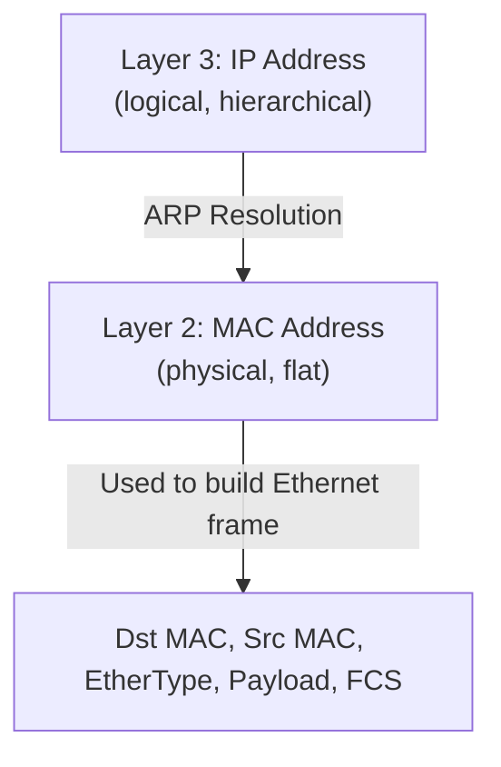
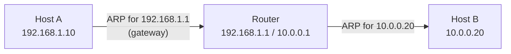

# 06.01 — ARP Concepts

> [!abstract] The L3-to-L2 Bridge
> ARP (Address Resolution Protocol, RFC 826) resolves a known Layer 3 IP address to its corresponding Layer 2 MAC address. It is the operational bridge between logical and physical addressing in IPv4 networks. Without ARP, an IP host could not construct the Ethernet frame needed to deliver a packet on the local subnet.



---

##  Why ARP Exists

When Host A (`192.168.1.10`) wants to send a packet to Host B (`192.168.1.20`) on the same subnet:

1. **L3 says:** "Send this packet to 192.168.1.20."
2. **L2 needs:** "What's the destination MAC address for the Ethernet frame?"
3. **A has no way to derive B's MAC from B's IP.** MACs are physical, burned-in at the factory; IPs are logical, assigned by software. There's no mathematical relationship.

So A must **ask** the network: "Who has 192.168.1.20? Tell me your MAC."

That's ARP.

---

##  The ARP Cache

Hosts don't ARP for every single packet — that would flood the network. Instead, they maintain an **ARP cache** (also called **ARP table**), a small in-memory hash table that maps recently-resolved IPs to MACs:

```
$ arp -a
192.168.1.1    00:1a:2b:3c:4d:5e    ether   eth0
192.168.1.20   00:11:22:33:44:55    ether   eth0
192.168.1.50   00:50:56:ab:cd:ef    ether   eth0
```

Cache behavior:
- **Populated dynamically** when an ARP reply arrives.
- **Populated as a side effect** when a host receives an ARP request — even if it's not the target, it learns the sender's IP→MAC mapping (this is the "ARP cache update on receive" optimization).
- **Entries age out** after a configurable timer (Linux: ~60s for incomplete, ~1hr for complete; Windows: 2–10 min; Cisco: 4 hr).
- **Static entries** can be added manually — useful for infrastructure devices (default gateway, servers) where you want to prevent spoofing.

> [!info] Why age out?
> MACs can change — a NIC is replaced, a VM is vMotioned to a different host, a firewall failover swaps the active unit. If ARP entries never expired, hosts would keep sending to the old MAC indefinitely. Aging ensures stale entries get refreshed.

---

##  ARP Cache vs CAM Table — Don't Confuse Them

| Property | ARP Cache | CAM Table |
| :--- | :--- | :--- |
| Device | Host, router, L3 switch | L2 switch |
| Maps | IP → MAC | MAC → Switch port |
| Layer | L3  L2 boundary | L2 |
| Populated by | ARP request/reply | Source MAC of incoming frames |
| CLI | `arp -a` / `show arp` | `show mac-address-table` |
| Aging | Hours (4h typical Cisco) | Minutes (5min typical Cisco) |

See [[03 - Physical & Data Link Layer/03.06 CAM Table vs ARP Cache|03.06]] for the full comparison.

---

##  Scope of ARP

ARP operates **within a single broadcast domain** (one VLAN, one subnet). It does **not** cross routers:

- If A wants to send to B on a different subnet, A doesn't ARP for B — A ARPs for its **default gateway**, and the gateway handles the rest.
- The gateway ARPs for B (or for the next-hop gateway) on B's subnet.



Routers do **not** forward ARP broadcasts — this is one of the architectural reasons routers terminate broadcast domains.

---

##  See Also

- [[06 - ARP & Address Resolution/06.02 ARP Operation Lifecycle|06.02 ARP Operation Lifecycle]] — the actual request/reply dance.
- [[06 - ARP & Address Resolution/06.03 ARP Packet Format|06.03 ARP Packet Format]] — the bits on the wire.
- [[03 - Physical & Data Link Layer/03.06 CAM Table vs ARP Cache|03.06 CAM vs ARP]] — the table comparison.
