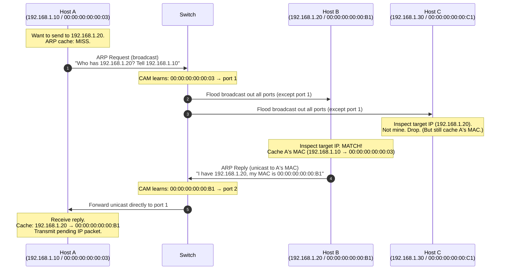

# 06.02 — ARP Operation Lifecycle

> [!abstract] The Request-Reply Dance
> When Host A needs to send a packet to Host B on the same subnet but doesn't have B's MAC in its ARP cache, it performs a **broadcast request** asking "Who has B's IP?". B replies with a **unicast reply** containing its MAC. A caches the result and proceeds.



---

##  Step-by-Step

### Step 1: Cache Check
Host A wants to send a packet to `192.168.1.20`. Before transmitting, A checks its ARP cache:
- **Hit** → A builds the Ethernet frame with the cached MAC and transmits.
- **Miss** → A places the IP packet in a "pending" queue and initiates the ARP transaction below.

### Step 2: ARP Request (Broadcast)
A constructs an ARP Request:
- **Sender Hardware Address:** `00:00:00:00:00:03` (A's MAC)
- **Sender Protocol Address:** `192.168.1.10` (A's IP)
- **Target Hardware Address:** `00:00:00:00:00:00` (unknown — left as zero)
- **Target Protocol Address:** `192.168.1.20` (B's IP)

A encapsulates this in an Ethernet II frame:
- **Source MAC:** `00:00:00:00:00:03` (A's MAC)
- **Destination MAC:** `FF:FF:FF:FF:FF:FF` (broadcast)
- **EtherType:** `0x0806` (ARP)

A transmits. The switch receives the broadcast frame, learns A's MAC → port 1 in its CAM table, and floods the frame out all ports except port 1.

### Step 3: Receiver Processing
Every host on the subnet receives the broadcast:
- **Host C (192.168.1.30, not the target):** decapsulates the ARP payload, compares the target IP (`192.168.1.20`) against its own IP (`192.168.1.30`), finds no match, **drops the frame**. But as an optimization, C **updates its ARP cache** with A's IP→MAC mapping — if A is asking for C's MAC, A probably wants to talk to C next, so the cache update saves a future ARP.
- **Host B (192.168.1.20, the target):** decapsulates, finds a match. B updates its ARP cache with A's mapping (same optimization) and proceeds to reply.

### Step 4: ARP Reply (Unicast)
B constructs an ARP Reply:
- **Sender Hardware Address:** `00:00:00:00:00:B1` (B's MAC)
- **Sender Protocol Address:** `192.168.1.20` (B's IP)
- **Target Hardware Address:** `00:00:00:00:00:03` (A's MAC, learned from the request)
- **Target Protocol Address:** `192.168.1.10` (A's IP)

B encapsulates this in a unicast Ethernet frame (source = B's MAC, destination = A's MAC) and transmits. The switch learns B's MAC → port 2 in its CAM table and forwards the frame only to A's port.

### Step 5: Cache Update and Data Transmission
A receives the ARP reply, extracts B's MAC, updates its ARP cache, and transmits the pending IP packet — now encapsulated in a unicast Ethernet frame addressed to B's MAC.

---

##  Observing ARP — Commands

| OS | View ARP cache | Add static entry | Flush cache |
| :--- | :--- | :--- | :--- |
| Linux | `ip neigh show` or `arp -n` | `ip neigh add 192.168.1.20 lladdr 00:11:22:33:44:55 dev eth0 nud permanent` | `ip neigh flush all` |
| macOS | `arp -a` | `arp -s 192.168.1.20 00:11:22:33:44:55` | `arp -d 192.168.1.20` |
| Windows | `arp -a` | `arp -s 192.168.1.20 00-11-22-33-44-55` | `arp -d *` |
| Cisco IOS | `show arp` | `arp 192.168.1.20 0011.2233.4455 arpa` | `clear arp-cache` |

### Capturing ARP with tcpdump
```bash
sudo tcpdump -i eth0 -n arp
# Sample output:
# 14:32:11.123456 00:00:00:00:00:03 > ff:ff:ff:ff:ff:ff, ARP, length 42: Request who-has 192.168.1.20 tell 192.168.1.10, length 28
# 14:32:11.123789 00:00:00:00:00:b1 > 00:00:00:00:00:03, ARP, length 42: Reply 192.168.1.20 is-at 00:00:00:00:00:b1, length 28
```

---

##  Common Pitfalls

1. **ARP entries go stale.** If B's NIC is replaced, A's cache still has the old MAC for hours. Symptom: A can reach everyone except B, even though B is up. Fix: `arp -d <B's IP>` on A to force re-resolution.
2. **Duplicate IPs cause ARP flapping.** If two hosts are configured with the same IP, the switch sees the same IP mapping to two different MACs alternately. Symptom: intermittent connectivity to that IP.
3. **ARP is unauthenticated.** Any host can send an unsolicited ARP reply claiming to be any IP. This is the basis of **ARP cache poisoning** / **ARP spoofing** attacks. See [[06 - ARP & Address Resolution/06.04 Advanced ARP|06.04 Advanced ARP]].

---

##  See Also

- [[06 - ARP & Address Resolution/06.01 ARP Concepts|06.01 ARP Concepts]]
- [[06 - ARP & Address Resolution/06.03 ARP Packet Format|06.03 ARP Packet Format]]
- [[06 - ARP & Address Resolution/06.04 Advanced ARP|06.04 Advanced ARP]] — gratuitous ARP, probing, security.
- [[03 - Physical & Data Link Layer/03.04 Hubs vs Switches|03.04 Switches]] — how the switch learns CAM entries during ARP.
