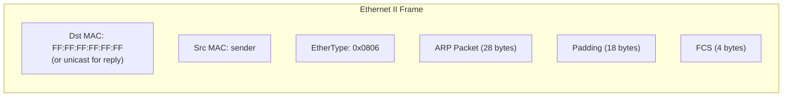

# 06.03 — ARP Packet Format

> [!abstract] 28 Bytes That Bridge L2 and L3
> An ARP packet is exactly 28 bytes (for Ethernet/IPv4). It's encapsulated directly inside an Ethernet II frame — there's no IP header. The EtherType is `0x0806`.



---

##  Field-by-Field

| Field | Size | Value |
| :--- | :-: | :--- |
| **Hardware Type** | 2 bytes | L2 protocol. `1` = Ethernet. |
| **Protocol Type** | 2 bytes | L3 protocol. `0x0800` = IPv4. (Same as EtherType for IPv4.) |
| **Hardware Address Length** | 1 byte | Length of MAC in bytes. `6` for Ethernet. |
| **Protocol Address Length** | 1 byte | Length of L3 address in bytes. `4` for IPv4. |
| **Operation (Opcode)** | 2 bytes | `1` = ARP Request, `2` = ARP Reply. (Also: `3` = RARP Request, `4` = RARP Reply.) |
| **Sender Hardware Address** | 6 bytes | Sender's MAC. |
| **Sender Protocol Address** | 4 bytes | Sender's IPv4 address. |
| **Target Hardware Address** | 6 bytes | Target's MAC. **All zeros in requests** (unknown). Filled in replies. |
| **Target Protocol Address** | 4 bytes | Target's IPv4 address. |

**Total ARP packet size:** $2 + 2 + 1 + 1 + 2 + 6 + 4 + 6 + 4 = 28$ bytes.

---

##  Why the Length Fields?

The Hardware Address Length and Protocol Address Length fields make ARP **protocol-independent**. The same ARP format can resolve IPv4 to Ethernet, IPv4 to Frame Relay, IPv4 to Token Ring, IPX to Ethernet, etc. — just by changing the type/length fields.

For Ethernet/IPv4, the values are fixed (6 and 4), so these fields look redundant. But they're why ARP could be reused across media types.

---

##  Why Padding?

The minimum Ethernet frame payload is 46 bytes. ARP packets are only 28 bytes. So the NIC adds **18 bytes of zero padding** to reach the 46-byte minimum before adding the FCS.

```
┌────────────────────────────────────────────┐
│ Ethernet header:    14 bytes                │
│ ARP packet:         28 bytes                │
│ Padding:            18 bytes (zeros)         │
│ FCS:                 4 bytes                │
└────────────────────────────────────────────┘
Total on wire (excl. preamble): 64 bytes 
```

Wireshark will show "Padding: 18 bytes" below the ARP layer — this is normal, not a bug.

---

##  Hex Walkthrough

A captured ARP request (with Ethernet header):

```
ffff ffff ffff          ← Destination MAC (broadcast)
09ab 14d8 0548          ← Source MAC
0806                    ← EtherType (ARP)
0001                    ← Hardware Type: Ethernet (1)
0800                    ← Protocol Type: IPv4 (0x0800)
06                      ← Hardware Address Length: 6
04                      ← Protocol Address Length: 4
0001                    ← Operation: ARP Request (1)
09ab 14d8 0548          ← Sender MAC: 09:AB:14:D8:05:48
7d05 300a               ← Sender IP: 125.5.48.10
0000 0000 0000          ← Target MAC: 00:00:00:00:00:00 (unknown)
7d12 6e03               ← Target IP: 125.18.110.3
(18 bytes of zero padding follows, not shown)
```

The reply would look identical except:
- Destination MAC = sender's MAC (unicast)
- Operation = `0002` (Reply)
- Sender and Target fields are swapped — the original target is now the sender.

---

##  ARP Operation Codes

| Opcode | Meaning |
| :-: | :--- |
| 1 | ARP Request |
| 2 | ARP Reply |
| 3 | RARP Request (Reverse ARP — historical, asks "what's my IP given my MAC?") |
| 4 | RARP Reply |
| 5 | DRARP Request |
| 6 | DRARP Reply |
| 7 | DRARP Error |
| 8 | InARP Request (Inverse ARP — used by Frame Relay) |
| 9 | InARP Reply |
| 10 | ARP NAK |

Modern Ethernet/IPv4 only uses opcodes 1 and 2. The others are for legacy or specialized link types.

---

##  ARP Packet-Level Security Considerations

ARP packets carry **no authentication**. Any host on the subnet can:
- Send an ARP Reply claiming to be any IP (even if no Request was sent).
- Send ARP Requests with a forged sender IP (the "gratuitous ARP" attack vector).
- Spam the network with ARP Replies to overwrite caches (ARP cache poisoning).

Mitigations:
- **Static ARP entries** — manual entries that don't get overwritten. Useful for critical infrastructure (default gateway) but doesn't scale.
- **Dynamic ARP Inspection (DAI)** on Cisco switches — inspects ARP packets against the DHCP snooping database and drops forged ones.
- **IEEE 802.1AE (MACsec)** — encrypts L2 frames, including ARP, preventing tampering on the wire.

See [[06 - ARP & Address Resolution/06.04 Advanced ARP|06.04 Advanced ARP]] for the full attack surface.

---

##  See Also

- [[06 - ARP & Address Resolution/06.01 ARP Concepts|06.01 ARP Concepts]]
- [[06 - ARP & Address Resolution/06.02 ARP Operation Lifecycle|06.02 ARP Lifecycle]]
- [[03 - Physical & Data Link Layer/03.03 Ethernet II Frame Structure|03.03 Ethernet II Frame]] — where ARP packets live.
