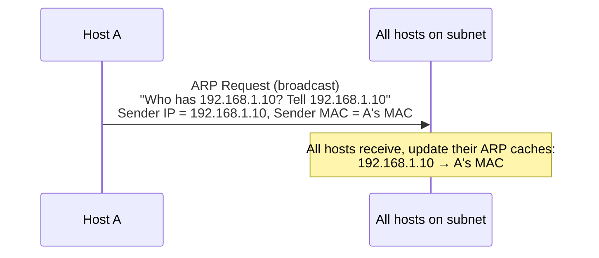
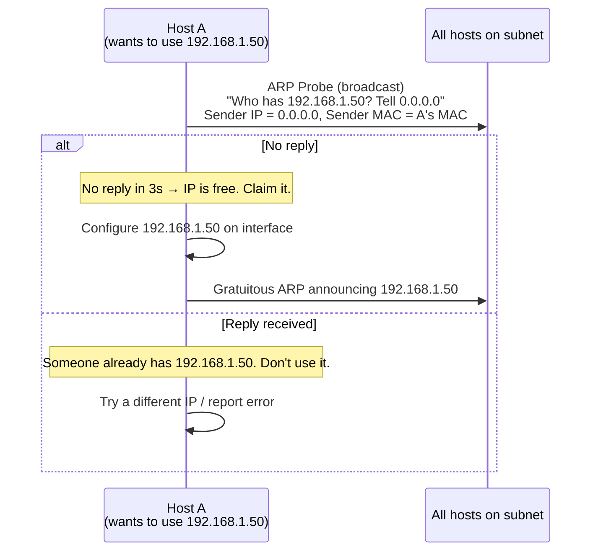
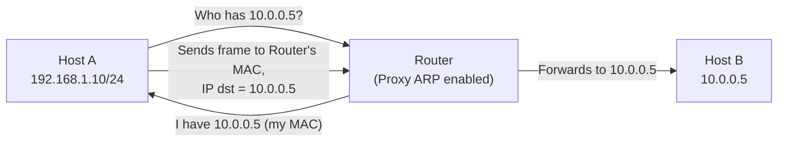
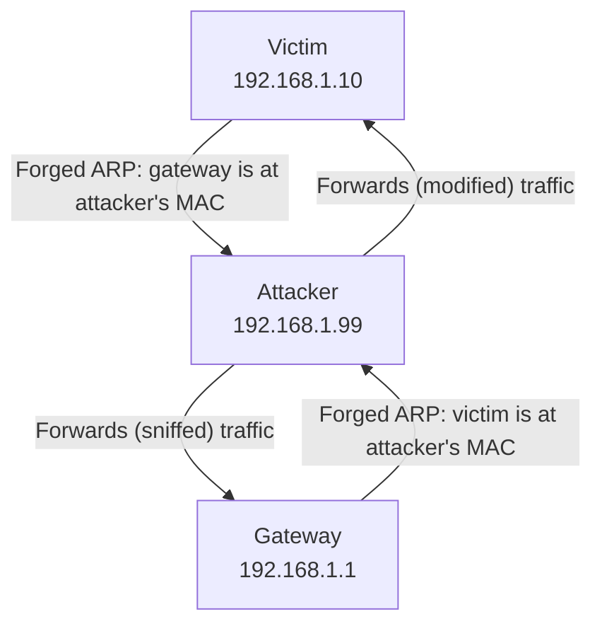

# 06.04 — Advanced ARP

> [!abstract] Beyond Request/Reply
> Three ARP variants you'll meet in production: **Gratuitous ARP** (announces an IP is yours), **ARP Probe** (asks if an IP is free before claiming it), and **Proxy ARP** (one host answers ARP on behalf of another). Plus the dark side: ARP cache poisoning and how to defend against it.

---

##  Gratuitous ARP (ARP Announcement)

A **gratuitous ARP** is an ARP Request where the **target IP is the sender's own IP**. The sender is essentially announcing: "Hey everyone, this IP is mine, and here's my MAC."

### Use Cases

1. **IP conflict detection.** When an interface comes up, it sends a gratuitous ARP. If anyone replies, another host is already using that IP — the interface fails to come up with an error like "Duplicate IP address detected".
2. **ARP cache update after MAC change.** When a NIC is replaced, a VM is vMotioned, or a firewall fails over to its peer, the new MAC needs to propagate. A gratuitous ARP forces every host on the subnet to update its cache immediately, instead of waiting for the old entry to age out.
3. **High-availability failover.** VRRP, HSRP, and CARP send gratuitous ARPs when the active router fails over. The new active router announces the virtual IP → its own MAC, and all hosts start sending traffic to it.

> [!info] Gratuitous ARP can be Request OR Reply
> Different OSes send it as either a Request (sender IP = target IP) or a Reply (broadcast, unsolicited). Both work — hosts receiving either will update their cache. RFC 5227 (IPv4 Address Conflict Detection) standardized the Request form.

---

##  ARP Probe (Address Conflict Detection)

An **ARP Probe** is an ARP Request with the **sender IP set to `0.0.0.0`** and the target IP set to the address being probed. The sender is asking: "Is anyone using this IP?"

### Use Cases

1. **DHCP client conflict detection** (RFC 5227) — before a client finalizes its DHCP lease, it probes the offered IP. If someone is using it, the client declines the lease and asks for another.
2. **Static IP configuration** — modern OSes (macOS, Windows 10+) probe before binding a static IP.
3. **Link-local address claiming** (RFC 3927) — when a host picks a random `169.254.x.x` APIPA address, it probes first.

---

##  Proxy ARP

**Proxy ARP** is when a router answers ARP Requests on behalf of hosts on a different subnet. The router pretends to be the target, so the sender builds frames addressed to the router's MAC; the router then forwards the IP packet to the real destination.

### When is Proxy ARP useful?

1. **Hosts with wrong subnet masks.** If a host thinks the whole network is one flat /16 but it's actually segmented into /24s, Proxy ARP on the router lets the host reach other /24s without reconfiguration.
2. **Transparent firewalls.** A firewall inserted inline without readdressing can use Proxy ARP to intercept traffic.
3. **Mobile IP / VM migration.** When a VM moves between datacenters, Proxy ARP at the new location can keep traffic flowing until DNS / ARP caches update.

### Risks

- **Hides subnetting.** Hosts think they're on a flat network when they're not. Troubleshooting becomes harder.
- **Broadcasts still don't cross.** Proxy ARP doesn't forward broadcasts — only unicast traffic that's been ARP-resolved.
- **Can be abused.** A rogue host running Proxy ARP can intercept traffic meant for any IP.

Modern networks usually disable Proxy ARP. Cisco: `no ip proxy-arp` on interfaces where it's not explicitly needed.

---

##  ARP Cache Poisoning (Spoofing)

Because ARP is **unauthenticated**, an attacker can send forged ARP Replies to:
- **The victim** — "The gateway's IP is at *my* MAC." The victim now sends all its traffic to the attacker.
- **The gateway** — "The victim's IP is at *my* MAC." The gateway now sends all return traffic to the attacker.

The attacker is now a **man-in-the-middle (MITM)** — they can sniff, modify, or block traffic.

### Tools that demonstrate this
- `arpspoof` (dsniff package)
- `ettercap`
- `bettercap`

### Defenses

| Defense | How it works | Tradeoff |
| :--- | :--- | :--- |
| **Static ARP entries** | Manual, non-overwritable IP→MAC mappings | Doesn't scale; breaks when MACs legitimately change |
| **Dynamic ARP Inspection (DAI)** | Switch inspects ARP packets against DHCP snooping DB | Requires enabling DHCP snooping first; some CPU cost |
| **Port security** | Limit MACs per port; block unknown MACs | Doesn't catch spoofing of allowed MACs |
| **802.1AE MACsec** | Encrypts all L2 frames including ARP | Requires MACsec-capable hardware everywhere |
| **DHCP snooping** | Drops DHCP offers from non-trusted ports | Foundational for DAI |

The standard enterprise recipe is **DHCP snooping + Dynamic ARP Inspection + IP Source Guard**. Together these defeat most L2 attacks.

---

##  Other ARP-Related Security Concerns

- **ARP scanning** — attacker sends ARP requests for every IP in a subnet to map live hosts. Tools: `arp-scan`, `nmap -PR`. Mitigation: port security, DAI.
- **Smurf attack** (historical) — attacker sends ICMP echo to a directed broadcast address with the victim's IP as source. Every host on the subnet replies to the victim. Mitigation: `no ip directed-broadcast` on routers (default now).
- **ARP storm** — a misbehaving host sends thousands of ARP requests per second, saturating the switch's CAM table or CPU. Mitigation: ARP rate limiting on switches.

---

##  See Also

- [[06 - ARP & Address Resolution/06.01 ARP Concepts|06.01 ARP Concepts]]
- [[06 - ARP & Address Resolution/06.02 ARP Operation Lifecycle|06.02 ARP Lifecycle]]
- [[06 - ARP & Address Resolution/06.05 IPv6 NDP|06.05 IPv6 NDP]] — IPv6's successor to ARP, with built-in security (SEND).
- [[09 - NAT & Perimeter Security/09.06 DMZ Architecture|09.06 DMZ]] — where proxy ARP sometimes appears.
