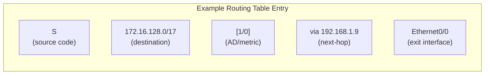
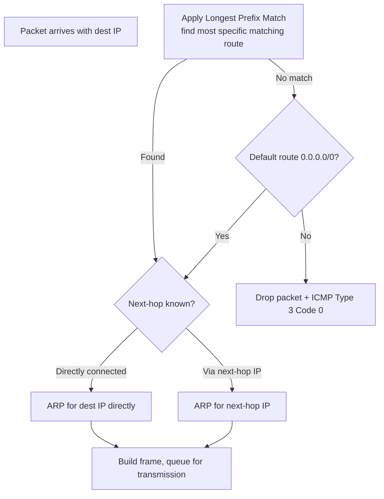

# 07.01 — Routing Table Structure

> [!abstract] The Router's Lookup Table
> A **routing table** is a list of routes the router uses to decide where to forward each packet. Each entry has five key fields: destination prefix, exit interface, next-hop IP, administrative distance, and metric. Reading a routing table correctly is the foundational skill of network troubleshooting.



---

##  Anatomy of a Routing Table Entry

A typical entry in `show ip route` looks like:

```
S    172.16.128.0/17 [1/0] via 192.168.1.9, Ethernet0/0
```

| Field | Value | Meaning |
| :--- | :--- | :--- |
| **Source code** | `S` | How the route was learned. `S` = static, `C` = directly connected, `O` = OSPF, `R` = RIP, `B` = BGP, `D` = EIGRP, `S*` = candidate default. |
| **Destination prefix** | `172.16.128.0/17` | The network this route applies to. |
| **AD / Metric** | `[1/0]` | Administrative Distance / Metric. Lower AD = more trusted. |
| **Next-hop** | `via 192.168.1.9` | The IP address to forward to. May be omitted for directly connected routes. |
| **Exit interface** | `Ethernet0/0` | The local interface to send the packet out of. |

### Source Codes (Cisco IOS)

| Code | Source |
| :-: | :--- |
| `C` | Directly Connected |
| `S` | Static |
| `S*` | Candidate Default |
| `R` | RIP |
| `B` | BGP |
| `D` | EIGRP |
| `EX` | External EIGRP |
| `O` | OSPF |
| `O IA` | OSPF Inter-Area |
| `O E1` | OSPF External Type 1 |
| `O E2` | OSPF External Type 2 |
| `i` | IS-IS |
| `i L1` | IS-IS Level 1 |
| `i L2` | IS-IS Level 2 |

---

##  Direct vs Indirect Delivery

When a router forwards a packet, the destination is either:

### Directly Connected (Direct Delivery)
The destination IP is in a subnet that matches one of the router's own interfaces.
- Action: ARP-resolve the destination IP directly, build the frame, transmit out that interface.
- No next-hop IP needed (next-hop = destination itself).
- Source code `C` in the routing table.

### Remote (Indirect Delivery)
The destination is not in any of the router's directly-connected subnets.
- Action: Look up the routing table → find the matching route → forward to the next-hop router.
- ARP-resolve the **next-hop IP** (not the destination IP), build the frame with the next-hop's MAC.
- Source code `S`, `O`, `R`, `B`, etc.

> [!info] The MAC changes at every hop
> As a packet travels from source to destination across multiple routers, the **L2 MAC addresses change at every hop** (source MAC = exit interface MAC, destination MAC = next-hop's MAC). But the **L3 IP addresses stay the same end-to-end** (modulo NAT). This is the core difference between L2 and L3.

---

##  The Default Route

A **default route** (`0.0.0.0/0`) matches every destination IP — but with the shortest possible prefix length (0). Thanks to Longest Prefix Match ([[07 - IP Routing/07.03 Longest Prefix Match|07.03]]), it's only used as a last resort, when no more specific route matches.

```
S*   0.0.0.0/0 [1/0] via 203.0.113.1
```

The `*` indicates this is a candidate default route. The router uses it as the "gateway of last resort" for any packet whose destination matches nothing else.

Common use case: a stub network (home, branch office) has one path to the internet. Instead of learning every internet route (~950,000 of them!), the stub just has a default route pointing to its ISP.

---

##  Reading `show ip route` Output

```
R1# show ip route
Codes: L - local, C - connected, S - static, R - RIP, M - mobile, B - BGP
       D - EIGRP, EX - EIGRP external, O - OSPF, IA - OSPF inter area
       N1 - OSPF NSSA external type 1, N2 - OSPF NSSA external type 2
       E1 - OSPF external type 1, E2 - OSPF external type 2
       i - IS-IS, su - IS-IS summary, L1 - IS-IS level-1, L2 - IS-IS level-2
       ia - IS-IS inter area, * - candidate default, U - per-user static route
       o - ODR, P - periodic downloaded static route, H - NHRP, l - LISP
       a - application route
       + - replicated route, % - next hop override, p - overrides from PfR

Gateway of last resort is 203.0.113.1 to network 0.0.0.0

S*    0.0.0.0/0 [1/0] via 203.0.113.1
      10.0.0.0/8 is variably subnetted, 4 subnets, 2 masks
C        10.0.0.0/30 is directly connected, Serial0/0/0
L        10.0.0.1/32 is directly connected, Serial0/0/0
C        10.0.0.4/30 is directly connected, Serial0/0/1
L        10.0.0.5/32 is directly connected, Serial0/0/1
      192.168.1.0/24 is variably subnetted, 2 subnets, 2 masks
C        192.168.1.0/24 is directly connected, FastEthernet0/0
L        192.168.1.1/32 is directly connected, FastEthernet0/0
O    192.168.2.0/24 [110/2] via 10.0.0.2, 00:05:12, Serial0/0/0
```

Walkthrough:
- `S*` → candidate default route to `0.0.0.0/0` via `203.0.113.1`.
- `C` → directly connected /30 networks on Serial0/0/0 and Serial0/0/1.
- `L` → local /32 routes for the router's own interface IPs (Cisco-specific, used for receiving traffic addressed to the router itself).
- `O` → OSPF-learned route to `192.168.2.0/24` via next-hop `10.0.0.2` on Serial0/0/0, with AD 110 and metric 2.
- `00:05:12` → how long since this route was last updated.

The "Gateway of last resort is 203.0.113.1 to network 0.0.0.0" line summarizes the default route.

---

##  Routing Table Lookup Process



Three things can drop the packet at this stage:
1. No matching route and no default → ICMP Type 3 Code 0 (Network Unreachable).
2. ARP fails for the next-hop → packet queued briefly then dropped silently.
3. Output interface is down → packet dropped, route removed from table.

---

##  See Also

- [[07 - IP Routing/07.02 Administrative Distance & Metrics|07.02 Administrative Distance]]
- [[07 - IP Routing/07.03 Longest Prefix Match|07.03 LPM]]
- [[07 - IP Routing/07.04 Static Routing|07.04 Static Routing]]
- [[13 - Cisco IOS CLI/13.03 Diagnostics & Verification|13.03 Cisco Diagnostics]] — `show ip route` in practice.
