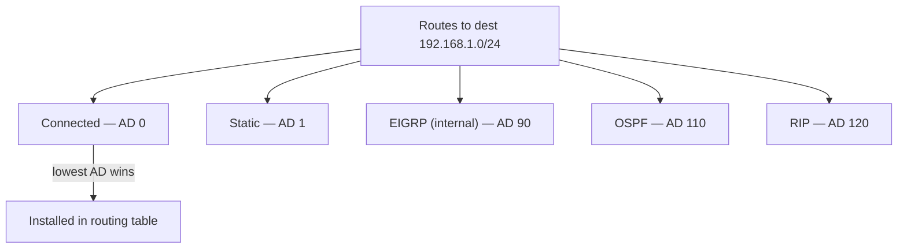

# 07.02 — Administrative Distance & Metrics

> [!abstract] Two-Level Tie-Breaking
> When a router learns about the same destination from multiple sources (e.g., static + OSPF + RIP), it must pick one. **Administrative Distance (AD)** is the first tie-breaker — it rates the trustworthiness of the *source*. If AD ties, the **metric** is the second tie-breaker — it rates the *quality of the path* within one source.



---

##  Administrative Distance

AD is a Cisco-proprietary concept (other vendors have equivalents) that rates routing sources on a 0–255 scale, where **lower = more trusted**.

| Source | Default AD |
| :--- | :-: |
| **Directly Connected** | 0 |
| **Static Route** | 1 |
| **EIGRP Summary** | 5 |
| **eBGP (External BGP)** | 20 |
| **EIGRP (internal)** | 90 |
| **IGRP** | 100 |
| **OSPF** | 110 |
| **IS-IS** | 115 |
| **RIP** | 120 |
| **EGP** | 140 |
| **ODR (On-Demand Routing)** | 160 |
| **EIGRP (external)** | 170 |
| **iBGP (Internal BGP)** | 200 |
| **Unreachable** | 255 |

### How AD is Used

When a router receives advertisements for the same destination prefix from multiple sources, it picks the one with the **lowest AD** and installs it in the routing table. The others are kept in their respective protocol databases but not used for forwarding.

> [!example] Selection Process
> A router receives three advertisements for `192.168.1.0/24`:
> - **OSPF**: Metric 50, AD 110
> - **RIPv2**: Metric 2, AD 120
> - **EIGRP**: Metric 256000, AD 90
>
> The router picks **EIGRP** because it has the lowest AD (90 < 110 < 120). The metrics are *not compared across protocols* — they use different units (RIP hops vs OSPF cost vs EIGRP composite).

### Overriding Default AD

You can override the default AD per route:

```cisco
! Set AD of a static route to 250 (less trusted than OSPF)
ip route 192.168.1.0 255.255.255.0 10.0.0.1 250
```

This is called a **floating static route** — it's installed only when the dynamic protocol (e.g., OSPF) loses its route. Used as a backup path.

```cisco
! Under OSPF, change AD for internal/external routes
router ospf 1
  distance ospf intra-area 100 inter-area 105 external 120
```

---

##  Metrics

The **metric** rates the quality of the path *within one routing protocol*. When a router learns multiple paths to the same destination from the **same** protocol (same AD), it compares metrics — lower is better.

Different protocols use different metrics:

| Protocol | Metric | Range |
| :--- | :--- | :--- |
| **RIP** | Hop count | 0–15 (16 = unreachable) |
| **OSPF** | Cost = Reference BW / Interface BW | 1–65535 |
| **EIGRP** | Composite (BW + delay + reliability + load) | 1–4,294,967,295 |
| **IS-IS** | Cost (default 10 for every hop) | 1–1023 |
| **BGP** | Path attributes (LOCAL_PREF, AS_PATH length, MED, etc.) | N/A |

### Metric Examples

**RIP:** Path A = 3 hops, Path B = 5 hops → Path A wins (fewer hops).
- But Path A might be 3 dial-up hops and Path B might be 5 fiber hops. RIP doesn't know — it only counts hops. This is why RIP is mostly obsolete.

**OSPF:** Cost = Reference BW / Interface BW.
- Default reference BW = 100 Mbps.
- 100 Mbps link → cost 1.
- 10 Mbps link → cost 10.
- 1 Gbps link → cost 1 (the famous "gigabit bottleneck" — gigabit and fast ethernet both have cost 1, so OSPF can't distinguish them).
- Fix: `auto-cost reference-bandwidth 10000` (10 Gbps reference) → 1 Gbps = cost 10, 10 Gbps = cost 1.

**EIGRP:** A composite metric, by default $256 \times (\text{scaled bandwidth} + \text{scaled delay})$. The formula can also include reliability and load, but rarely does in practice.

**BGP:** A multi-attribute decision process, not a single number. BGP considers, in order: WEIGHT, LOCAL_PREF, locally originated, AS_PATH length, origin code, MED, eBGP over iBGP, IGP metric to next-hop. See [[08 - Routing Protocols/08.08 Path-Vector - BGP|08.08 BGP]].

---

##  Equal-Cost Multipath (ECMP)

If a router learns multiple paths to the same destination from the same protocol with the **identical metric**, it can install all of them and load-balance. This is called **Equal-Cost Multipath (ECMP)**.

- Cisco IOS does ECMP by default (up to 4 paths for most protocols; up to 16 for EIGRP and OSPF with the `maximum-paths` command).
- Per-flow load balancing is preferred (hash on src/dst IP + ports) so packets belonging to the same TCP connection arrive in order.

**Variance** in EIGRP allows unequal-cost load balancing — using lower-quality paths proportionally to their metric.

---

##  AD vs Metric — One-Sentence Summary

> **AD picks the source; metric picks the path within the source.**

Or, more operationally:

> **If you have two routes to the same subnet from OSPF, compare metrics. If you have one from OSPF and one from RIP, compare AD.**

---

##  See Also

- [[07 - IP Routing/07.01 Routing Table Structure|07.01 Routing Table Structure]]
- [[07 - IP Routing/07.03 Longest Prefix Match|07.03 Longest Prefix Match]]
- [[08 - Routing Protocols/08.00 Chapter Overview|Chapter 8 — Routing Protocols]] — how each protocol computes its metric.
- [[00 - Master Index/Quick Reference Cheatsheet| Cheatsheet]] — AD defaults table.
