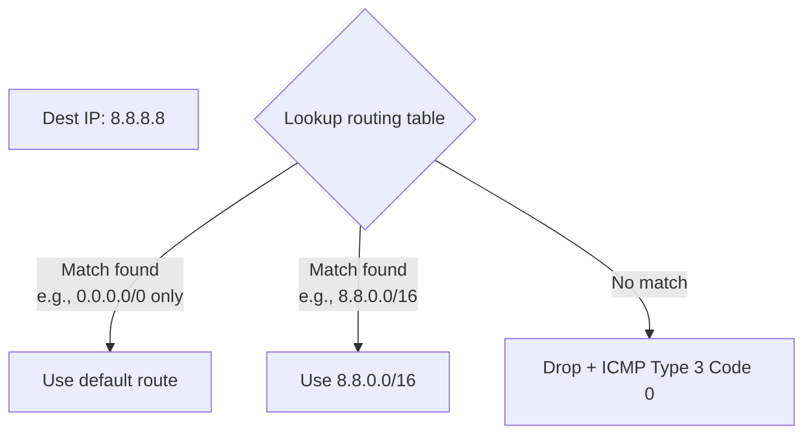

# 07.03 — Longest Prefix Match (LPM)

> [!abstract] Most Specific Wins
> When a router looks up a destination IP, multiple routes may match. The **Longest Prefix Match (LPM)** rule says: pick the route whose prefix length is the largest — i.e., the most specific match. LPM is the universal lookup rule for IP routing.

$$\text{Selected Route} = \max_j \left( \text{Prefix Length}_j \right) \quad \text{such that } \text{Destination IP} \text{ matches } \text{Route}_j$$

---

##  Worked Example

A router has three routes:
- **Route A:** `192.168.0.0/16`
- **Route B:** `192.168.1.0/24`
- **Route C:** `192.168.1.48/28`

A packet arrives destined for `192.168.1.57`. Which route wins?

### Step 1: Convert destination IP to binary

| Octet | Decimal | Binary |
| :-: | :-: | :--- |
| 1 | 192 | `11000000` |
| 2 | 168 | `10101000` |
| 3 | 1 | `00000001` |
| 4 | 57 | `00111001` |

Full: `11000000.10101000.00000001.00111001`

### Step 2: Test each route

| Route | Prefix binary | Mask bits | Match? |
| :--- | :--- | :-: | :-: |
| A: `192.168.0.0/16` | `11000000.10101000.xxxxxxxx.xxxxxxxx` | 16 |  (first 16 bits match) |
| B: `192.168.1.0/24` | `11000000.10101000.00000001.xxxxxxxx` | 24 |  (first 24 bits match) |
| C: `192.168.1.48/28` | `11000000.10101000.00000001.0011xxxx` | 28 |  (first 28 bits match) |

All three match! Apply LPM:

$$\max(16, 24, 28) = 28$$

**Route C (`192.168.1.48/28`) wins** — it has the longest matching prefix.

---

##  Why LPM Exists

LPM allows networks to **special-case** particular hosts or subnets while keeping a broader default. Example:

- A company has `10.0.0.0/8` as a summary route to its internal network.
- Within that, the engineering subnet is `10.5.0.0/16`.
- Within that, the build farm is `10.5.99.0/24`.
- Within that, a special host is `10.5.99.42/32`.

A packet to `10.5.99.42` should go to the build farm host directly, not via the broader engineering route. LPM picks `/32` because it's the most specific.

This is also how **policy routing**, **host routes**, and **traffic engineering** work — you add more specific routes to override broader ones for selected destinations.

---

##  Default Route — The Ultimate LPM Fallback

The default route `0.0.0.0/0` has prefix length 0 — it matches every IP, but with the shortest possible prefix. LPM picks it only when no other route matches.

---

##  How LPM is Implemented

Conceptually, LPM is "check every route and pick the longest match" — but real routers do this in hardware for every packet, billions of times per second. Three implementation strategies:

1. **Trie (prefix tree) lookup** — routes are stored in a binary tree where each bit is a node. The router walks the tree bit-by-bit and remembers the last valid route it saw. $O(W)$ lookup where $W$ = prefix length (32 for IPv4, 128 for IPv6).

2. **Hash-based lookup (TCAM)** — Content-Addressable Memory stores routes by prefix length, and the router queries the TCAM for each prefix length from longest to shortest, stopping at the first match. $O(1)$ lookup but expensive hardware.

3. **Software fast-path** — modern Linux uses an LPM trie in kernel space, with the FIB (Forwarding Information Base) populated by the routing daemon. Lookup is $O(\log N)$ or $O(W)$ depending on the data structure.

Cisco routers use **CEF (Cisco Express Forwarding)** — a TCAM-based LPM that does a lookup in a single memory access.

---

##  LPM Pitfalls

### Pitfall 1: Discontiguous Subnets
If you have `10.1.0.0/24` and `10.3.0.0/24` but not `10.2.0.0/24`, you can't summarize them as `10.0.0.0/16` — that would advertise a route to `10.2.0.0/24` you don't own. Use two /24 routes instead.

### Pitfall 2: Unexpected Host Routes
A `/32` host route accidentally added (e.g., from a misconfigured VPN client) will preempt the broader subnet route for that one host. The host will be unreachable from the rest of the subnet.

### Pitfall 3: Longest Match ≠ Best Path
LPM is a **mechanical** rule — it picks the most specific match, not the "best" path by quality. A /32 pointing to a slow WAN link will preempt a /24 pointing to a fast LAN link. Be careful when adding host routes.

---

##  Diagnosing LPM Issues

If a host can reach `8.8.8.8` but not `8.8.4.4`, suspect LPM:

1. `show ip route 8.8.8.8` — see which route the router uses.
2. `show ip route 8.8.4.4` — see if a different route is used (or no route).
3. Look for a more specific route (e.g., `8.8.8.0/24`) that catches `8.8.8.8` but not `8.8.4.4`.
4. Remove or correct the offending route.

The `show ip route <IP>` command (Cisco IOS) tells you exactly which route LPM would pick for that destination — invaluable for debugging.

---

##  See Also

- [[07 - IP Routing/07.01 Routing Table Structure|07.01 Routing Table Structure]]
- [[07 - IP Routing/07.02 Administrative Distance & Metrics|07.02 Administrative Distance]]
- [[07 - IP Routing/07.06 Route Aggregation|07.06 Route Aggregation]] — the inverse operation.
