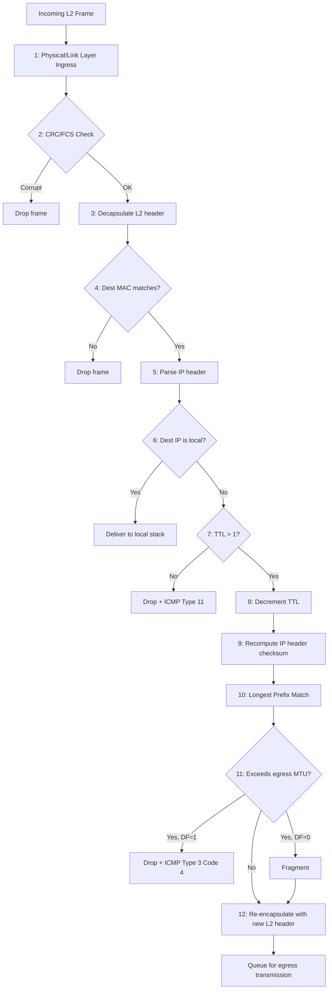

# 07.05 — Router Operations & Packet Processing

> [!abstract] The Ingress-to-Egress Pipeline
> What does a router *actually do* with every packet it receives? Twelve distinct steps, from physical ingress to egress queue. Understanding this pipeline is the key to predicting router behavior under any failure scenario — and to answering the trickiest cert exam questions.

---

##  Step-by-Step

### 1. Frame Ingress
Bits arrive on the physical interface. The interface's MAC controller decodes them into a digital frame and passes it up to the L2 processing engine.

### 2. CRC / FCS Verification
The router computes the CRC-32 over the entire frame (except the FCS field itself) and compares it to the received FCS value. If they don't match, the frame is corrupted and **dropped silently** — no ICMP, no retransmission at L2. The upper layers (TCP) will detect the loss and retransmit.

### 3. L2 Decapsulation
The router inspects the destination MAC address. It must match either:
- The MAC address of the receiving interface (unicast to the router), or
- A multicast address the router is listening to (e.g., `01:00:5E:00:00:05` for OSPF).

If neither matches, the frame is dropped. (Exception: the router is in promiscuous mode or bridging mode, which is rare.)

The router strips the L2 header and trailer, exposing the L3 packet. The **EtherType** field tells it what to do next: `0x0800` → IPv4, `0x86DD` → IPv6, `0x0806` → ARP.

### 4. Destination IP Check
The router checks if the destination IP matches one of its own interfaces:
- **Yes (local delivery):** The packet is destined for the router itself (e.g., OSPF hello, SSH to the router, ICMP echo to the router). Pass to the appropriate L4 protocol stack. Skip the rest of the forwarding pipeline.
- **No (forward):** Continue to step 5.

### 5. TTL Decrement
The router inspects the TTL in the IPv4 header:
- If **TTL ≤ 1**: drop the packet, send ICMP Type 11 Code 0 (Time Exceeded in Transit) back to the source. This is how traceroute works — send packets with progressively higher TTLs and listen for these ICMP messages.
- Otherwise: decrement TTL by 1.

$$\text{TTL}_{\text{new}} = \text{TTL}_{\text{old}} - 1$$

### 6. Header Checksum Recomputation
Because the TTL field changed, the IP header checksum is now invalid. The router recomputes it:

$$\text{New checksum} = \text{one's complement of the sum of all 16-bit words in the header}$$

(This is a small but real per-packet CPU cost — IPv6 dropped the header checksum for this reason.)

### 7. Longest Prefix Match (LPM)
The router's forwarding engine runs the LPM algorithm ([[07 - IP Routing/07.03 Longest Prefix Match|07.03]]) against its routing table to find the best route for the destination IP.

- **Match found:** use the route's next-hop IP and exit interface.
- **No match, default route exists:** use the default route.
- **No match, no default:** drop the packet, send ICMP Type 3 Code 0 (Network Unreachable).

### 8. MTU Check & Fragmentation
The router checks the packet size against the egress interface's MTU:
- **Packet fits:** forward as-is.
- **Packet exceeds MTU, DF flag = 1:** drop the packet, send ICMP Type 3 Code 4 (Fragmentation Needed, DF Set) including the next-hop MTU. This is what powers PMTUD.
- **Packet exceeds MTU, DF flag = 0:** fragment the packet per [[05 - IP Datagram & Fragmentation/05.02 Fragmentation Mathematics|05.02]].

### 9. L2 Re-Encapsulation
The router builds a new L2 frame:
- **Source MAC:** the MAC of the router's egress interface.
- **Destination MAC:** the MAC of the next-hop router (or the destination itself, if directly connected).

To find the next-hop's MAC, the router consults its **ARP cache**. If the entry is missing, the router sends an ARP request, queues the packet until the reply arrives, then transmits. If the reply never arrives (host down, wrong subnet, etc.), the packet is dropped after a queue timeout.

For point-to-point interfaces (Serial, GRE, IPsec tunnels), there's no MAC — the router just encapsulates and transmits.

### 10. New FCS Calculation
The router computes a new CRC-32 for the new frame and appends it as the FCS.

### 11. Egress Queue
The completed frame is placed in the egress interface's queue. QoS policies may reorder, shape, or drop packets here based on DSCP markings and queue depth.

### 12. Transmission
The frame is serialized onto the physical medium — copper, fiber, or radio — and begins its journey to the next hop.

---

##  What Changes at Every Hop

| Field | Changes? | Why |
| :--- | :-: | :--- |
| Source MAC |  Yes | Becomes the egress interface's MAC |
| Destination MAC |  Yes | Becomes the next-hop's MAC |
| Source IP |  No | Stays end-to-end (modulo NAT) |
| Destination IP |  No | Stays end-to-end (modulo NAT) |
| TTL |  Yes | Decremented by 1 at each router |
| Header Checksum |  Yes | Recomputed because TTL changed |
| L4 header & payload |  No | Untouched (modulo NAT, IPsec) |
| FCS |  Yes | Recomputed for the new frame |

---

##  Common Pitfalls

1. **Forgetting that MACs change.** A common Wireshark confusion: you capture at one end and see source MAC = your router, but the destination MAC = some MAC you don't recognize. That's the next-hop router's MAC, not the final destination's.

2. **Forgetting that TTL changes.** If you capture the same packet at multiple hops, the TTL decreases by 1 each time. Use this to count hops in a capture.

3. **Assuming NAT is happening when it isn't.** Source/dest IPs are *unchanged* by a normal router. Only NAT devices change them. If you see IPs changing in a capture, you're behind NAT (or looking at a tunnel).

4. **Forgetting the FCS is per-hop.** A frame's FCS validates only the L2 transmission on that single link. Each router recomputes it.

---

##  See Also

- [[05 - IP Datagram & Fragmentation/05.01 IP Header Fields|05.01 IP Header Fields]] — what the router inspects.
- [[05 - IP Datagram & Fragmentation/05.04 Path MTU Discovery|05.04 PMTUD]] — step 8 in detail.
- [[06 - ARP & Address Resolution/06.02 ARP Operation Lifecycle|06.02 ARP]] — how the router finds the next-hop MAC.
- [[07 - IP Routing/07.03 Longest Prefix Match|07.03 LPM]] — step 7 in detail.
