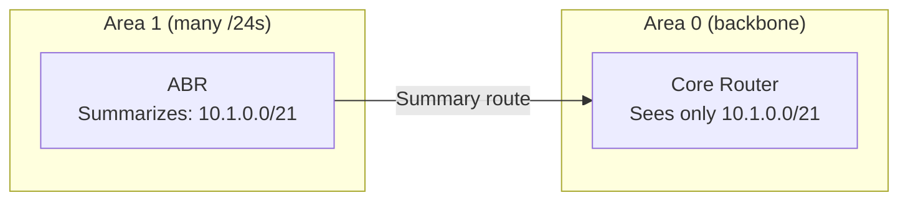

# 07.06 — Route Aggregation (Supernetting)

> [!abstract] Many Routes → One Route
> **Route aggregation** (also called **supernetting** or **summarization**) is the inverse of subnetting: combine multiple contiguous, smaller routes into a single, less-specific route. It shrinks routing tables, reduces convergence churn, and hides internal topology from upstream networks.

The math is identical to [[04 - IPv4 Network Layer/04.07 CIDR & Route Summarization|CIDR summarization]] — but here we focus on how it's used in routing protocols.

---

##  Why Aggregate?

1. **Shrinks routing tables.** The global BGP table has ~950,000 routes (2024). Without aggregation, it would be tens of millions.
2. **Hides topology changes.** If an internal subnet flaps, only the local router knows. The summary route stays stable upstream — no convergence churn.
3. **Reduces CPU/bandwidth.** Fewer routes to advertise, store, recompute.
4. **Improves security.** Upstream routers don't see your internal subnet structure.

---

##  The Algorithm

To aggregate a list of contiguous subnets:

1. Convert the changing octets to binary.
2. Count the matching bits from left to right.
3. Keep the matching bits; set the rest to `0` → summary address.
4. Set prefix length = number of matching bits.

### Worked Example

Aggregate these 8 subnets:
- `10.1.0.0/24`
- `10.1.1.0/24`
- `10.1.2.0/24`
- ...
- `10.1.7.0/24`

Third octet values: 0, 1, 2, 3, 4, 5, 6, 7. In binary (8 bits):
- 0 = `00000`**000**
- 1 = `00000`**001**
- 2 = `00000`**010**
- 3 = `00000`**011**
- 4 = `00000`**100**
- 5 = `00000`**101**
- 6 = `00000`**110**
- 7 = `00000`**111**

First 5 bits match (`00000`). The last 3 bits vary (covering all 8 combinations). So:
- Matching bits: 8 (first octet) + 8 (second octet) + 5 (third octet) = 21.
- Summary address: `10.1.0.0/21` (third octet = `00000000` = 0).
- Summary covers `10.1.0.0` to `10.1.7.255` — exactly our 8 subnets.

**Summary route:** `10.1.0.0/21`.

---

##  Aggregation in Each Routing Protocol

### Static
Manually create a static summary route:
```cisco
R1(config)# ip route 10.1.0.0 255.255.248.0 null0
```
The `null0` interface is the "bit bucket" — packets matching this summary but no more-specific route get dropped. This is the standard trick to advertise a summary upstream without depending on every specific subnet being present.

### RIP
RIPv2 supports route aggregation by disabling auto-summary and advertising a summary interface:
```cisco
R1(config-router)# no auto-summary
R1(config-if)# ip summary-address rip 10.1.0.0 255.255.248.0
```

### OSPF
OSPF summarizes at **Area Border Routers (ABRs)** (between areas) and **ASBRs** (external routes):
```cisco
R1(config-router)# area 1 range 10.1.0.0 255.255.248.0
R1(config-router)# summary-address 10.2.0.0 255.255.0.0
```

### EIGRP
EIGRP summarizes on interfaces:
```cisco
R1(config-if)# ip summary-address eigrp 1 10.1.0.0 255.255.248.0
```

### BGP
BGP summarizes via the `aggregate-address` command:
```cisco
R1(config-router)# aggregate-address 10.1.0.0 255.255.248.0 summary-only
```
The `summary-only` keyword suppresses the more-specific routes — only the aggregate is advertised.

---

##  Aggregation Caveats

### 1. Contiguity Required
You can only aggregate subnets that form a complete, aligned power-of-two block. If you have `10.1.0.0/24`, `10.1.1.0/24`, `10.1.3.0/24` (skipping 2), you can't aggregate to `10.1.0.0/22` — that would include `10.1.2.0/24` which you don't own.

### 2. Don't Aggregate What You Don't Own
If your summary covers subnets you don't own (even by accident), traffic destined for those subnets will be black-holed to you. Always verify the summary covers exactly your networks.

### 3. Loss of Specificity
Once aggregated, the upstream routers can't distinguish between the individual subnets. If one subnet has a problem, the summary still looks healthy. Use end-to-end monitoring (ping, synthetic transactions) inside the aggregated range.

### 4. Suboptimal Routing in Dual-Homed Designs
If you have two upstream links and you aggregate differently on each, traffic may take a suboptimal path. Plan carefully.

---

##  Summarization in OSPF Areas

OSPF multi-area design is built around summarization. A router in Area 0 (backbone) doesn't need to know every subnet in Area 1 — it just needs a summary route from the Area 1 ABR.



This is why OSPF scales to enterprise size — the core routers maintain a small LSDB and a small routing table.

---

##  See Also

- [[04 - IPv4 Network Layer/04.07 CIDR & Route Summarization|04.07 CIDR & Summarization]] — the math.
- [[07 - IP Routing/07.03 Longest Prefix Match|07.03 LPM]] — the inverse operation.
- [[08 - Routing Protocols/08.05 OSPF Areas & Router Types|08.05 OSPF Areas]] — how OSPF uses summarization.
- [[14 - Memory Aids & Mnemonics/14.01 IPv4 Subnetting Memory Tricks|14.01 Subnetting Mnemonics]].
