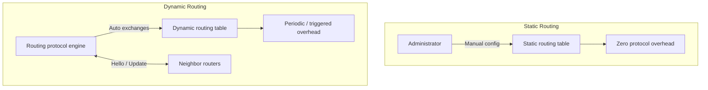

# 07.07 — Static vs Dynamic Routing

> [!abstract] Manual vs Automated
> **Static routing** is manually-configured forwarding paths. **Dynamic routing** uses routing protocols (RIP, OSPF, BGP, EIGRP) to automatically discover paths and adapt to topology changes. The right choice depends on network size, change rate, and operational trade-offs.



---

##  Comparison Matrix

| Parameter | Static | Dynamic |
| :--- | :--- | :--- |
| **Configuration complexity** | Simple in small nets; unmanageable in large | Requires upfront design; scales automatically |
| **Topology adaptation** | Manual — link failures drop traffic until admin fixes | Automatic — protocols detect failures and reroute |
| **Route selection logic** | Pre-determined by admin | Algorithmic (cost, hop count, etc.) |
| **CPU / memory overhead** | Negligible | Higher (protocol engines, topology DBs, SPF calcs) |
| **Link bandwidth consumption** | Zero | Some (hellos, LSAs, periodic updates) |
| **Security profile** | Higher — topology hidden from neighbors | Lower — must authenticate updates |
| **Scalability** | Poor — manual config everywhere | Excellent — auto-propagation |
| **Convergence time** | Slow (manual) | Fast (sub-second with modern protocols) |
| **Failure isolation** | Easy — routes are explicit | Harder — depends on protocol debugging |
| **Best for** | Small networks, defaults, backup paths | Medium-to-large networks, multi-path designs |

---

##  When to Use Static

Use static routing when:

1. **Small networks** (≤ 5 routers, ≤ 20 subnets) — the overhead of dynamic protocols isn't worth it.
2. **Stub networks** — one path to the outside world. A single default route suffices.
3. **Default routes** — even dynamic networks use a static default at the edge.
4. **Backup paths** — floating static routes (high AD) for failover when dynamic protocols fail.
5. **Security-sensitive links** — when you don't want to expose topology to the neighbor (e.g., to an untrusted partner network).
6. **Low-bandwidth links** — dynamic protocol overhead is a concern (e.g., satellite uplinks, dial-on-demand ISDN).

##  When to Use Dynamic

Use dynamic routing when:

1. **Multiple paths exist** between segments — dynamic protocols pick the best and reroute on failure.
2. **Network changes frequently** — adds, moves, deletes are auto-propagated.
3. **Network is large** — manual config doesn't scale.
4. **Redundancy is required** — sub-second failover is needed.
5. **Multi-vendor environment** — dynamic protocols (OSPF, BGP) are standardized.

##  When to Use Both

Most real networks use both:
- **Dynamic protocols** in the core (OSPF or EIGRP).
- **Static default routes** at the edge (to the ISP).
- **Floating static routes** as backups for critical links.
- **Static host routes** for special cases (e.g., a black-hole route for a known-bad IP).

---

##  Hybrid Scenario Example

Consider a 3-branch enterprise:

```
                   Internet
                      |
                   [Edge Rtr]  ← Static default to ISP
                      |
                   [HQ Core]   ← OSPF area 0
                    /     \
              [Branch 1]  [Branch 2]  ← OSPF area 1, area 2
```

- Edge router: **static default** to ISP (no need to learn 950K BGP routes).
- HQ core, branches: **OSPF** for internal route distribution.
- Each branch has a **floating static route** to the others via 4G backup, used only if the primary WAN link fails.

This is the typical pattern: static at the edge, dynamic in the core, floating statics for backup.

---

##  Decision Heuristic

Ask these questions in order:

1. **Is the network small (≤ 5 routers)?** → Static.
2. **Is there only one path to "the outside"?** → Static default.
3. **Are there multiple paths between internal segments?** → Dynamic.
4. **Is the network large or growing?** → Dynamic.
5. **Is sub-second failover required?** → Dynamic (with fast-converging protocol like OSPF or EIGRP).

---

##  See Also

- [[07 - IP Routing/07.04 Static Routing|07.04 Static Routing]] — configuration details.
- [[07 - IP Routing/07.02 Administrative Distance & Metrics|07.02 AD & Metrics]] — how routers pick between static and dynamic for the same destination.
- [[08 - Routing Protocols/08.00 Chapter Overview|Chapter 8 — Routing Protocols]] — the dynamic alternatives.
