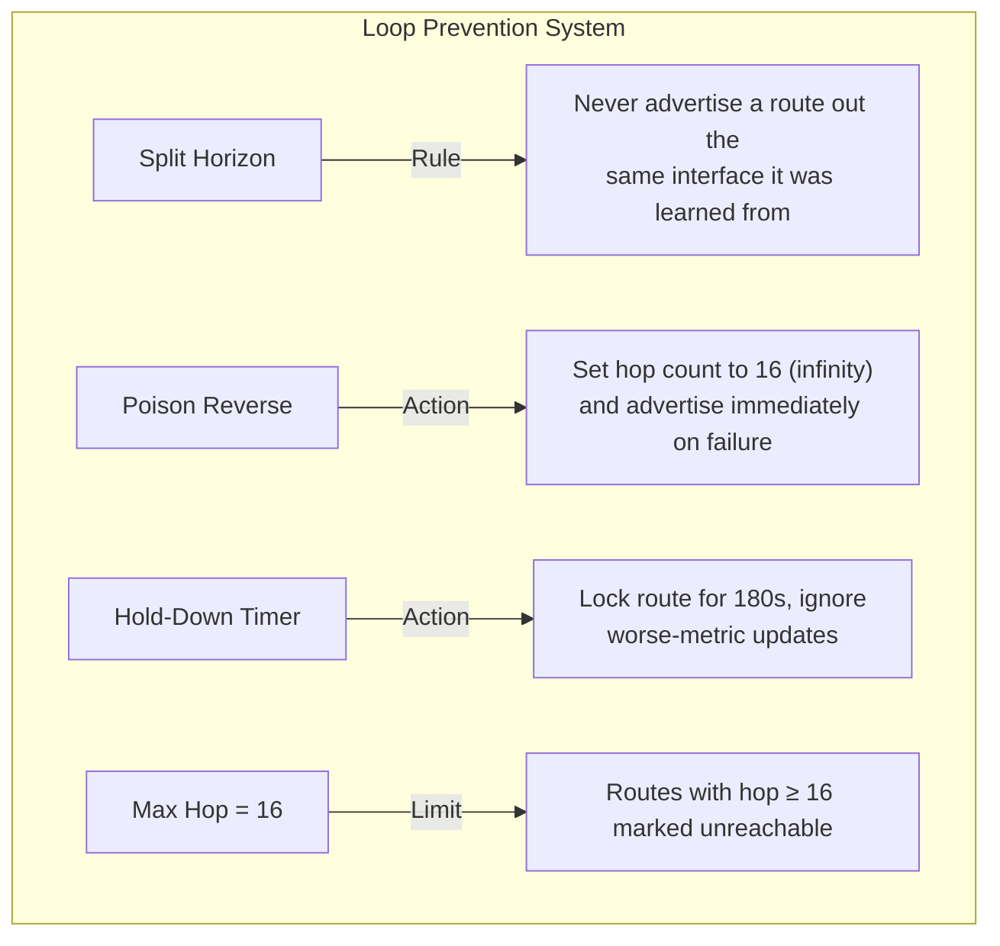
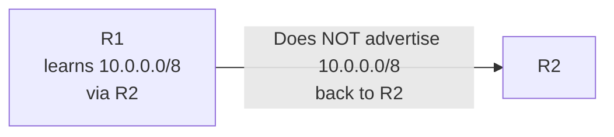
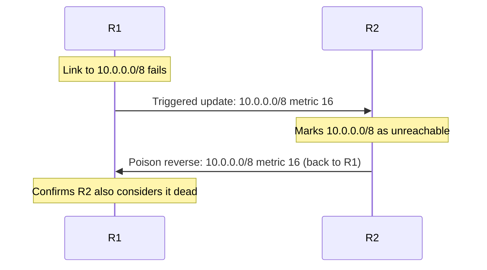
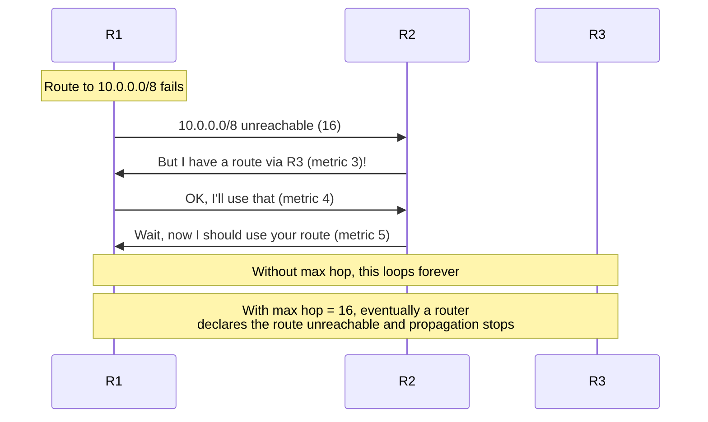

# 08.02 — RIP Loop Prevention

> [!abstract] Fighting the Loop
> Distance-vector protocols are prone to **routing loops** because routers trust their neighbors' tables blindly. RIP implements four loop-prevention mechanisms — **Split Horizon**, **Poison Reverse**, **Hold-Down Timers**, and **count-to-infinity prevention via the max-hop limit**.

---

##  Split Horizon

**Rule:** A router never advertises a route back out the interface through which it learned it.

**Why:** Without this rule, R2 might tell R1 about a route that R2 actually learned *from* R1. If R1's original route fails, R1 might pick up R2's advertisement and start forwarding to R2 — which then forwards back to R1. Loop.

**Variants:**
- **Simple Split Horizon** — omit the route from outgoing updates on the learning interface.
- **Split Horizon with Poison Reverse** — *explicitly advertise* the route back with metric 16 (infinity). This is more robust — it positively tells the neighbor "don't use me for this destination."

Cisco IOS enables split horizon by default on most interfaces (except some Frame Relay multipoint subinterfaces, where it's disabled by default due to NBMA topology quirks).

---

##  Poison Reverse

When a router detects that a directly connected route has failed, it doesn't wait for the periodic update — it immediately advertises the route to neighbors with metric 16 (unreachable).

Poison Reverse is the more aggressive sibling of Split Horizon. Instead of *silently* not advertising a route back, it explicitly advertises the route as poison (metric 16) back to the neighbor that told it about the route. This accelerates convergence — neighbors learn about failures immediately instead of waiting for the invalid timer.

---

##  Hold-Down Timer

When a router receives an update indicating a route is unreachable, it places that route in a **hold-down state** for 60 seconds (Cisco default; RFC says 180s).

During the hold-down period:
- The router ignores any routing updates for that subnet that offer a **worse** metric than the original route.
- The router accepts updates with a **better** metric (e.g., if a new path was found).

**Purpose:** prevent flapping. After a link fails, multiple routers may have stale information. Hold-down gives the network time to converge before re-installing the route from a possibly-stale source.

---

##  Maximum Hop Count (16 = Infinity)

RIP's max hop count is 15. A metric of 16 means "unreachable." This caps the **count-to-infinity** problem:

Without the 16-hop limit, two routers could keep bouncing routes back and forth forever, each incrementing the metric, in the classic count-to-infinity failure.

The 16-hop limit also caps the size of RIP networks — RIP can't be used in any network where the longest path exceeds 15 hops.

---

##  Loop Prevention Summary

| Mechanism | What it prevents | Default state |
| :--- | :--- | :--- |
| Split Horizon | Advertise route back where it was learned | On (most interfaces) |
| Poison Reverse | Accelerates failure propagation | On (with split horizon) |
| Hold-Down (60s) | Premature re-installation of failed route | On |
| Invalid Timer (180s) | Mark stale routes unreachable | On |
| Flush Timer (240s) | Permanently remove dead routes | On |
| Max Hop = 16 | Count-to-infinity | Built-in |

---

##  Why Loop Prevention Is Hard in Distance-Vector

Distance-vector protocols have **no global topology view**. Each router only knows what its neighbors told it. So when a link fails:
- R1 knows the link failed.
- R2 doesn't know yet — it has to wait for the next periodic update (or a triggered update from R1).
- During the gap, R2 might still advertise the dead route to R3, who advertises it back to R1, who might think "oh, R3 has a working path" and re-install the route — creating a loop.

The four mechanisms above close this gap from different angles: prevent backward advertisement, accelerate failure propagation, ignore premature re-installation, cap the metric.

Link-state protocols (OSPF) avoid this entirely by giving every router the full topology map, so each can compute loop-free paths locally.

---

##  See Also

- [[08 - Routing Protocols/08.01 Distance-Vector - RIP|08.01 Distance-Vector & RIP]]
- [[08 - Routing Protocols/08.03 RIP Update Logic|08.03 RIP Update Logic]]
- [[08 - Routing Protocols/08.04 Link-State - OSPF|08.04 OSPF]] — how link-state avoids loops entirely.
