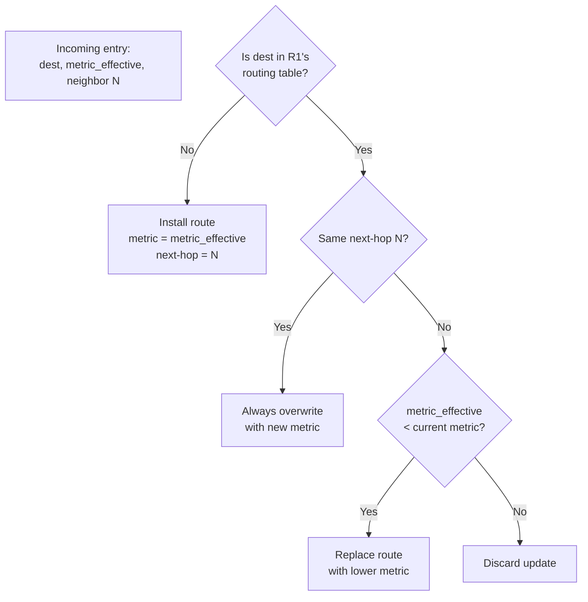

# 08.03 — RIP Update Logic

> [!abstract] The Four Decision Rules
> When a RIP router receives a routing update from a neighbor, it follows a precise four-rule decision tree to decide whether to install, replace, or discard each route entry. The trickiest rule is the **"same neighbor" rule** — which can override the "better metric wins" intuition.

---

##  The Four Rules

When RIP router R1 receives an update from neighbor N containing route `(dest, metric_in)`:

### Step 1: Increment the incoming metric
$$\text{metric}_{\text{effective}} = \text{metric}_{\text{in}} + 1$$

Every incoming metric is incremented by 1 to account for the additional hop through N.

### Step 2: Apply the decision tree to each entry

| Rule | Condition | Action |
| :-: | :--- | :--- |
| **1. New Route** | Dest not in routing table | Install route with new metric and next-hop N |
| **2. Better Metric** | Dest exists, next-hop is *different* from N, new metric < current metric | Replace route with lower metric, change next-hop to N |
| **3. Same Next-Hop** | Dest exists, next-hop is *already* N | Always overwrite — even if new metric is *worse* |
| **4. Worse Metric, Different Neighbor** | Dest exists, next-hop is not N, new metric ≥ current metric | Discard the update |

> [!warning] Rule 3 trips up everyone
> The "same next-hop" rule says: if you originally learned the route from N, and N now sends you a new metric for that route, **believe N** — even if the new metric is worse. Why? Because N is the authoritative source for that route (it's the next-hop). If N's metric went up, the path through N genuinely got worse; don't ignore reality.

---

##  Worked Example

**Given R1's current routing table:**
| Destination | Metric | Next-Hop |
| :--- | :-: | :--- |
| 134.33.0.0/16 | 1 | Directly Connected |
| 145.108.0.0/16 | 1 | Directly Connected |
| 0.0.0.0/0 | 1 | 134.33.12.1 |
| 34.0.0.0/8 | 4 | 145.108.1.9 |
| 141.12.0.0/16 | 3 | 145.108.1.9 |

**Update received from neighbor `145.108.1.9`:**
| Destination | Metric (incoming) |
| :--- | :-: |
| 199.245.180.0/24 | 3 |
| 34.0.0.0/8 | 2 |
| 141.12.0.0/16 | 4 |

### Step 1: Increment all incoming metrics

| Destination | metric_in | metric_effective |
| :--- | :-: | :-: |
| 199.245.180.0/24 | 3 | **4** |
| 34.0.0.0/8 | 2 | **3** |
| 141.12.0.0/16 | 4 | **5** |

### Step 2: Apply the decision tree

#### Entry 1: `199.245.180.0/24` (effective metric 4)
- In R1's table? **No.** → Rule 1 (New Route) → **Install**.
- New entry: `199.245.180.0/24 | metric 4 | next-hop 145.108.1.9`

#### Entry 2: `34.0.0.0/8` (effective metric 3)
- In R1's table? **Yes** (current metric 4, next-hop `145.108.1.9`).
- Same next-hop? **Yes** → Rule 3 (Same Next-Hop) → **Overwrite**, even though new metric is lower.
- Wait — lower metric is "better," so this seems obvious. But the point of Rule 3 is that we'd overwrite *even if it were worse*.
- Updated entry: `34.0.0.0/8 | metric 3 | next-hop 145.108.1.9`

#### Entry 3: `141.12.0.0/16` (effective metric 5)
- In R1's table? **Yes** (current metric 3, next-hop `145.108.1.9`).
- Same next-hop? **Yes** → Rule 3 (Same Next-Hop) → **Overwrite**, *even though new metric is worse* (5 > 3).
- Updated entry: `141.12.0.0/16 | metric 5 | next-hop 145.108.1.9`

### Resulting R1 Routing Table

| Destination | Metric | Next-Hop |
| :--- | :-: | :--- |
| 134.33.0.0/16 | 1 | Directly Connected |
| 145.108.0.0/16 | 1 | Directly Connected |
| 0.0.0.0/0 | 1 | 134.33.12.1 |
| 34.0.0.0/8 | **3** (was 4) | 145.108.1.9 |
| 141.12.0.0/16 | **5** (was 3) | 145.108.1.9 |
| **199.245.180.0/24** (new) | **4** | 145.108.1.9 |

The counterintuitive outcome: R1's route to `141.12.0.0/16` got *worse* (3 → 5) because the same neighbor that originally advertised it sent a new (worse) metric. This is the "same neighbor" rule in action — R1 trusts `145.108.1.9` because it's the next-hop.

---

##  Why This Matters Operationally

If a network engineer doesn't understand Rule 3, they'll see a routing table entry's metric go *up* and assume something is wrong — maybe a routing loop, maybe a bug. Neither — it's just the same neighbor reporting a worse metric, which the router correctly installs.

This rule is what makes RIP **responsive** to topology changes. If R1's path through N to a destination gets longer (because N's path to it got longer), R1 needs to know — even if no better alternative exists yet.

---

##  See Also

- [[08 - Routing Protocols/08.01 Distance-Vector - RIP|08.01 Distance-Vector & RIP]]
- [[08 - Routing Protocols/08.02 RIP Loop Prevention|08.02 RIP Loop Prevention]]
- [[Quizzes/Quiz 05 - IP Routing|Quiz 05]] — practice questions on this exact logic.
