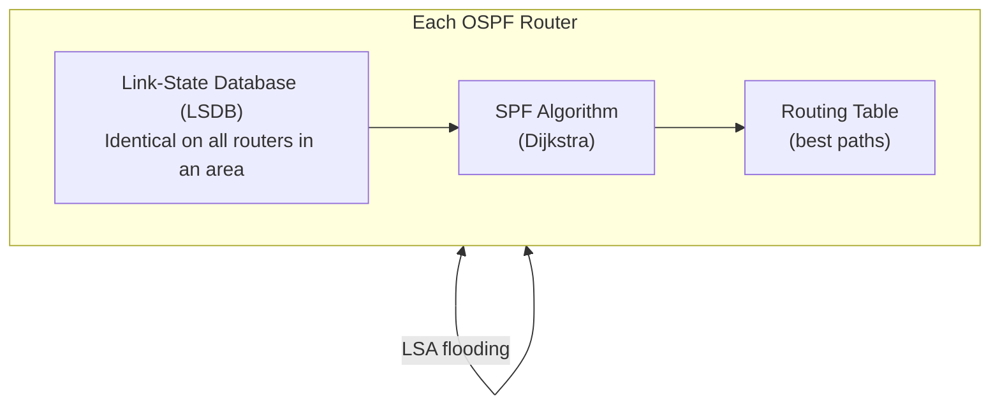
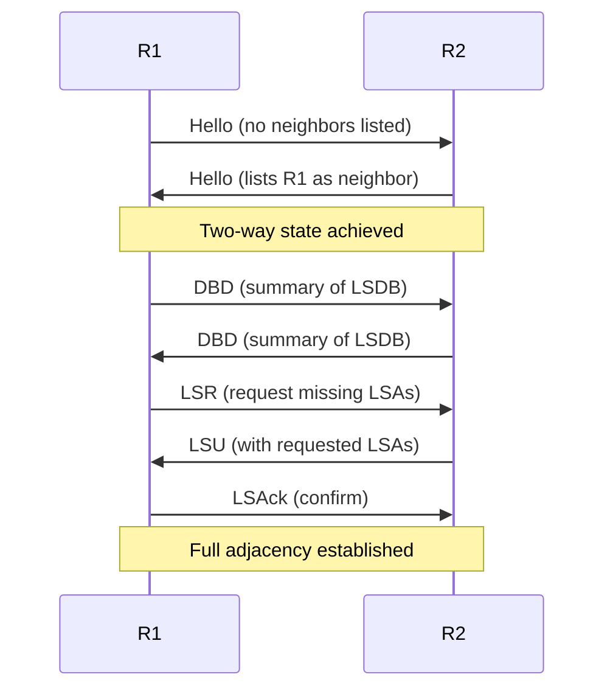
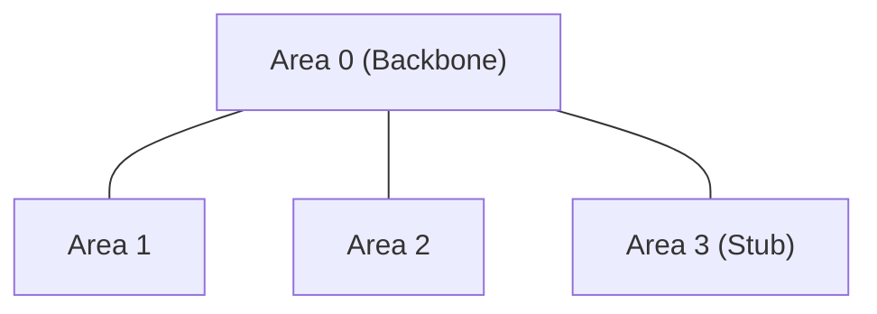

# 08.04 — Link-State & OSPF

> [!abstract] The Full Map
> **Link-state** protocols exchange information about every link in the network, allowing each router to build a complete topological map (the **Link-State Database, LSDB**). Each router then runs **Dijkstra's Shortest Path First (SPF)** algorithm locally to compute the best paths. The canonical link-state protocol is **OSPF** (Open Shortest Path First).



---

##  How Link-State Differs from Distance-Vector

| Property | Distance-Vector (RIP) | Link-State (OSPF) |
| :--- | :--- | :--- |
| What's exchanged | Whole routing table (rumors) | Link states (raw topology) |
| Router's view | Only neighbor tables | Complete topology map (LSDB) |
| Algorithm | Bellman-Ford | Dijkstra (SPF) |
| Convergence | Slow (30s + timers) | Fast (event-triggered LSAs) |
| Loop-prone? | Yes (needs mitigations) | No (SPF computes loop-free tree) |
| CPU/memory | Low | Higher (LSDB + SPF calc) |
| Scalability | Limited to ~15 hops | Scales to thousands of routers with areas |

---

##  OSPF — Open Shortest Path First

| Property | Value |
| :--- | :--- |
| Algorithm | Dijkstra's SPF |
| Metric | Cost = Reference BW / Interface BW |
| Transport | IP protocol 89 (no TCP/UDP) |
| Multicast addresses | `224.0.0.5` (all OSPF routers), `224.0.0.6` (DR/BDR) |
| AD (Cisco) | 110 |
| Default reference bandwidth | 100 Mbps (10^8 bps) |
| Hello interval | 10s (default on broadcast/point-to-point) |
| Dead interval | 40s (4 × Hello) |

---

##  OSPF Packet Types

OSPF uses five packet types, all riding directly on IP (protocol 89):

| Type | Name | Purpose |
| :-: | :--- | :--- |
| **1** | Hello | Discover and maintain neighbor adjacencies |
| **2** | Database Description (DBD) | Summarize LSDB contents for synchronization |
| **3** | Link-State Request (LSR) | Request specific LSAs from a neighbor |
| **4** | Link-State Update (LSU) | Carry the requested LSAs |
| **5** | Link-State Acknowledgment (LSAck) | Confirm receipt of LSUs (reliable transport) |

### Adjacency Formation Sequence



---

##  OSPF Databases (Three Tables)

Every OSPF router maintains three tables:

### 1. Neighbor Table (Adjacency Database)
Lists all OSPF neighbors and their states (Down, Init, Two-Way, ExStart, Exchange, Loading, Full). This is per-interface.

### 2. Topology Table (LSDB — Link-State Database)
Contains every LSA in the area. **Identical on all routers in the same area.** This is the complete topological map.

### 3. Routing Table (Forwarding Database)
The result of running SPF on the LSDB. Contains the best path to every destination. **Different on every router** (because each router is the root of its own SPF tree).

---

##  LSA Types

| Type | Name | Originator | Scope |
| :-: | :--- | :--- | :--- |
| **1** | Router LSA | Every router | Flooded within its area only |
| **2** | Network LSA | DR (Designated Router) | Flooded within its area only |
| **3** | Network Summary LSA | ABR | Flooded between areas |
| **4** | ASBR Summary LSA | ABR | Flooded between areas |
| **5** | AS External LSA | ASBR | Flooded throughout the AS |
| **7** | NSSA External LSA | ASBR in NSSA | Flooded within NSSA area |

The key insight: LSA types 1 and 2 stay **inside their area**, keeping the LSDB small. Types 3, 4, 5 cross area boundaries. This is what makes OSPF scalable — large networks can have hundreds of areas, each with a small LSDB.

---

##  OSPF Cost Metric

$$\text{Cost} = \frac{\text{Reference Bandwidth}}{\text{Interface Bandwidth}}$$

Default reference bandwidth: $10^8$ bps = 100 Mbps.

| Interface | Bandwidth | Cost (default ref) | Cost (10G ref) |
| :--- | :-: | :-: | :-: |
| 10 Mbps Ethernet | 10 Mbps | 10 | 1000 |
| 100 Mbps Fast Ethernet | 100 Mbps | 1 | 100 |
| 1 Gbps Gigabit Ethernet | 1 Gbps | 1 | 10 |
| 10 Gbps | 10 Gbps | 1 | 1 |
| 100 Gbps | 100 Gbps | 1 | 1 |

Notice the **gigabit bottleneck** — at the default reference bandwidth, 100 Mbps and 10 Gbps links both have cost 1, so OSPF can't distinguish them. See [[08 - Routing Protocols/08.06 OSPF Cost & Gigabit Bottleneck|08.06]] for the fix.

---

##  OSPF Areas

OSPF partitions networks into **areas** to scale:



- **Area 0 (Backbone)** — all other areas must connect to it. This is the OSPF "hub."
- **Regular areas** — carry intra-area, inter-area, and external routes.
- **Stub areas** — don't carry external routes (LSA type 5); use a default route instead.
- **NSSA (Not-So-Stubby Area)** — can originate external routes (type 7) but doesn't accept type 5.

See [[08 - Routing Protocols/08.05 OSPF Areas & Router Types|08.05]] for the full breakdown.

---

##  Designated Router (DR) & Backup DR (BDR)

On broadcast multi-access networks (Ethernet), OSPF elects a **DR** and **BDR** to reduce LSA flooding:

- Without DR/BDR: $N$ routers form $N(N-1)/2$ adjacencies — $O(N^2)$ LSA flooding.
- With DR/BDR: every router forms adjacencies only with DR and BDR. LSAs go to the DR (`224.0.0.6`), which floods them to everyone (`224.0.0.5`).

DR election: highest priority (default 1; range 0–255; 0 = ineligible). Ties broken by highest router ID. Configure with:
```cisco
R1(config-if)# ip ospf priority 200
```

DR/BDR are **not** preemptive — once elected, they stay until they fail. To force a re-election, clear the OSPF process: `clear ip ospf process`.

---

##  See Also

- [[08 - Routing Protocols/08.05 OSPF Areas & Router Types|08.05 OSPF Areas]]
- [[08 - Routing Protocols/08.06 OSPF Cost & Gigabit Bottleneck|08.06 OSPF Cost]]
- [[08 - Routing Protocols/08.07 Dijkstra Algorithm Walkthrough|08.07 Dijkstra Walkthrough]]
- [[13 - Cisco IOS CLI/13.04 RIP & OSPF Configuration|13.04 RIP & OSPF Config]]
