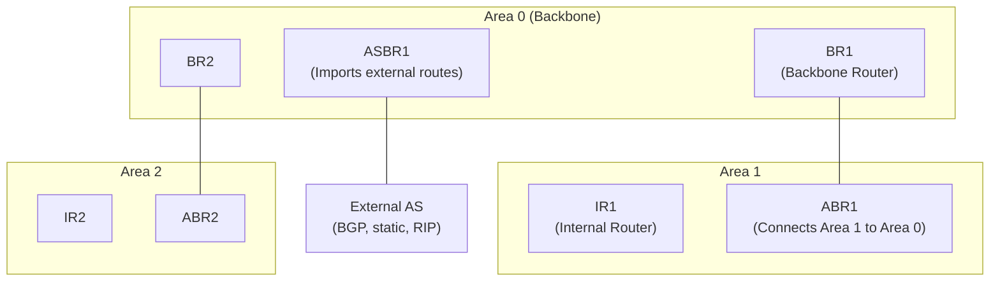

# 08.05 — OSPF Areas & Router Types

> [!abstract] Scaling Through Hierarchy
> A single OSPF area can hold maybe 50–100 routers before the LSDB grows too large for SPF to converge fast enough. The fix is **multi-area design**: split the network into areas connected via the **Area 0 backbone**, with **ABRs** and **ASBRs** at the boundaries. This keeps each area's LSDB small while maintaining end-to-end reachability.



---

##  OSPF Area Types

| Area Type | LSA 1/2 | LSA 3/4 | LSA 5 | Use |
| :--- | :-: | :-: | :-: | :--- |
| **Backbone (Area 0)** | Yes | Yes | Yes | Required transit area |
| **Normal** | Yes | Yes | Yes | Default area type |
| **Stub** | Yes | Yes | No (replaced by default) | Branch sites; saves LSDB |
| **Totally Stubby** | Yes | No (default only) | No | Cisco proprietary; maximum savings |
| **NSSA** | Yes | Yes | No (type 7 instead) | Branch with local external routes |
| **Totally NSSA** | Yes | No | No (type 7 only) | Cisco proprietary |

**Why use stub areas?** A branch office with one WAN link doesn't need to know about 10,000 external routes — a single default route from the ABR suffices. Stub areas drop type 5 LSAs, dramatically shrinking the LSDB on branch routers.

---

##  OSPF Router Types

A router can be multiple types simultaneously (e.g., an ABR is also a Backbone Router).

### Internal Router (IR)
All interfaces are in the **same non-zero area**. The router's LSDB contains only its own area's LSAs.

### Backbone Router (BR)
Has at least one interface in **Area 0**. May or may not be an ABR (if all interfaces are in Area 0, it's a BR but not an ABR).

### Area Border Router (ABR)
Has interfaces in **multiple areas** — at least one in Area 0 and one or more in non-zero areas. The ABR maintains **separate LSDBs** for each area it touches. It generates type 3 (Network Summary) LSAs to advertise one area's networks into another area.

### Autonomous System Boundary Router (ASBR)
Sits at the boundary of the OSPF AS and **redistributes routes from other protocols** (BGP, RIP, EIGRP, static) into OSPF. The ASBR generates type 5 (AS External) LSAs. Every router in the AS needs to know how to reach the ASBR — that's what type 4 (ASBR Summary) LSAs are for, generated by ABRs.

---

##  Multi-Area Design Rules

1. **Area 0 is mandatory.** All non-zero areas must connect to it, either directly or via a virtual link (which is a hack and should be avoided).
2. **Keep Area 0 compact.** It's the transit area for all inter-area traffic, so its routers carry the most LSAs.
3. **Cap area size.** Cisco recommends ≤ 50 routers per area. Larger areas slow SPF convergence.
4. **Use stub areas at branches.** A stub area's routers don't need external routes — a default route from the ABR suffices.
5. **Summarize at ABRs.** ABRs can summarize one area's subnets before advertising them to another area. This shrinks the receiving area's LSDB and routing table.
6. **Use contiguous area addressing.** If area 1 is `10.1.0.0/16` and area 2 is `10.2.0.0/16`, summarization is trivial.

---

##  Configuring OSPF Areas

```cisco
R1(config)# router ospf 1
R1(config-router)# network 10.1.0.0 0.0.255.255 area 1
R1(config-router)# network 10.0.0.0 0.0.0.255 area 0
```

The `network` command's mask is a **wildcard mask** (inverse of subnet mask). `0.0.255.255` means "match the first two octets exactly, ignore the last two."

To make an area stub:
```cisco
R1(config-router)# area 1 stub
```
This must be configured on **every router in area 1**, including the ABR. Otherwise adjacencies won't form.

For totally stubby (Cisco proprietary):
```cisco
R1(config-router)# area 1 stub no-summary
```
Only on the ABR — it stops sending type 3 LSAs into the area.

---

##  Inter-Area Routing — The "OSPF Distance Vector"

Within an area, OSPF is true link-state — every router has the full topology, computes SPF, picks optimal paths.

Between areas, OSPF behaves more like distance-vector — ABRs advertise summary LSAs (type 3) that say "I can reach network X with cost Y." The receiving area's routers don't see the topology of the other area; they just trust the summary cost.

This is why OSPF area design matters: a poor design can lead to suboptimal inter-area paths.

---

##  See Also

- [[08 - Routing Protocols/08.04 Link-State - OSPF|08.04 Link-State & OSPF]]
- [[08 - Routing Protocols/08.06 OSPF Cost & Gigabit Bottleneck|08.06 OSPF Cost]]
- [[07 - IP Routing/07.06 Route Aggregation|07.06 Route Aggregation]] — summarization at the routing level.
