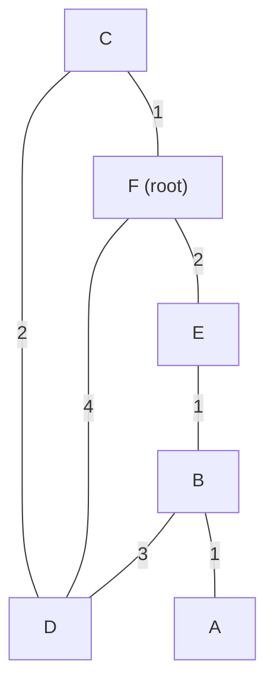
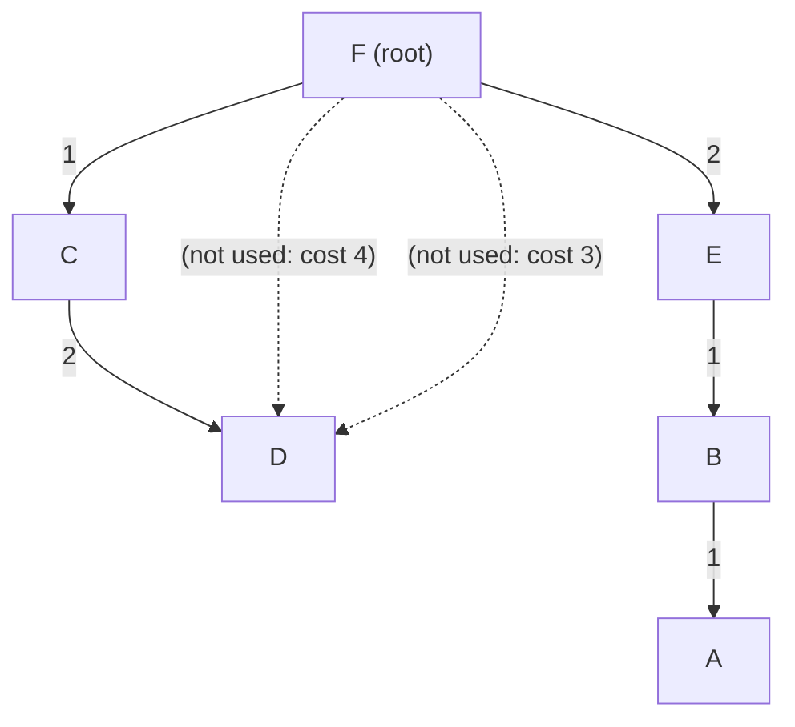

# 08.07 — Dijkstra Algorithm Walkthrough

> [!abstract] Shortest Path First
> OSPF routers run **Dijkstra's Shortest Path First (SPF)** algorithm locally on their LSDB to compute the shortest path tree rooted at themselves. This note walks through a complete SPF computation by hand — the same exercise every cert exam covers.

**Given link costs:**
- F → C: 1
- F → E: 2
- F → D: 4
- C → D: 2
- E → B: 1
- B → A: 1
- B → D: 3

**Goal:** Compute the shortest path tree from F.

---

##  The Algorithm

Dijkstra's algorithm maintains two sets:
- **Tentative (T):** unconfirmed paths under evaluation. Each entry is `(node, cost_so_far, next_hop)`.
- **Permanent (P):** confirmed shortest paths.

Algorithm:
1. Initialize: $P = \{(\text{root}, 0, -)\}$, $T = \emptyset$.
2. For each neighbor of the most-recently-permanent node, compute cost = permanent_node_cost + link_cost. If the neighbor isn't in $T$, add it. If it's in $T$ with a higher cost, update it.
3. Find the entry in $T$ with the lowest cost. Move it to $P$.
4. Repeat from step 2 until $T$ is empty.

---

##  Step-by-Step from Node F

### Step 1: Initialize
$$P = \{[F, 0, -]\}, \quad T = \emptyset$$

Look at F's neighbors:
- C: cost = 0 + 1 = 1
- E: cost = 0 + 2 = 2
- D: cost = 0 + 4 = 4

$$T = \{[C, 1, F], [E, 2, F], [D, 4, F]\}$$

### Step 2: Pick lowest from T
Lowest cost in T: C with cost 1. Move to P.

$$P = \{[F, 0, -], [C, 1, F]\}$$

Evaluate C's neighbors:
- D (via C): cost = 1 + 2 = 3. Current D in T is cost 4. **3 < 4**, so update D's entry: `[D, 3, C]`.

$$T = \{[E, 2, F], [D, 3, C]\}$$

### Step 3: Pick lowest from T
Lowest cost in T: E with cost 2. Move to P.

$$P = \{[F, 0, -], [C, 1, F], [E, 2, F]\}$$

Evaluate E's neighbors:
- B (via E): cost = 2 + 1 = 3. B isn't in T. Add it: `[B, 3, E]`.

$$T = \{[D, 3, C], [B, 3, E]\}$$

### Step 4: Pick lowest from T (tie)
D and B both have cost 3. Tie-breaker doesn't matter — pick either. Let's move both.

$$P = \{[F, 0, -], [C, 1, F], [E, 2, F], [D, 3, C], [B, 3, E]\}$$

Evaluate neighbors of D and B:
- From D: no new nodes (C and B already in P with lower or equal costs).
- From B: A (via B) = cost 3 + 1 = 4. Add: `[A, 4, E]`.

$$T = \{[A, 4, E]\}$$

### Step 5: Pick lowest from T
A with cost 4. Move to P.

$$P = \{[F, 0, -], [C, 1, F], [E, 2, F], [D, 3, C], [B, 3, E], [A, 4, E]\}$$

T is empty. Algorithm terminates.

---

##  Resulting Shortest Path Tree

The dashed links (F→D direct and B→D) are not in the SPF tree because better paths exist through C and E respectively.

---

##  Routing Table for Node F

| Destination | Shortest Path | Total Cost | Next-Hop |
| :---: | :--- | :-: | :-: |
| **C** | F → C | **1** | Direct (interface to C) |
| **D** | F → C → D | **3** | Via C |
| **E** | F → E | **2** | Direct (interface to E) |
| **B** | F → E → B | **3** | Via E |
| **A** | F → E → B → A | **4** | Via E |

Note the next-hop is always the *first hop* on the path, not the entire path. This is what gets installed in the routing table.

---

##  Key Insights

1. **Every router computes its own SPF tree** rooted at itself. F's tree is different from C's tree, even though they share the same LSDB.
2. **The LSDB is identical** in all routers in the same area — it's the topology map. What differs is the perspective (which node is the root).
3. **Ties are broken arbitrarily** — both D and B had cost 3 in step 4. Either could be permanent first; the final tree is the same.
4. **Updates can only decrease cost in T** — once a node is in T with a cost, we only update if a lower cost is found. This guarantees termination.

---

##  Convergence Cost

Dijkstra's algorithm is $O(V^2)$ with a simple implementation, $O((V + E) \log V)$ with a priority queue. For a 100-router area, that's ~10,000 operations — a modern router does this in milliseconds.

But it's still CPU work. This is why OSPF throttles SPF calculations — if the network is flapping, OSPF delays successive SPF runs to avoid CPU overload.

---

##  See Also

- [[08 - Routing Protocols/08.04 Link-State - OSPF|08.04 OSPF]] — overview of the protocol that runs Dijkstra.
- [[08 - Routing Protocols/08.06 OSPF Cost & Gigabit Bottleneck|08.06 OSPF Cost]] — what feeds into Dijkstra.
- [[Quizzes/Quiz 07 - Routing Protocols|Quiz 07]] — Dijkstra walkthrough questions.
