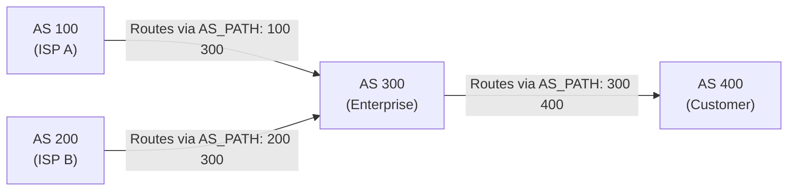
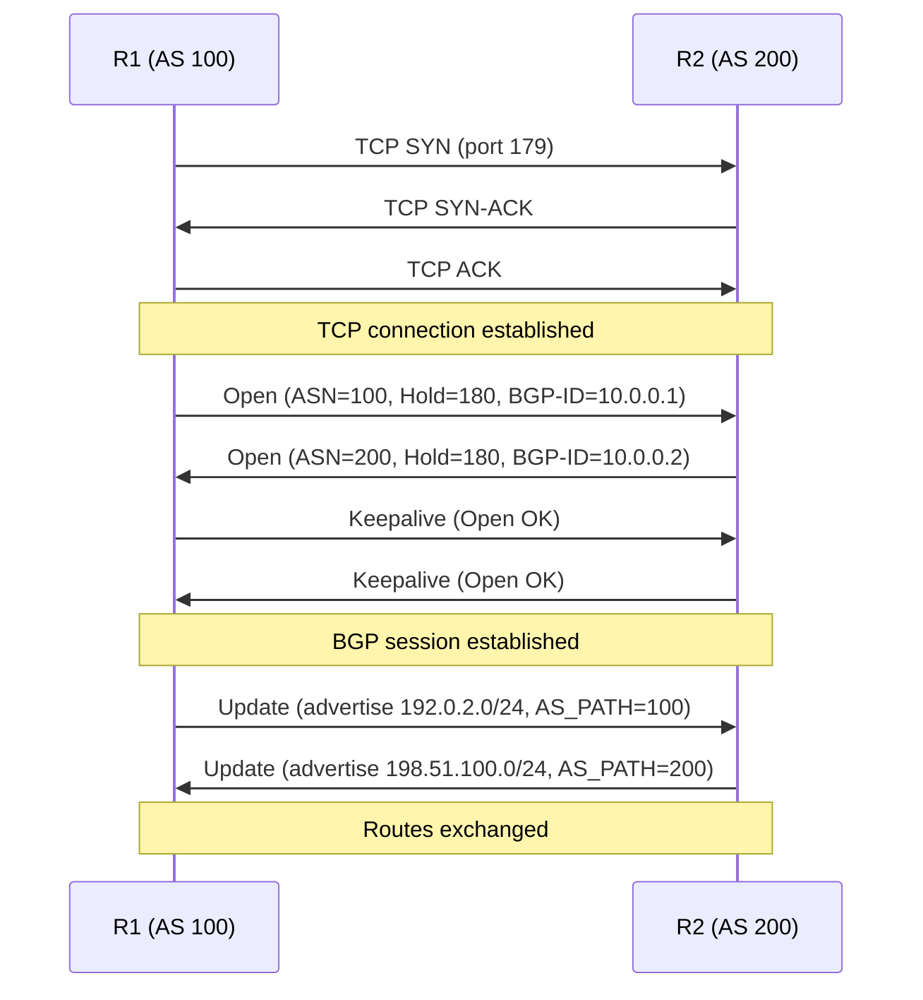

# 08.08 — Path-Vector & BGP

> [!abstract] The Protocol That Runs the Internet
> **BGP (Border Gateway Protocol, RFC 4271)** is the routing protocol of the global internet. It's a **path-vector** protocol: instead of tracking hops (RIP) or link states (OSPF), it tracks the **list of Autonomous Systems (ASes)** a route has traversed. This makes loop detection trivial and lets operators enforce complex routing policies.

---

##  Autonomous Systems (AS)

An **Autonomous System** is a collection of IP networks under a single administrative authority, with a unified routing policy. Each AS gets a unique **AS Number (ASN)** from IANA / a Regional Internet Registry.

| ASN Range | Use |
| :--- | :--- |
| 1 – 64511 | Public (must be assigned by RIR) |
| 64512 – 65535 | Private (RFC 6996, for internal use, like RFC 1918 for IPs) |

Examples of public ASNs:
- AS 15169 — Google
- AS 13335 — Cloudflare
- AS 32934 — Facebook/Meta
- AS 16509 — Amazon AWS

---

##  Path-Vector Algorithm

Unlike distance-vector (which tracks hops) or link-state (which floods topology), path-vector tracks the **AS_PATH** — the sequence of ASes a route has traversed.

**Loop prevention is trivial:** when a router receives a BGP update, it checks if its own ASN appears in the AS_PATH. If yes, **discard the update** (it would create a loop).

**Metric:** BGP doesn't use a single number. It uses a multi-attribute decision process (see below).

---

##  BGP Session Mechanics

BGP sessions run over **TCP port 179**. This is unique among routing protocols — most use multicast or their own transport. The choice of TCP gives BGP:
- Reliable transport (no need for ACKs in the protocol itself).
- Fragmentation handling (large updates split into multiple TCP segments).
- Congestion control (BGP backs off if the network is congested).

Two session types:
- **eBGP (external BGP)** — between routers in different ASes. TTL of packets defaults to 1 (directly connected).
- **iBGP (internal BGP)** — between routers in the same AS. TTL defaults to 255 (can be multiple hops away). All iBGP peers must be fully meshed or use route reflectors / confederations.

---

##  BGP Message Types

| Type | Name | Purpose |
| :-: | :--- | :--- |
| **1** | **Open** | Establishes a BGP session; exchanges ASN, hold time, BGP identifier |
| **2** | **Update** | Advertises new routes (with path attributes) OR withdraws dead routes |
| **3** | **Notification** | Reports errors and closes the session |
| **4** | **Keepalive** | Periodically confirms session is alive (default every 60s) |

### Session Establishment

---

##  BGP Path Attributes

BGP doesn't use a single metric — it uses a multi-attribute decision process. The most important attributes (in decision order):

| Attribute | Description |
| :--- | :--- |
| **AS_PATH** | List of ASes the route has traversed. Used for loop prevention and as a tie-breaker (shorter is better). |
| **NEXT_HOP** | The IP address to forward to. |
| **LOCAL_PREF** | Local preference (higher = more preferred). Used to influence outbound traffic within an AS. |
| **MED (Multi-Exit Discriminator)** | Hint to neighboring AS about which path is preferred (lower = more preferred). Used to influence inbound traffic. |
| **ORIGIN** | IGP (best), EGP, Incomplete (worst). Indicates how the route was injected into BGP. |
| **Weight** | Cisco-proprietary, local to the router only (higher = preferred). Highest priority in decision process. |

### BGP Decision Process (Cisco, simplified)

In order:
1. Highest **WEIGHT** (local to router).
2. Highest **LOCAL_PREF** (AS-wide).
3. Locally originated routes (via `network` or `aggregate-address`).
4. Shortest **AS_PATH**.
5. Lowest **ORIGIN** code.
6. Lowest **MED**.
7. eBGP over iBGP.
8. Lowest IGP metric to NEXT_HOP.
9. Oldest route (if still tied).
10. Lowest router ID.

This multi-step process gives operators enormous control over traffic engineering — far more than any IGP metric.

---

##  Policy Routing

Unlike IGPs, BGP doesn't necessarily pick the "shortest" path. It picks the path that aligns with **policy** — political, commercial, or security rules.

Examples:
- "Prefer paths via AS 64512 (cheap transit) over paths via AS 2914 (expensive transit)."
- "Don't transit traffic between AS 100 and AS 200 (we're not a transit provider)."
- "Prefer paths originating in our own country (lower latency)."
- "Send traffic from customers on premium plans via the fastest path; everyone else via the cheap path."

These policies are expressed as route-maps and AS-path access-lists in Cisco IOS. This is what makes BGP the protocol of choice for inter-domain routing — it's not just about reachability, it's about *policy-compliant* reachability.

---

##  BGP's Role on the Internet

The global BGP table (Default Free Zone, DFZ) has ~950,000 IPv4 routes as of 2024. Every Tier 1 and Tier 2 ISP runs BGP with their peers. Every datacenter edge router runs BGP with their upstreams. Every CDN runs BGP to advertise their anycast prefixes worldwide.

If BGP breaks, the internet breaks. Notable BGP incidents:
- **2008 Pakistan Telecom incident** — Pakistan accidentally advertised YouTube's prefix worldwide; most traffic to YouTube went to Pakistan for ~2 hours.
- **2019 Cloudflare leak** — Cloudflare leaked ~30,000 internal routes globally, causing widespread packet loss.
- **2021 Facebook outage** — BGP withdrawals from Facebook's AS caused their entire network to disappear from the internet for 6 hours.

BGP security is an active area — RPKI (Resource Public Key Infrastructure) lets ASes cryptographically sign their route announcements, making hijacking harder.

---

##  See Also

- [[08 - Routing Protocols/08.01 Distance-Vector - RIP|08.01 RIP]] — different algorithm family.
- [[08 - Routing Protocols/08.04 Link-State - OSPF|08.04 OSPF]] — different algorithm family.
- [[07 - IP Routing/07.02 Administrative Distance & Metrics|07.02 AD]] — BGP has AD 20 (eBGP) / 200 (iBGP).
