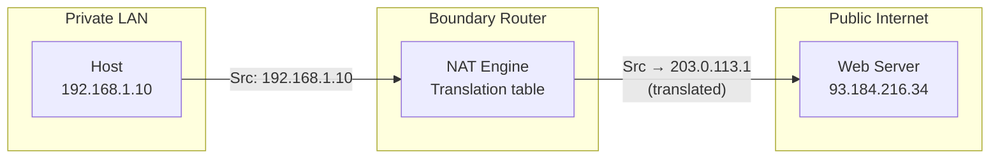

# 09.01 — NAT Principles

> [!abstract] Why NAT Exists
> IPv4 has only ~4.3 billion addresses — not enough for the 8+ billion devices that want to be online. **Network Address Translation (NAT)** bridges the gap by translating private, non-routable IPv4 addresses into public, routable ones at the network boundary. Without NAT, the internet would have collapsed in the late 1990s.

---

##  The IPv4 Address Exhaustion Problem

When IPv4 was designed in 1981, 4.3 billion addresses seemed infinite. By 1994, the IANA pool was visibly depleting. Three responses were attempted in parallel:

1. **CIDR (1993)** — replaced classful addressing with flexible prefixes. Bought time.
2. **NAT (1994)** — let private networks share a small pool of public IPs. Bought more time.
3. **IPv6 (1998)** — designed to replace IPv4 entirely with $3.4 \times 10^{38}$ addresses. Still being adopted 25+ years later.

NAT was meant to be a stopgap until IPv6 shipped. It's still with us because IPv6 adoption is slow.

---

##  Cisco NAT Terminology

Cisco IOS uses specific terms for the four corners of a NAT translation:

| Term | Meaning |
| :--- | :--- |
| **Inside Local** | The private IP of an internal host, as seen from the inside (e.g., `192.168.1.10`). What the host thinks its IP is. |
| **Inside Global** | The public IP that the NAT device translates the inside host to (e.g., `203.0.113.1`). What the outside world sees. |
| **Outside Local** | The IP of an external host, as seen from the inside (rarely translated; usually equals Outside Global). |
| **Outside Global** | The public IP of an external destination host (e.g., `93.184.216.34`). |

> [!info] Most troubleshooting needs only Inside Local  Inside Global
> Outside Local/Global are mostly relevant for advanced bidirectional NAT scenarios. For 95% of NAT configurations, you only care about translating the inside host's source IP.

---

##  The Translation Process

A NAT device maintains a **translation table** with entries like:

| Inside Local (private) | Inside Global (public) | Outside Global | Ports (if PAT) |
| :--- | :--- | :--- | :--- |
| 192.168.1.10 | 203.0.113.1 | 93.184.216.34 | 52100 → 10001 |

When a packet arrives at the NAT device:
- **Outbound:** replace source IP with Inside Global. Optionally replace source port (PAT). Forward.
- **Inbound:** look up destination port in the translation table. Replace destination IP with the matching Inside Local. Optionally replace destination port. Forward.

---

##  Three NAT Flavors

| Type | Mapping | Use Case | Pool Demand |
| :--- | :--- | :--- | :--- |
| **Static NAT** | 1:1 permanent | Public-facing servers | High (1 public IP per host) |
| **Dynamic NAT** | m:n from pool | Outbound bursts | Medium (pool size = max concurrent) |
| **PAT (NAT Overload)** | n:1 with ports | Home/SMB internet | Low (1 public IP serves thousands) |

Each is detailed in its own note:
- [[09 - NAT & Perimeter Security/09.02 Static NAT|09.02 Static NAT]]
- [[09 - NAT & Perimeter Security/09.03 Dynamic NAT|09.03 Dynamic NAT]]
- [[09 - NAT & Perimeter Security/09.04 PAT NAT Overload|09.04 PAT]]

---

##  NAT Pros and Cons

### Pros
- **Conserves public IPv4 addresses** — PAT lets thousands of hosts share one public IP.
- **Hides internal topology** — outside world sees only the NAT device's IP.
- **Implicit security** — unsolicited inbound traffic is dropped (no translation entry exists).
- **Simplifies readdressing** — change ISP, change only the NAT device's public IP; internal network stays the same.

### Cons
- **Breaks end-to-end principle** — the internet was designed for hosts to talk directly; NAT inserts a stateful middlebox.
- **Breaks protocols that embed IPs** — FTP (active mode), SIP, H.323, some games. Requires ALGs (Application Layer Gateways) to fix.
- **Complicates inbound services** — port forwarding is required for any internal server to be reachable from outside.
- **Stateful failure** — if the NAT device fails, all sessions through it die. Failover is harder than for stateless routers.
- **Slows IPv6 adoption** — NAT works "well enough" that there's less pressure to deploy IPv6.

> [!warning] NAT is not a firewall
> A common misconception: "NAT provides security." It does *implicitly* drop unsolicited inbound traffic, but that's a side effect, not a security feature. A stateful firewall does this better and intentionally. Modern networks should use a real firewall, not rely on NAT for security.

---

##  See Also

- [[04 - IPv4 Network Layer/04.04 Public vs Private (RFC 1918)|04.04 RFC 1918]] — private IP ranges that NAT bridges.
- [[09 - NAT & Perimeter Security/09.02 Static NAT|09.02 Static NAT]]
- [[09 - NAT & Perimeter Security/09.03 Dynamic NAT|09.03 Dynamic NAT]]
- [[09 - NAT & Perimeter Security/09.04 PAT NAT Overload|09.04 PAT]]
